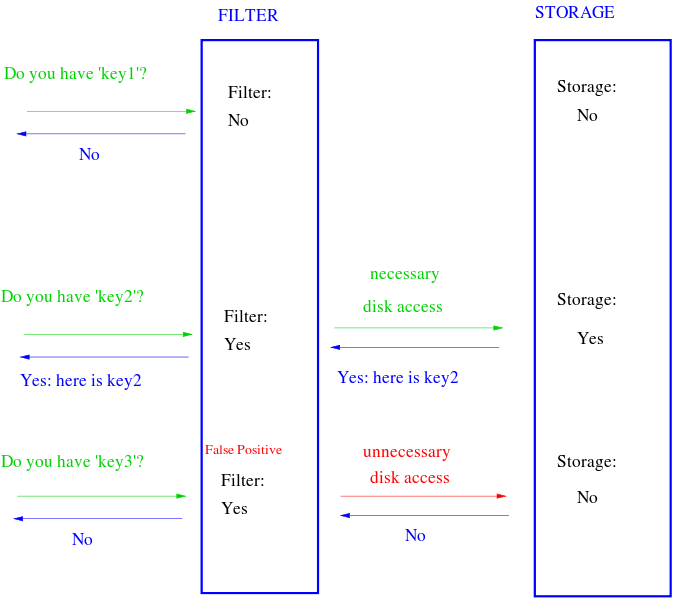

# 布隆过滤器

## 简介
```
A Bloom filter is a space-efficient probabilistic data structure, conceived by Burton Howard Bloom in 1970, that is used to test whether an element is a member of a set. False positive matches are possible, but false negatives are not – in other words, a query returns either "possibly in set" or "definitely not in set". Elements can be added to the set, but not removed (though this can be addressed with a "counting" filter); the more elements that are added to the set, the larger the probability of false positives.
```
布隆过滤器是空间高效的概率性数据结构，1970年有Burton Howard Bloom提出。主要是用来判断一个元素不是在一个set（集合）中。误识别率（假正例False positives）不可避免，换句话说一个元素要么不在set（集合）中，要么可能在set中。该数据结构接受添加元素，但是不接受删除元素。并且随着添加的元素增多，误识别率也会变大。



## 定义

算法(参考2中由example)：
1. 首先需要k个hash函数（different hash function），每个函数可以把key散列成为1个整数
2. 初始化时，需要一个长度为n比特(bit)的数组，每个比特位初始化为0
3. 某个key加入集合时，用k个hash函数计算出k个散列值，并把数组中对应的比特位设置为1
4. 判断某个key是否在集合时，用k个hash函数计算出k个散列值，并查询数组中对应的比特位，如果所有的比特位都是1，认为在集合中。

优点：不需要存储key，节省空间，高效

缺点：
1. 算法判断key在集合中时，有一定的概率key其实不在集合中（即存在误识别率）
2. 无法删除

关注点：选用哪些哈希函数？如何降低误识别率？

### 哈希函数
```
The hash functions used in a Bloom filter should be independent and uniformly distributed. They should also be as fast as possible (cryptographic hashes such as sha1, though widely used therefore are not very good choices).
```
哈希函数应当是独立的、均匀分布的，高效的。

```
There are literally thousands of named hashing functions. Some are secure, but comparatively slow to calculate. Some are very fast, but have more collisions. Some are close to perfectly uniformly distributed, but very hard to implement. You get the idea. If there’s one rule in programming it’s this: there will always be trade-offs.
```
实际上存在着成千个哈希函数。有一些是安全的，但是相比来说计算起来较慢。有一些是快速的，但是会有碰撞的可能（输入不同的参数，有几率hash得到相同的hash值）。有些接近完全均匀分布，但很难实现。所以在选择哈希函数中只能达到一个权衡。

参考2中列出了一些hash函数，和一些应用使用的hash函数，参考5的Hashing章节介绍了一些哈希函数的优缺点

### 如何设计大小
首先推导出误识别率（p）的公式（可以参考1，4中的推导过程）：


(该集合为m位，k个hash函数，总共插入了n个元素)

布隆过滤器误识别率 p 与位数组大小 m 和集合中插入元素个数 n 的关系图，假定 Hash 函数个数选取最优数目:k = (m / n)ln2(由上面的约等式计算得出，数学高深~)：


### 用途

1. Cache filtering(棒，反垃圾过滤，url过滤)
Using a Bloom filter to prevent one-hit-wonders from being stored in a web cache decreased the rate of disk writes by nearly one half, reducing the load on the disks and potentially increasing disk performance.

2. 可以参考4中的examples
```
The Exim mail transfer agent (MTA) uses Bloom filters in its rate-limit feature.
Medium uses Bloom filters to avoid recommending articles a user has previously read.
Ethereum uses Bloom filters for quickly finding logs on the Ethereum blockchain.
...
```

## 综述
为了探究的是布隆过滤器无法对元素进行删除这一个缺点，布隆过滤器此后还出现了许多变种，感兴趣可以看一下维基百科上面的信息。

## 参考
1. [https://www.cnblogs.com/allensun/archive/2011/02/16/1956532.html](https://www.cnblogs.com/allensun/archive/2011/02/16/1956532.html)
2. [https://llimllib.github.io/bloomfilter-tutorial/](https://llimllib.github.io/bloomfilter-tutorial/)
3. [https://www.cnblogs.com/liyulong1982/p/6013002.html](https://www.cnblogs.com/liyulong1982/p/6013002.html)
4. [https://en.wikipedia.org/wiki/Bloom_filter](https://en.wikipedia.org/wiki/Bloom_filter)
5. [https://blog.medium.com/what-are-bloom-filters-1ec2a50c68ff](https://blog.medium.com/what-are-bloom-filters-1ec2a50c68ff)