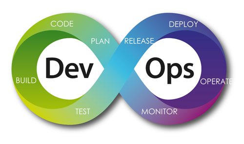
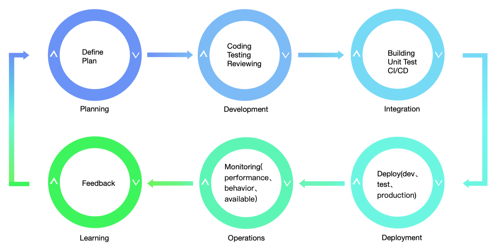

## DevOps
### 背景
### 定义
用搜索引擎找了一下，随机抽了几个对DevOps的定义，可以看出，Devops可以理解为是一种集`实践`、`工具`和`文化理念`于一身`软件开发过程`和`组织文化`。通过`自动化`和`集成``软件开发(Dev)`和`IT运营(Ops)`的工作，`更快``更高质量`的`持续交付`软件。DevOps和敏捷软件开发相辅相成。

-  IBM对此解释为：DevOps是一种软件开发过程的概述和一种组织文化转变。通过自动化和集成开发团队（Dev）与运营团队(Ops)的工作，加速交付更高质量的软件。
  ```
  By definition, DevOps outlines a software development process and an organizational culture shift that speeds the delivery of higher quality software by automating and integrating the efforts of development and IT operations teams – two groups that traditionally practiced separately from each other, or in silos.
  ```

- Microsoft对此解释为：开发（Dev）和运营（Ops）的结合体，通过人员、流程和技术的结合，持续向客户提供价值。
  ```
  A compound of development (Dev) and operations (Ops), DevOps is the union of people, process, and technology to continually provide value to customers.
  What does DevOps mean for teams? DevOps enables formerly siloed roles—development, IT operations, quality engineering, and security—to coordinate and collaborate to produce better, more reliable products. By adopting a DevOps culture along with DevOps practices and tools, teams gain the ability to better respond to customer needs, increase confidence in the applications they build, and achieve business goals faster.
  ```

- Wikipedia对此的解释为：DevOps是一套结合了软件开发(Dev)和IT运营（Ops）的实践。旨在缩短系统开发声明周期并提供高软件质量的持续交付。DevOps和敏捷软件开发相辅相成。
  ```
  DevOps is a set of practices that combines software development (Dev) and IT operations (Ops). It aims to shorten the systems development lifecycle and provide continuous delivery with high software quality.[1] DevOps is complementary with Agile software development; several DevOps aspects came from the Agile methodology.
  ```
- AWS对此的解释为：DevOps 集文化理念、实践和工具于一身，可以提高组织高速交付应用程序和服务的能力，与使用传统软件开发和基础设施管理流程相比，能够帮助组织更快地发展和改进产品。这种速度使组织能够更好地服务其客户，并在市场上更高效地参与竞争。

- Atlassian对此的解释为：DevOps 是一套实践、工具和文化理念，可自动化和集成软件开发（Dev）和IT队伍之间的流程。强调团队授权，跨团队交流和协作，技术自动化。
```
DevOps is a set of practices, tools, and a cultural philosophy that automate and integrate the processes between software development and IT teams. It emphasizes team empowerment, cross-team communication and collaboration, and technology automation.
```

### 生命周期
该生命周期并不是一直不变的，具体实施时也并不一定是一成不变的。
#### 比如，Plan->Develop->Deliver->Operate

#### 比如，Plan->Build->Test->Release->Monitor

#### 比如，Plan->Code->Build->Test->Release->Deploy->Operate->Monitor


总而言之，基本上就是Planning、Development、Deliver、Operations、Feedback


- Planning：规划阶段，定义需求，规划版本和发布计划。(Planning)
- Development：编程、测试、code review。(Coding and Testing)
- Integration：编译打包、单元测试、持续集成，持续交付（Building、CI/CD）
- Deployment：持续部署。(Deploying)
- Operations：维护和监控。(Minitor)
- Learning：反馈。

### 工具链
- 项目管理：GitHub Issues、Jira、TeamWork
- 代码管理：SVN、GitHub、GitLab
- CI/CD：Jenkins、TravisCI、CircleCI、ArgoCD、Zadig
- 自动化测试框架：Selenium、Appium
- 性能测试框架：NeoLoad
- 配置管理工具：Terraform、Kubernetes
- 监控工具：DataDog、Prometheus
- 反馈工具

## 参考
1. [https://www.ibm.com/cloud/learn/devops-a-complete-guide](https://www.ibm.com/cloud/learn/devops-a-complete-guide)
2. [https://docs.microsoft.com/en-us/devops/what-is-devops](https://docs.microsoft.com/en-us/devops/what-is-devops)
3. [https://en.wikipedia.org/wiki/DevOps](https://en.wikipedia.org/wiki/DevOps)
4. [https://aws.amazon.com/cn/devops/what-is-devops/](https://aws.amazon.com/cn/devops/what-is-devops/)
5. [https://www.atlassian.com/devops](https://www.atlassian.com/devops)
6. [https://en.wikipedia.org/wiki/DevOps_toolchain](https://en.wikipedia.org/wiki/DevOps_toolchain)
7. [https://sqa.mampu.gov.my/index.php/en/section-2-devops-approach](https://sqa.mampu.gov.my/index.php/en/section-2-devops-approach)