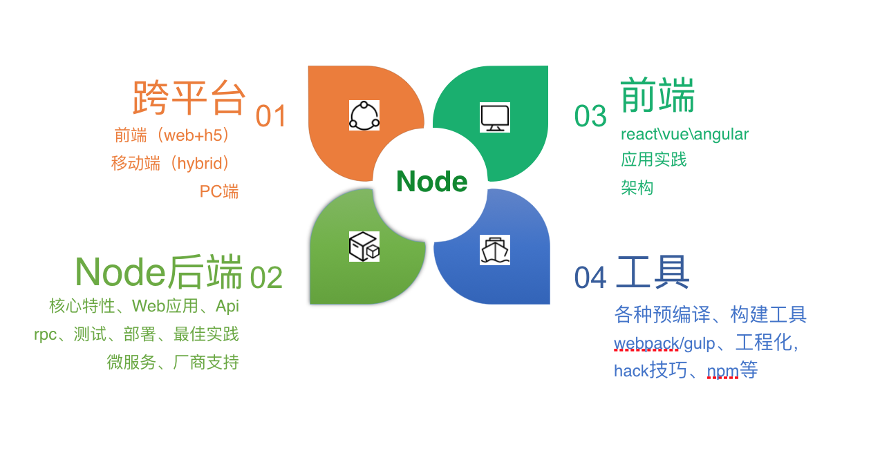

# Node入门

## 简介和背景

```
Node.js® is a JavaScript runtime built on Chrome's V8 JavaScript engine.
```
一个基于chrome v8 的javascript引擎构建的javascript运行时。

Atwood定律：
> 任何能够用`JavaScript`实现的应用系统，最终都必将用`JavaScript`实现(Jeff Atwood)

PS:学习node纯属个人兴趣，不涉及到前端和后端之间的争夺和利益冲突（哈哈哈😁）。

## 原理


Node.js 是基于 Chrome V8引擎构建的，由事件循环（Event Loop）分发 I/O 任务，最终工作线程（Work Thread）将任务丢到线程池（Thread Pool）里去执行，而事件循环只要等待执行结果就可以了。

梳理：
* Chrome V8 是 JavaScript 引擎
* Node.js 内置 Chrome V8 引擎，所以它使用的 JavaScript 语法
* JavaScript 语言的一大特点就是单线程，也就是说，同一个时间只能做一件事
* 单线程就意味着，所有任务需要排队，前一个任务结束，才会执行后一个任务。如果前一个任务耗时很长，后一个任务就不得不一直等着
* 如果排队是因为计算量大，CPU 忙不过来，倒也算了，但是很多时候 CPU 是闲着的，因为 I/O 很慢，不得不等着结果出来，再往下执行
* CPU 完全可以不管 I/O 设备，挂起处于等待中的任务，先运行排在后面的任务
* 将等待中的 I/O 任务放到 Event Loop 里
* 由 Event Loop 将 I/O 任务放到线程池里
* 只要有资源，就尽力执行

> （摘自参考5）

## 使用场景



|分类|描述|相关模块|
|:---:|:---:|:---:|
|网站|类似于 cnodejs.org 这样传统的网站|Express / Koa|
|Api|同时提供给移动端，PC，H5 等前端使用的 HTTP Api 接口|Restify / HApi|
|Api代理|为前端提供的，主要对后端Api接口进行再处理，以便更多的适应前端开发|Express / Koa|
|IM即时聊天|实时应用，很多是基于 WebSocket协议的|Socket.io / sockjs|
|反向代理|提供类似于 nginx 反向代理功能，但对前端更友好|anyproxy / node-http-proxy / hiproxy|
|前端构建工具|辅助前端开发，尤其是各种预编译，构建相关的工具，能够极大的提高前端开发效率|Grunt / Gulp / Bower / Webpack / Fis3 / YKit|
|命令行工具|使用命令行是非常酷的方式，前端开发自定义了很多相关工具，无论是shell命令，node脚本，还是各种脚手架等，几乎每个公司\小组都会自己的命令行工具集|Cordova / Shell.js|
|操作系统|有实现，但估计不太会有人用|NodeOS|
|跨平台打包工具|使用 Web 开发技术开发PC客户端是目前最流行的方式，会有更多前端开发工具是采用这种方式的|PC端的electron、nw.js，比如钉钉PC客户端、微信小程序IDE、微信客户端，移动的Cordova，即老的Phonegap，还有更加有名的一站式开发框架Ionicframework|
|P2P|区块链开发、BT客户端|webtorrent / ipfs|
|编辑器|Atom 和 VSCode 都是基于 electron 模块的|electron|
|物联网与硬件|ruff.io和很多硬件都支持node sdk|ruff|

> （摘自参考5）

## 异步流程技术演变
建议阅读参考1，关于node的异步流程演变过程。(狼叔威武！)

### Promise大法
实现的代码参考链接2，采用了express框架，代码结构诸如以下：
```
updateById(id, params, callback) {
    this.findById(id, goods => {
        if (goods) {
            Promise.resolve(
                this.repository.updateById(id, params)
            ).then(result => {
                callback(result)
            }).catch(err => {
                callback(false)
            })
        } else {
            callback(false)
        }
    })
}
```
总体的感受就是如果你的项目分层了的话，比如分成了controller,module,service,repository,model层，callback大法就需要一路传入到底，这种做法有点像你让一个人帮你买一个蛋糕，然后给他一个盘子（因为你想用盘子来盛），然后他买的时候再把盘子给售货员。。。

### Async/Await大法
实现的代码参考链接3，采用了国产thinkjs框架，代码结构诸如以下：
```
  async create(params) {
    let goods = await this.model('goods/goods').findByName(params.name);
    // 有属性，不为空
    if (think.app.context.isEmpty(goods)) {
      think.logger.info('[create]search info if exsit: ', [JSON.stringify(goods)]);
      return false;
    }
    let res = await this.model('goods/goods').create(params);
    return res;
  }
```
总体的感受就是摆脱了Promise的callback，代码看上去像同步（实质是异步），越来越对后端开发者友善了~~~

## 备注
### 使用建议
参照5，狼叔给出了异步流程控制的建议，总体来说Promise是基础的，也是使用最多的，是基础，Async是趋势。

### 调试
调试可为打日志输入控制台，结合IDE进行断点调试，编写测试用例等方式。
给出thinkjs调试方法：https://thinkjs.org/zh-cn/doc/3.0/debug.html，很方便，Promise我使用的是console.log进行调试的，一般打日志就足够了。

## 参考
1. [https://cnodejs.org/topic/560dbc826a1ed28204a1e7de](https://cnodejs.org/topic/560dbc826a1ed28204a1e7de)
2. [https://github.com/Birjemin/express-babel](https://github.com/Birjemin/express-babel)
3. [https://github.com/Birjemin/express-thinkjs](https://github.com/Birjemin/express-thinkjs)
4. [https://thinkjs.org/doc/index.html](https://thinkjs.org/doc/index.html)
5. [https://i5ting.github.io/How-to-learn-node-correctly/](https://i5ting.github.io/How-to-learn-node-correctly/)