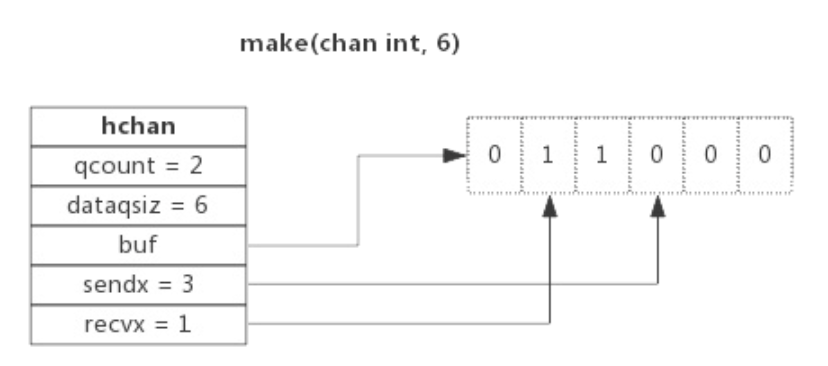
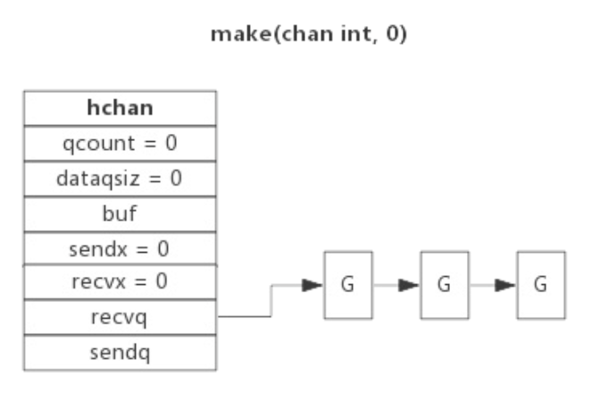
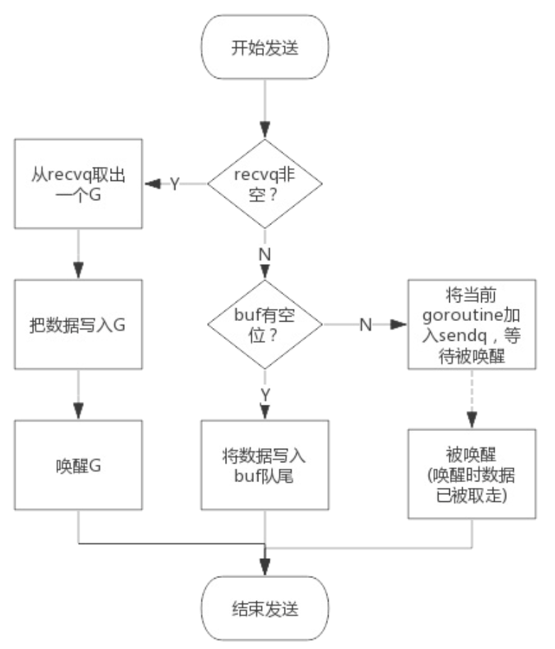
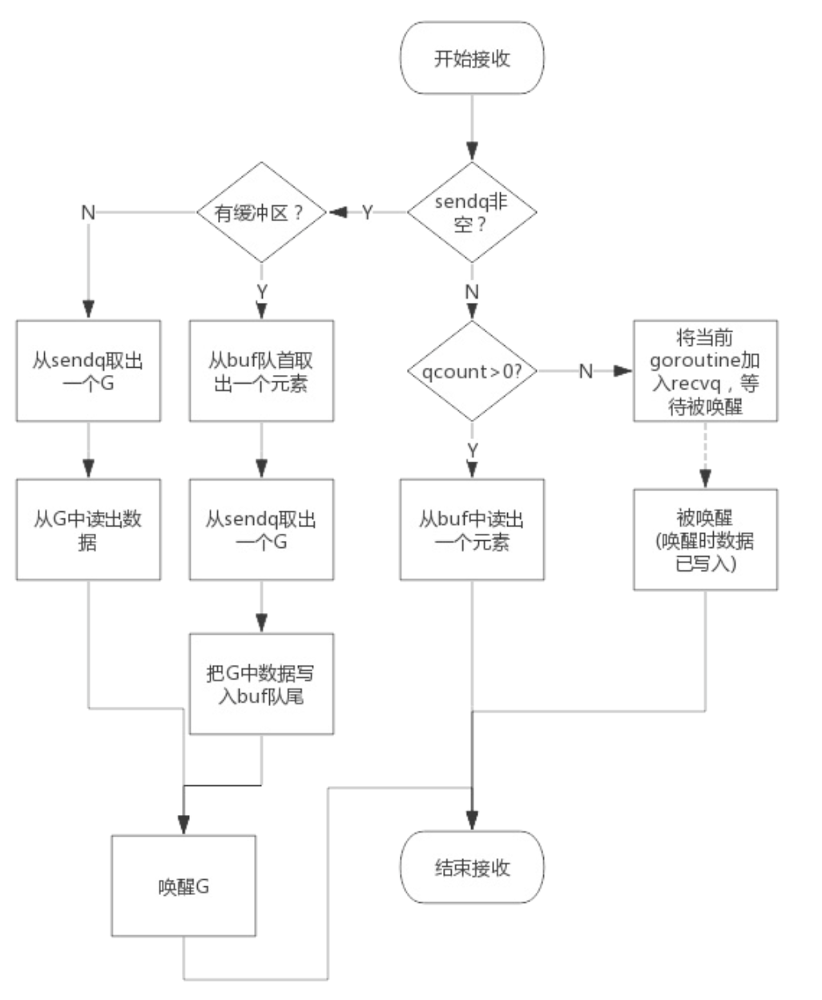

## Golang-channel

### 结构
```
type hchan struct {
	qcount   uint           // total data in the queue
	dataqsiz uint           // size of the circular queue
	buf      unsafe.Pointer // points to an array of dataqsiz elements
	elemsize uint16
	closed   uint32
	elemtype *_type // element type
	sendx    uint   // send index
	recvx    uint   // receive index
	recvq    waitq  // list of recv waiters
	sendq    waitq  // list of send waiters

	// lock protects all fields in hchan, as well as several
	// fields in sudogs blocked on this channel.
	//
	// Do not change another G's status while holding this lock
	// (in particular, do not ready a G), as this can deadlock
	// with stack shrinking.
	lock mutex
}
```


- buf为缓冲区，一个环形链表
- recvq和sendq分别分接收队列（读）和发送队列（写），双向链表
- lock为锁，每一个操作都是原子性的

### 解析

- 阻塞，被阻塞时，则会将goroutine挂在channel的等待队列中
  - 读数据时，channel缓冲区为空或者没有缓冲区，发生阻塞；置于recvq中；
  - 写数据时，channel缓冲区满或者没有缓冲区，发生阻塞；置于sendq中；
- 唤醒：读阻塞的goroutine会被channel写入数据的goroutine唤醒；写阻塞的goroutine会被读出数据的rotoutine唤醒。
  
  注意，一般情况下recvq和sendq至少有一个为空。只有一个例外，那就是同一个goroutine使用select语句向 channel一边写数据，一边读数据。
- 初始化：make函数伪代码
```
func makechan(t *chantype, size int) *hchan {
  var c *hchan
  c = new(hchan)
  c.buf = malloc(元素类型大小*size)
  c.elemsize = 元素类型大小
  c.elemtype = 元素类型
  c.dataqsiz = size
  return c
}
```
- 向channel写入数据：
  - 等待接收队列（读队列）recvq不为空（如果为缓冲队列，则说明缓冲区没有数据，返回不为缓冲队列，没有缓冲区），直接从等待接收队列recvq取出G，将数据写入并唤醒G
  - 如果缓冲区有空余位置（缓冲队列），直接写入缓冲区；
  - 如果没有空余位置（不为缓冲队列，或者缓冲区满），将数据写入G，置入等待发送队列sendq，等待唤醒
  
- 从channel读出数据：
  - 等待发送队列（写队列）sendq不为空，且没有缓冲区，直接从sendq取出G，将G中数据读出，并唤醒G
  - 等待发送队列sendq不为空，且有缓冲区（说明缓冲区满），从缓冲区头部取出数据，从sendq取出一个G，将G写入缓冲区尾部，把G唤醒
  - 缓冲区有数据，直接从缓冲区读数据
  - 将当前G加入接收队列recvq，进入休眠，等待写G唤醒
  
- 关闭channel
  - 关闭channel时会把recvq中的G全部唤醒，本该写入G的数据位置为nil。把sendq中的G全部唤醒，但这些G会panic
- panic出现的常见场景：
  - 关闭值为nil的channel
  - 关闭已经被关闭的channel
  - 向已经关闭的channel写数据

### 用法
- 单向channel
  - func readChan(chanName <-chan int): 通过形参限定函数内部只能从channel中读取数据
  - func writeChan(chanName chan<- int): 通过形参限定函数内部只能向channel中写入数据
- select
  - select的case语句读channel不会阻塞，尽管channel中没有数据。这是由于case语句编 译后调用读channel时会明确传入不阻塞的参数，此时读不到数据时不会将当前goroutine加入到等待队列，而是直 接返回。
- range
  - 遍历

### 示例
见参考3

## 参考
1. [https://studygolang.com/articles/20714](https://studygolang.com/articles/20714)
2. [https://i6448038.github.io/2017/12/04/golang-concurrency-principle/](https://i6448038.github.io/2017/12/04/golang-concurrency-principle/)
3. [https://www.geeksforgeeks.org/channel-in-golang](https://www.geeksforgeeks.org/channel-in-golang)