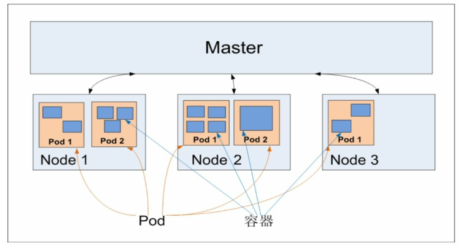

# Kubernetes入门
Kubernetes权威指南-第四版本，笔记整理：
- 第一篇：Kubernetes入门

## 基本概念和术语
Kubernetes中的大部分概念如Node、Pod、Deployment、Service等都可以被看作一种资源对象，几乎所有资源对象都可以通过 Kubernetes提供的kubectl工具(或者API编程调用)执行增、删、改、查等操作并将其保存在etcd中持久化存储。Kubernetes 其实是一个高度自动化的资源控制系统，它通过跟踪对比etcd库里保存的“资源期望状态”与当前环境中的“实际资源状态”的差异来实现自动控制和自动纠错的高级功能。

但随着Kubernetes版本的持续升级，一些资源对象会不断引入新的属性。为了在不影响当前功能的情况下引入对新特性的支持，我们通常会采用下面两种典型方法。
- 方法1，在设计数据库表的时候，在每个表中都增加一个很长的备注字段，之后扩展的数据以某种格式(如XML、JSON、简单字符 串拼接等)放入备注字段。因为数据库表的结构没有发生变化，所以此时程序的改动范围是最小的，风险也更小，但看起来不太美观。
- 方法2，直接修改数据库表，增加一个或多个新的列，此时程 序的改动范围较大，风险更大，但看起来比较美观。

更加优雅的做法是，先采用方法1实现这个新特性，经过几个版本的迭代，等新特性变得稳定成熟了以后，可以在后续版本中采用方法2升级到正式版。为此，Kubernetes为每个资源 对象都增加了类似数据库表里备注字段的通用属性Annotations，以实现方法1的升级。

### Master
集群控制节点（高可用部署建议用3台服务器）。在每个Kubernetes集群里都需要有一个Master来负责整个集群的管理和控制，基本上 Kubernetes的所有控制命令都发给它，它负责具体的执行过程，我们后面执行的所有命令基本都是在Master上运行的

Master节点上关键进程（重点）：
- Kubernetes API Server(kube-apiserver): 集群控制入口进程，同时提供了HTTP Restful接口的关键服务进程，负责所有资源的增删改查等操作的唯一入口
- Kubernetes Controller Server(kube-controller-manager): 资源对象的自动化控制中心
- Kubernetes Scheduler(kube-sheduler): 资源调度进程，负责资源调度

存储服务（也可以单独部署ETCD集群）：
etcd

### Node
除Master节点外的节点（虚拟机或者物理机），Node是Kubernetes集群中的工作负载节点，每个Node都会被Master分配一些工作负载(Docker容器)，当某个Node宕机时，其上的工作负载会被Master自动转移到其他节点上

关键进程：
- kubelet: 负责Pod对应的容器的创建、启停等任务，同时与Master密切协作，实现集群管理的基本功能。
- kube-proxy: 实现Kubernetes Service的通信与负载均衡机制的重要组件。
- Docker Engine(docker): Docker引擎，负责本机的容器创建和管理工作（最新版本已不再只支持docker虚拟化，只要遵循CRI规范的虚拟产品都可）。

Node可以在运行期间动态增加到Kubernetes集群中，前提是在这个节点上已经正确安装、配置和启动了上述关键进程，在默认情况下 kubelet会向Master注册自己，这也是Kubernetes推荐的Node管理方式。 一旦Node被纳入集群管理范围，kubelet进程就会定时向Master汇报自身的情报，例如操作系统、Docker版本、机器的CPU和内存情况，以及当前有哪些Pod在运行等，这样Master就可以获知每个Node的资源使用情况，并实现高效均衡的资源调度策略。而某个Node在超过指定时间不上报信息时，会被Master判定为“失联”，Node的状态被标记为不可用(Not Ready)，随后Master会触发“工作负载大转移”的自动流程

```shell
kubectl get nodes
kubectl describe node node-name
```

### Pod
Pod是Kubernetes最重要的基本概念，每个Pod都有一个特殊的被称为“根容器”的Pause容器。Pause容器对应的镜像属于Kubernetes平台的一部分，除了Pause容器，每个Pod还包含一个或多个紧密相关的用户业务容器。


疑问：为什么Kubernetes会设计出一个全新的Pod的概念并且Pod有这样特殊的组成结构?
1. 在一组容器作为一个单元的情况下，我们难以简单地对“整体”进行判断及有效地行动。比如，一个容器死亡了，此时算是整体死亡么?是N/M的死亡率么?引入业务无关并且不易死亡的Pause容器作为Pod的根容器，以它的状态代表整个容器组的状态，就简单、巧妙地解决了这个难题。
2. Pod里的多个业务容器共享Pause容器的IP，共享Pause容 器挂接的Volume，这样既简化了密切关联的业务容器之间的通信问题，也很好地解决了它们之间的文件共享问题。

Kubernetes为每个Pod都分配了唯一的IP地址，称之为Pod IP，一个 Pod里的多个容器共享Pod IP地址。Kubernetes底层网络支持集群内任意两个Pod之间的TCP/IP直接通信

#### 分类：



- 普通Pod:一旦被创建，就会被放入etcd中存储，随后会被Kubernetes Master调度到某个具体的Node上并进行绑定(Binding)，随后该Pod被对应的Node上的kubelet进程实例化成一组相关的Docker容器并启动。在默认情况下，当Pod里的某个容器停止时，Kubernetes会自动检测到这个问题并且重新启动这个Pod(重启Pod里的所有容器)，如果Pod所在的Node宕机，就会将这个Node上的所有Pod重新调度到其他节点上

- 静态Pod(Static Pod):并没被存放在Kubernetes的etcd存储里，而是被存放在某个具体的Node上的一个具体文件中，并且只在此Node上启动、运行

### Label
一个Label是一个key=value的键值对，其中key与value由用户自己指定。Label可以被附加到各种资源对象上，例如Node、Pod、Service、Deployment等

示例：
- 版本标签："release":"stable"、"release":"canary"
- 环境标签："environment":"dev"、"environment":"qa"、"environment":"production"
- 架构标签："tier":"frontend"、"tier":"backend"、"tier":"middleware"
- 分区标签："partition":"customerA"、"partition":"customerB"
- 质量管控标签："track":"daily"、"track":"weekly"

标签操作：=、 !=、not in、 in

```
// 添加
kubectl label nodes kube-node label_name=label_value
// 修改
kubectl label nodes kube-node 1abel_name=label_value --overwrite
// 查询
kubectl get node -l "node=kube-node"
kubectl get pod -l "app.kubernetes.io/name=mysql"
kubectl get node --show-labels
// 删除
kubectl label nodes kube-node  label_name- 
```

使用案例：管理对象RC和Service则通过Selector字段设置需要关联Pod的Label，其他管理对象如Deployment、ReplicaSet、DaemonSet和Job则可以在Selector中使用基于集合的筛选条件定义

使用场景：
- kube-controller进程通过在资源对象RC上定义的Label Selector 来筛选要监控的Pod副本数量，使Pod副本数量始终符合预期设定的全自动控制流程
- kube-proxy进程通过Service的Label Selector来选择对应的Pod， 自动建立每个Service到对应Pod的请求转发路由表，从而实现Service的智能负载均衡机制。
- 通过对某些Node定义特定的Label，并且在Pod定义文件中使用 NodeSelector这种标签调度策略，kube-scheduler进程可以实现Pod定向调度的特性。


### Replication Controller(Replica Set)

<del>RC已废弃</del>

RC是Kubernetes系统中的核心概念之一，简单来说，它其实定义了一个期望的场景，即声明某种Pod的副本数量在任意时刻都符合某个预期值，所以RC的定义包括如下几个部分：
- Pod期望的数量
- 用于筛选目标Pod的Label Selector
- 当Pod的副本数量小于预期数量时，用于创建新Pod的Pod模板 (template)

Replica Set与RC当前的唯一区别是，Replica Sets支持基于集合的Label selector(Set-based selector)，而RC只支持基于等式的Label Selector(equality-based selector)，这使得Replica Set的功能更强

### Deployment
Deployment是Kubernetes在1.2版本中引入的新概念，用于更好地解决Pod的编排问题。为此，Deployment在内部使用了Replica Set来实现目的，无论从Deployment的作用与目的、YAML定义，还是从它的具体命令行操作来看，我们都可以把它看作RC的一次升级

使用场景：
- 创建一个Deployment对象来生成对应的Replica Set并完成Pod副本的创建
- 检查Deployment的状态来看部署动作是否完成(Pod副本数量 是否达到预期的值)
- 更新Deployment以创建新的Pod(比如镜像升级)
- 如果当前Deployment不稳定，则回滚到一个早先的Deployment 版本
- 暂停Deployment以便于一次性修改多个PodTemplateSpec的配 置项，之后再恢复Deployment，进行新的发布
- 扩展Deployment以应对高负载
- 查看Deployment的状态，以此作为发布是否成功的指标
- 清理不再需要的旧版本ReplicaSets

```yaml
# tomcat-deployment.yaml
apiVersion: extensions/v1beta1
kind: Deployment
metadata:
  name: frontend
spec:
  replicas: 1
  selector:
    matchLabels:
      tier: fronted
    matchExpressions:
      - {key: tier, operator: In, values: [frontend]}
  template:
    metadata:
      labels:
        app: app-demo
        tier: frontend
    spec:
      containers:
      - name: tomcat-demp
        image: tomcat
        imagePullpolicy: IfNotPresent
        ports:
        - containerPort: 8080
```
```
kubectl create -f tomcat-deployment.yaml
kubectl get deployments
kubectl get rs
kubectl get pods
kubectl descirbe deployment frontend
```

Pod的管理对象，除了RC和Deployment，还包括ReplicaSet、 DaemonSet、StatefulSet、Job等，分别用于不同的应用场景中

### Horizontal Pod Autoscaler(HPA)
HPA与之前的RC、Deployment一样，也属于一种Kubernetes资源对象。通过追踪分析指定RC控制的所有目标Pod的负载变化情况，来确定是否需要有针对性地调整目标Pod的副本数量，这是HPA的实现原理。

Pod负载的度量指标
- CPUUtilizationPercentage：这是一个算术平均值，即目标Pod所有副本自身的CPU利用率的平均值。一个Pod自身的CPU利用率是该Pod当前CPU的使用量除以它的Pod Request的值
- 应用程序自定义的度量指标：比如服务在每秒内的相应请求数(TPS或QPS)

```
kubectl autoscale deployment php-apache --cpu-percent=90 --min=1 --max=10
```

### StatefulSet(important)
在Kubernetes系统中，Pod的管理对象RC、Deployment、DaemonSet和Job都面向无状态的服务。但现实中有很多服务是有状态的，特别是 一些复杂的中间件集群，例如MySQL集群、MongoDB集群、Akka集 群、ZooKeeper集群等，这些应用集群有4个共同点：

- 每个节点都有固定的身份ID，通过这个ID，集群中的成员可以相互发现并通信。
- 集群的规模是比较固定的，集群规模不能随意变动。
- 集群中的每个节点都是有状态的，通常会持久化数据到永久存储中。
- 如果磁盘损坏，则集群里的某个节点无法正常运行，集群功能受损。

特性：
- StatefulSet里的每个Pod都有稳定、唯一的网络标识，可以用来发现集群内的其他成员。假设StatefulSet的名称为kafka，那么第1个Pod叫kafka-0，第2个叫kafka-1，以此类推
- StatefulSet控制的Pod副本的启停顺序是受控的，操作第n个Pod时，前n-1个Pod已经是运行且准备好的状态
- StatefulSet里的Pod采用稳定的持久化存储卷，通过PV或PVC来实现，删除Pod时默认不会删除与StatefulSet相关的存储卷(为了保证数据的安全)

StatefulSet除了要与PV卷捆绑使用以存储Pod的状态数据，还要与Headless Service(这种service的特性很重要)配合使用，即在每个StatefulSet定义中都要声明它属于哪个Headless Service。Headless Service与普通Service的关键区别在于，它没有Cluster IP，如果解析Headless Service的DNS域名，则返回的是该Service对应的全部Pod的Endpoint列表。StatefulSet在Headless Service的基础上又为StatefulSet控制的每个Pod实例都创建了一个DNS域名，这个域名的格式为:
```
$(podname).$(headless service name)
```

### Service
通过分析、识别并建模系统中的所有服务为微服务—Kubernetes Service，我们的系统最终由多个提供不同业务能力而又彼此独立的微服务单元组成的，服务之间通过TCP/IP进行通信，从而形成了强大而又灵活的弹性网格，拥有强大的分布式能力、弹性扩展能力、容错能力
```yaml
# tomcat-server.yaml
apiVersion: v1
kind: Service
metadata:
  name: tomcat-service
spec:
  ports:
  - port: 8080
  selector:
    tier: fronted
```
```
kubectl apply -f tomcat-server.yaml
kubectl get svc
kubectl get endpoints
```


Service多端口问题：很多服务都存在多个端口的问题，通常一个端口􏰀供业务服务，另 外一个端口􏰀供管理服务，比如Mycat、Codis等常见中间件。 Kubernetes Service支持多个Endpoint，在存在多个Endpoint的情况下，要 求每个Endpoint都定义一个名称来区分。下面是Tomcat多端口的Service 定义样例:
```yaml
apiVersion: v1
kind: Service
metadata:
  name: tomcat-service
spec:
  ports:
  - port: 8080
  name: service-port
  - port: 8005
  name: shutdown-port
  selector:
    tier: frontend
```

运行方式：
运行在每个Node上的kube-proxy 进程其实就是一个智能的软件负载均衡器，负责把对Service的请求转发到后端的某个Pod实例上，并在内部实现服务的负载均衡与会话保持机制。但Kubernetes发明了一种很巧妙又影响深远的设计:Service没有共用一个负载均衡器的IP地址，每个Service都被分配了一个全局唯一的虚拟IP地址，这个虚拟IP被称为Cluster IP。这样一来，每个服务就变成了具备唯一IP地址的通信节点，服务调用就变成了最基础的TCP网络通信问题

Q: Node IP、Cluster IP、Pod IP区别
- 首先，Node IP是Kubernetes集群中每个节点的物理网卡的IP地址， 是一个真实存在的物理网络，所有属于这个网络的服务器都能通过这个网络直接通信，不管其中是否有部分节点不属于这个Kubernetes集群。这也表明在Kubernetes集群之外的节点访问Kubernetes集群之内的某个节 点或者TCP/IP服务时，都必须通过Node IP通信；
- 其次，Pod IP是每个Pod的IP地址，它是Docker Engine根据docker0 网桥的IP地址段进行分配的，通常是一个虚拟的二层网络，前面说过， Kubernetes要求位于不同Node上的Pod都能够彼此直接通信，所以 Kubernetes里一个Pod里的容器访问另外一个Pod里的容器时，就是通过Pod IP所在的虚拟二层网络进行通信的，而真实的TCP/IP流量是通过 Node IP所在的物理网卡流出的；
- 最后，Service的Cluster IP，它也是一种虚拟的IP，但更像一个“伪造”的IP网络
  - Cluster IP无法被Ping，因为没有一个“实体网络对象”来响应
  - Cluster IP只能结合Service Port组成一个具体的通信端口，单独的Cluster IP不具备TCP/IP通信的基础，并且它们属于Kubernetes集群这样一个封闭的空间，集群外的节点如果要访问这个通信端口，则需要做一些额外的工作
  - 在Kubernetes集群内，Node IP网、Pod IP网与Cluster IP网之间的通信，采用的是Kubernetes自己设计的一种编程方式的特殊路由规则，与我们熟知的IP路由有很大的不同

外部访问方式：
- NodePort
  NodePort的实现方式是在Kubernetes集群里的每个Node上都为需要外部访问的Service开启一个对应的TCP监听端口，外部系统只要用任意一个Node的IP地址+具体的NodePort端口号即可访问此服务（netstat可以查看端口被监听）
- LoadBalancer（需要提供商支持）
  Load balancer组件独立于Kubernetes集群之外，通常是一个硬件的负载均衡器，或者是以软件方式实现的，例如HAProxy或者Nginx。对于每个Service，我们通常需要配置一个对应的Load balancer实例来转发流量到后端的Node上，这的确增加了工作量及出错的概率。于是Kubernetes提供了自动化的解决方案，如果我们的集群运行在谷歌的 公有云GCE上，那么只要把Service的type=NodePort改为 type=LoadBalancer，Kubernetes就会自动创建一个对应的Load balancer实例并返回它的IP地址供外部客户端使用。其他公有云提供商只要实现了支持此特性的驱动，则也可以达到上述目的


### Job
批处理任务通常并行(或者串行)启动多个计算进程去处理一批工作项(work item)，在处理完成后，整个批处理任务结束,与RC、Deployment、ReplicaSet、DaemonSet类似，Job也控制一组Pod容器。从这个角度来看，Job也是一种特殊的Pod副本自动控制器，同时Job控制Pod副本与RC等控制器的工作机制有以下重要差别：

- Job所控制的Pod副本是短暂运行的，可以将其视为一组 Docker容器，其中的每个Docker容器都仅仅运行一次。当Job控制的所有Pod副本都运行结束时，对应的Job也就结束了
- Job所控制的Pod副本的工作模式能够多实例并行计算，以 TensorFlow框架为例，可以将一个机器学习的计算任务分布到10台机器上，在每台机器上都运行一个worker执行计算任务，这很适合通过Job 生成10个Pod副本同时启动运算

### Volume
Volume(存储卷)是Pod中能够被多个容器访问的共享目录。Kubernetes的Volume概念、用途和目的与Docker的Volume比较类似，但两者不能等价。首先，Kubernetes中的V olume被定义在Pod上，然后被一个Pod里的多个容器挂载到具体的文件目录下;其次，Kubernetes中的 Volume与Pod的生命周期相同，但与容器的生命周期不相关，当容器终 止或者重启时，Volume中的数据也不会丢失。最后，Kubernetes支持多 种类型的V olume，例如GlusterFS、Ceph等先进的分布式文件系统

分类(使用可以参考[URL](https://www.golinuxcloud.com/kubernetes-volumes/))：
- emptyDir:
  - 临时空间，例如用于某些应用程序运行时所需的临时目录，且无须永久保留
  - 长时间任务的中间过程CheckPoint的临时保存目录
  - 一个容器需要从另一个容器中获取数据的目录(多容器共享目录)
- hostPath:
  - 容器应用程序生成的日志文件需要永久保存时，可以使用宿主机的高速文件系统进行存储
  - 需要访问宿主机上Docker引擎内部数据结构的容器应用时，可以通过定义hostPath为宿主机/var/lib/docker目录，使容器内部应用可以直接访问Docker的文件系统
  - 在不同的Node上具有相同配置的Pod，可能会因为宿主机上的目录和文件不同而导致对Volume上目录和文件的访问结果不一致
  - 如果使用了资源配额管理，则Kubernetes无法将hostPath在宿主机上使用的资源纳入管理
- gcePersistentDisk:
  - 使用这种类型的Volume表示使用谷歌公有云提供的永久磁盘 (Persistent Disk，PD)存放V olume的数据，它与emptyDir不同，PD上的内容会被永久保存，当Pod被删除时，PD只是被卸载(Unmount)， 但不会被删除。需要注意的是，你需要先创建一个PD，才能使用gcePersistentDisk
- awsElasticBlockStore:
- NFS:
  - 使用NFS网络文件系统提供的共享目录存储数据时，我们需要在系 统中部署一个NFS Server
- Other: iscsi、flocker、rbd、gitRepo、secret

### Persistent Volume
之前提到的Volume是被定义在Pod上的，属于计算资源的一部分，而实际上，网络存储是相对独立于计算资源而存在的一种实体资源。比如在使用虚拟机的情况下，我们通常会先定义一个网络存储，然后从中划出一个“网盘”并挂接到虚拟机上。Persistent Volume(PV)和与之相关联的Persistent Volume Claim(PVC)也起到了类似的作用
与Volume区别：
- PV只能是网络存储，不属于任何Node，但可以在每个Node上访问
- PV并不是被定义在Pod上的，而是独立于Pod之外定义的
- PV目前支持的类型包括:gcePersistentDisk、 AWSElasticBlockStore、AzureFile、AzureDisk、FC(Fibre Channel)、 Flocker、NFS、iSCSI、RBD(Rados Block Device)、CephFS、 Cinder、GlusterFS、VsphereVolume、Quobyte Volumes、VMware Photon、Portworx Volumes、ScaleIO Volumes和HostPath(仅供单机测试)

例子:
- 声明了需要5Gi 的存储空间PV
  - ReadWriteOnce:读写权限，并且只能被单个Node挂载。
  - ReadOnlyMany:只读权限，允许被多个Node挂载。
  - ReadWriteMany:读写权限，允许被多个Node挂载。
- 如果某个Pod想申请某种类型的PV，则首先需要定义一个 PersistentVolumeClaim对象
- 然后，在Pod的Volume定义中引用上述PVC
  - Available:空闲状态。
  - Bound:已经绑定到某个PVC上。
  - Released:对应的PVC已经被删除，但资源还没有被集群收回。
  - Failed:PV自动回收失败

### Namespace
Namespace(命名空间)是Kubernetes系统中的另一个非常重要的概念，Namespace在很多情况下用于实现多租户的资源隔离。Namespace 通过将集群内部的资源对象“分配”到不同的Namespace中，形成逻辑上分组的不同项目、小组或用户组，便于不同的分组在共享使用整个集群的资源的同时还能被分别管理
当给每个租户创建一个Namespace来实现多租户的资源隔离时，还能结合Kubernetes的资源配额管理，限定不同租户能占用的资源，例如CPU使用量、内存使用量等
```
kubectl get namespaces
```

### Annotation
Annotation(注解)与Label类似，也使用key/value键值对的形式进行定义。不同的是Label具有严格的命名规则，它定义的是Kubernetes对象的元数据(Metadata)，并且用于Label Selector。Annotation则是用户任意定义的附加信息，以便于外部工具查找。在很多时候，Kubernetes 的模块自身会通过Annotation标记资源对象的一些特殊信息

使用姿势
- build信息、release信息、Docker镜像信息等，例如时间戳、release id号、PR号、镜像Hash值、Docker Registry地址等
- 日志库、监控库、分析库等资源库的地址信息
- 程序调试工具信息，例如工具名称、版本号等
- 团队的联系信息，例如电话号码、负责人名称、网址等

### ConfigMap
集群中的配置
Kubernetes提供了一种内建机制，将存储在etcd中的 ConfigMap通过Volume映射的方式变成目标Pod内的配置文件，不管目标Pod被调度到哪台服务器上，都会完成自动映射。进一步地，如果ConfigMap中的key-value数据被修改，则映射到Pod中的“配置文件”也会 随之自动更新。于是，Kubernetes ConfigMap就成了分布式系统中最为简单(使用方法简单，但背后实现比较复杂)且对应用无侵入的配置中心。


### 小结
上述这些组件是Kubernetes系统的核心组件，它们共同构成了 Kubernetes系统的框架和计算模型。通过对它们进行灵活组合，用户就可以快速、方便地对容器集群进行配置、创建和管理。除了本章所介绍 的核心组件，在Kubernetes系统中还有许多辅助配置的资源对象，例如 LimitRange、ResourceQuota。另外，一些系统内部使用的对象Binding、Event等请参考Kubernetes的API文档。
- 掌握Master（kube-api-server、kube-controller-manager、kube-scheduler）节点和Node(kube-proxy、docker engine、kubelet)节点区别以及节点上各个服务的职责
- 掌握K8s中基本对象的概念：
  - Pod
  - Deployment、StatefulSet
  - Service

## 备注
1. [手册](https://kubernetes.io/docs/home/)

