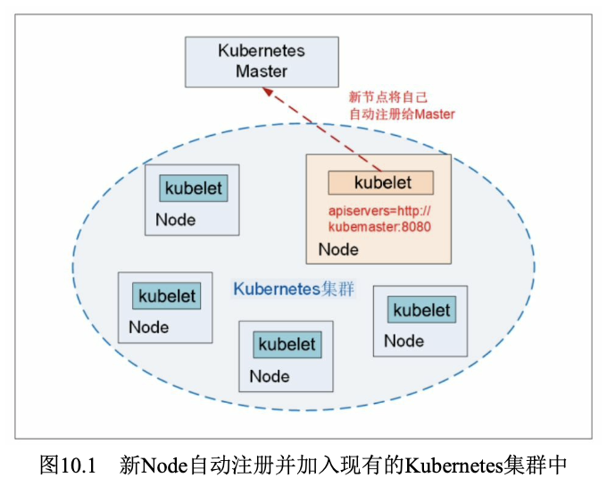
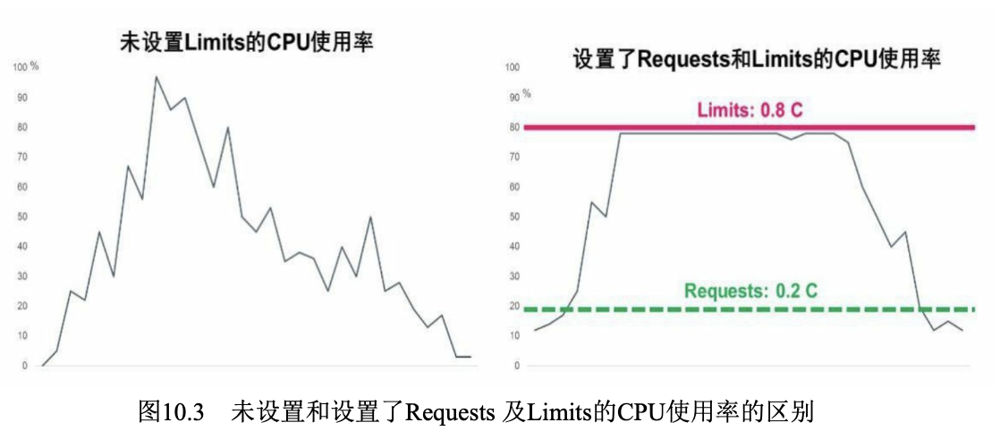
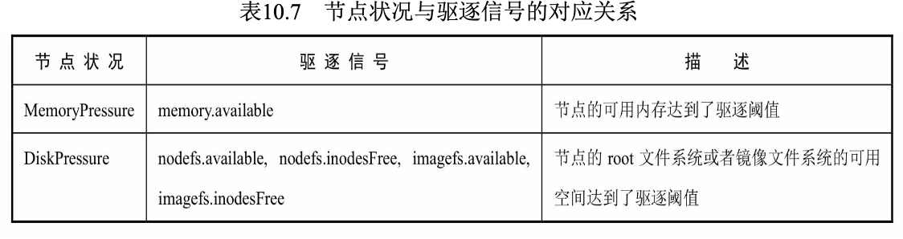
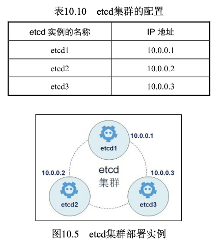
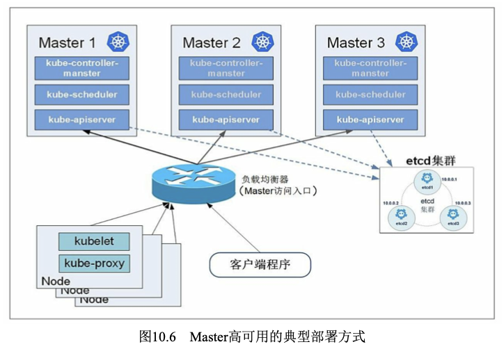
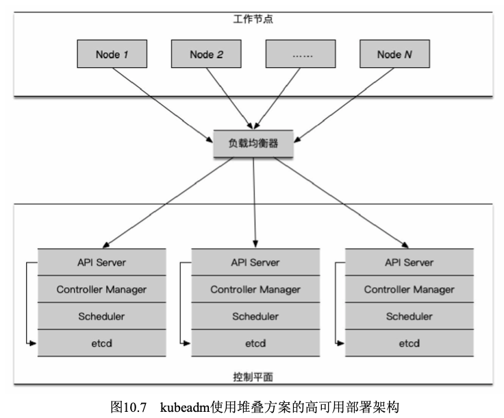
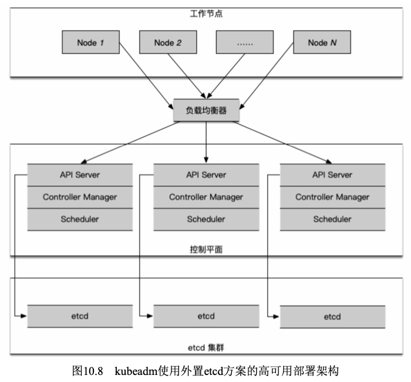
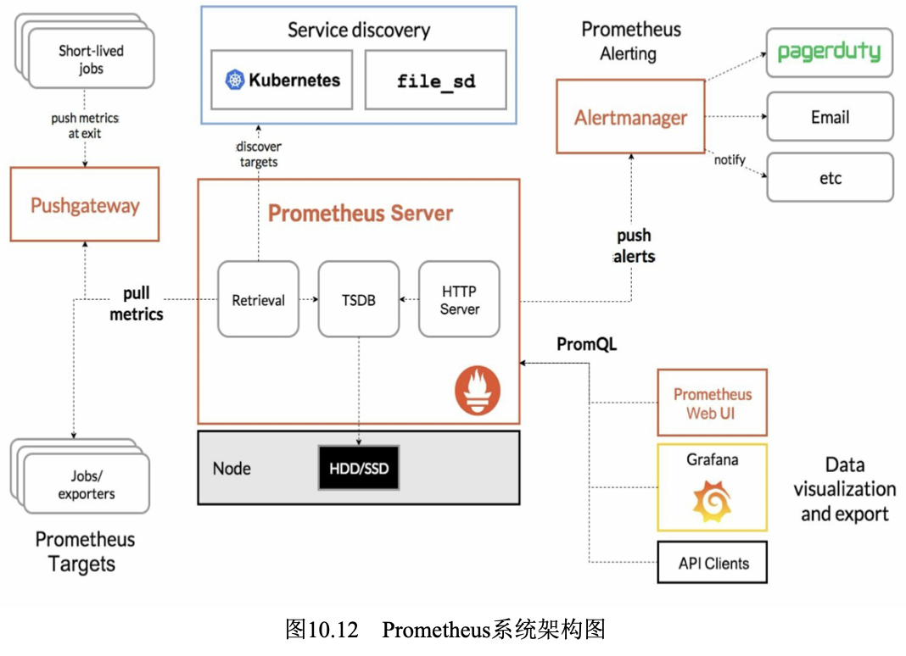
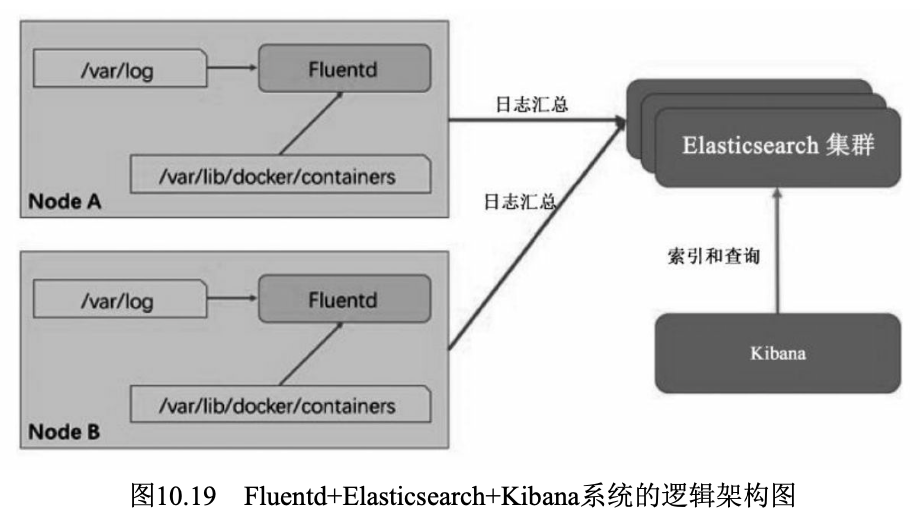
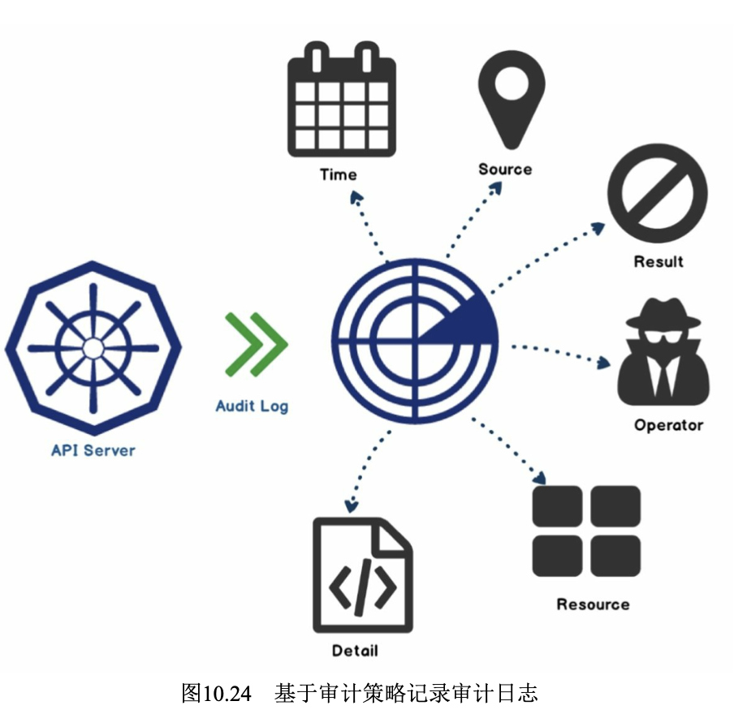

# Kubernetes集群管理
## Node的管理
### Node的隔离与恢复
在硬件升级、硬件维护等情况下，我们需要将某些Node隔离，使其 脱离Kubernetes集群的调度范围。Kubernetes提供了一种机制，既可以将 Node纳入调度范围，也可以将Node脱离调度范围。
```yaml
### unschedule_node.yaml
apiVersion: v1
kind: Node
metadata:
  name: k8s-node-1
  labels:
    kubernetes.io/hostname: k8s-node-1
spec:
  unscheduleable: true
```

```
kubectl replace -f unschedule_node.yaml
kubectl get nodes
kubectl patch node <node_name> -p '{"spec":{"unscheduleable":true}}'
kubectl cordon/uncordon <node_name>
```

### Node的扩容
在Kubernetes集群中，一个新Node的加入是非常简单的。在新的 Node上安装Docker、kubelet和kube-proxy服务，然后配置kubelet和kube-proxy的启动参数，将Master URL指定为当前Kubernetes集群Master的地址，最后启动这些服务。通过kubelet默认的自动注册机制，新的Node将会自动加入现有的Kubernetes集群中
Kubernetes Master在接受了新Node的注册之后，会自动将其纳入当前集群的调度范围，之后创建容器时，就可以对新的Node进行调度了。



## 更新资源对象的Label
Label是用户可灵活定义的对象属性，对于正在运行的资源对象， 我们随时可以通过kubectl label命令进行增加、修改、删除等操作。

```
kubectl label pod <pod-name> key=value
kubectl get pods -L key
kubectl label pod <pod-name> key-
kubectl label pod <pod-name> key=value --overwrite
```

## Namespace: 集群环境共享与隔离
在一个组织内部，不同的工作组可以在同一个Kubernetes集群中工作，Kubernetes通过命名空间和Context的设置对不同的工作组进行区分，使得它们既可以共享同一个Kubernetes集群的服务，也能够互不干扰

### 创建Namespace
为了在Kubernetes集群中实现这两个分组，首先需要创建两个命名空间：
```yaml
### namespace-development.yaml
apiVersion: v1
kind: Namespace
metadata:
  name: development

### namespace-production.yaml
apiVersion: v1
kind: Namespace
metadata:
  name: production
```

```
kubectl create -f namespace-development.yaml
kubectl create -f namespace-production.yaml
kubectl get ns/namespaces
kubectl create ns/namespaces <namespace-name>
```

### 定义Context（运行环境）
接下来，需要为这两个工作组分别定义一个 Context，即运行环境。这个运行环境将属于某个特定的命名空间。

```
kubectl config set-cluster kubernetes-cluster --server=https://192.168.1.128:8080
kubectl config set-context ctx-dev --namespace=development --cluster=kubernetes-cluster --user=dev
kubectl config set-context ctx-prod --namespace=production --cluster=kubernetes-cluster --user=prod

kubectl config view
```

### 设置工作组在特定Context环境下工作
使用`kubectl config use-context <context_name>`命令设置当前运行环境。
```yaml
### redis-slave-controller.yaml
apiVersion: v1
kind: ReplicationController
metadata:
  name: redis-slave
  labels:
    name: redis-slave
spec:
  replicas: 2
  selector:
    name: redis-slave
  template:
    metadata:
      labels:
        name: redis-slave
    spec:
      containers:
      - name: slave
        image: kubeguide/guestbook-redis-slave
        ports:
        - containerPort: 6379
```

```
// 下面的命令将把当前运行环境设置为ctx-dev
kubectl config use-context ctx-dev
kubectl create -f redis-slave-controller.yaml
kubectl get pods

// 下面的命令将把当前运行环境设置为ctx-prod
kubectl config use-context ctx-prod
kubectl get rc
kubectl get pods
kubectl create -f redis-slave-controller.yaml
kubectl get pods
```
至此，我们为两个工作组分别设置了两个运行环境，设置好当前运 行环境时，各工作组之间的工作将不会相互干扰，并且都能在同一个 Kubernetes集群中同时工作。

## Kubernetes资源管理
为了避免系统挂掉，该Node会选择“清理”某些Pod来释放资源，此时每个Pod都可能成为牺牲品。但有些Pod担负着更重要的职责，比其他 Pod更重要，比如与数据存储相关的、与登录相关的、与查询余额相关的，即使系统资源严重不足，也需要保障这些Pod的存活，Kubernetes中该保障机制的核心如下。
- 通过资源限额来确保不同的Pod只能占用指定的资源。
- 允许集群的资源被超额分配，以提高集群的资源利用率。
- 为Pod划分等级，确保不同等级的Pod有不同的服务质量 (QoS)，资源不足时，低等级的Pod会被清理，以确保高等级的Pod稳定运行。

### 计算资源管理
- Requests和Limits参数


### 资源配置范围管理(LimitRange)
### 资源服务质量管理（Resource QoS）
### 资源配额管理（Resource Quotas）
### ResourceQuota和LimitRange实践
### 资源管理总结
Kubernetes中资源管理的基础是容器和Pod的资源配置(Requests和 Limits)。容器的资源配置指定了容器请求的资源和容器能使用的资源 上限，Pod的资源配置则是Pod中所有容器的资源配置总和上限。
通过资源配额机制，我们可以对命名空间中所有Pod使用资源的总 量进行限制，也可以对这个命名空间中指定类型的对象的数量进行限 制。使用作用域可以让资源配额只对符合特定范围的对象加以限制，因 此作用域机制可以使资源配额的策略更加丰富、灵活。

## 资源紧缺时的Pod驱逐机制
### 驱逐策略
kubelet持续监控主机的资源使用情况，并尽量防止计算资源被耗尽。一旦出现资源紧缺的迹象，kubelet就会主动终止一个或多个Pod的运行，以回收紧缺的资源。当一个Pod被终止时，其中的容器会全部停止，Pod的状态会被设置为Failed。
### 驱逐信号
### 驱逐阈值
kubelet可以定义驱逐阈值，一旦超出阈值，就会触发kubelet进行资源回收操作。
### 驱逐监控频率
kubelet的--housekeeping-interval参数定义了一个时间间隔，kubelet 每隔一个这样的时间间隔就会对驱逐阈值进行评估。

### 节点的状况
kubelet会将一个或多个驱逐信号与节点的状况对应起来。
无论触发了硬阈值还是软阈值，kubelet都会认为当前节点的压力太大。

kubelet会持续向Master报告节点状态的更新过程，这一频率由参数--node-statusupdate- frequency指定，默认为10s。

### 节点状况的抖动

### 回收Node级别的资源
如果达到了驱逐阈值，并且也过了宽限期，kubelet就会回收超出限量的资源，直到驱逐信号量回到阈值以内。
kubelet在驱逐用户Pod之前，会尝试回收Node级别的资源。在观测到磁盘压力的情况下，基于服务器是否为容器运行时定义了独立的 imagefs，会导致不同的资源回收过程。

### 驱逐用户的Pod
kubelet会按照下面的标准对Pod的驱逐行为进行判断。 
- Pod要求的服务质量。 
- 根据Pod调度请求的被耗尽资源的消耗量。接下来，kubelet按照下面的顺序驱逐Pod。 
- BestEffort:紧缺资源消耗最多的Pod最先被驱逐。
- Burstable:根据相对请求来判断，紧缺资源消耗最多的Pod最先被驱逐，如果没有Pod超出它们的请求，则策略会瞄准紧缺资源消耗量最大的Pod。
- Guaranteed:根据相对请求来判断，紧缺资源消耗最多的Pod最先被驱逐，如果没有Pod超出它们的请求，策略会瞄准紧缺资源消耗量最大的Pod。

### 资源最少回收量
在某些场景下，驱逐Pod可能只回收了很少的资源，这就导致了 kubelet反复触发驱逐阈值。另外，回收磁盘这样的资源，是需要消耗时间的。
要缓和这种状况，kubelet可以对每种资源都定义minimum-reclaim。 kubelet一旦监测到了资源压力，就会试着回收不少于minimum-reclaim的 资源数量，使得资源消耗量回到期望的范围。

### 节点资源紧缺情况下的系统行为
- 调度器的行为：在节点资源紧缺的情况下，节点会向Master报告这一状况。在 Master上运行的调度器(Scheduler)以此为信号，不再继续向该节点调度新的Pod。
- Node的OOM行为：如果节点在kubelet能够回收内存之前遭遇了系统的OOM(内存不足)，节点则依赖oom_killer的设置进行响应。
- 对DaemonSet类型的Pod驱逐的考虑：通过DaemonSet创建的Pod具有在节点上自动重启的特性，因此我们不希望kubelet驱逐这种Pod;然而kubelet目前并没有能力分辨 DaemonSet的Pod，所以无法单独为其制定驱逐策略，所以强烈建议不要在DaemonSet中创建BestEffort类型的Pod，避免产生驱逐方面的问题。

### 可调度的资源和驱逐策略实践

### 现阶段问题
- kubelet无法及时观测到内存压力：kubelet目前从cAdvisor定时获取内存使用状况的统计情况。如果内 存使用在这个时间段内发生了快速增长，且kubelet无法观察到 MemoryPressure，则可能会触发OOMKiller。Kubernetes正在尝试将这一过程集成到memcg通知API中来减少这一延迟，而不是让内核首先发现这一情况。
- kubelet可能会错误地驱逐更多的Pod：这也是状态搜集存在时间差导致的。未来可能会通过按需获取根容器的统计信息来减少计算偏差。

## Pod Disruption Budget（主动驱逐保护）

## Kubernetes集群的高可用部署方案
### 手工方式高可用部署方案
#### etcd的高可用部署
etcd在整个Kubernetes集群中处于中心数据库的地位，为保证 Kubernetes集群的高可用性，首先需要保证数据库不是单一故障点。一方面，etcd需要以集群的方式进行部署，以实现etcd数据存储的冗余、备份与高可用;另一方面，etcd存储的数据本身也应考虑使用可靠的存储设备。
etcd集群的部署可以使用静态配置，也可以通过etcd提供的REST API在运行时动态添加、修改或删除集群中的成员。本节将对etcd集群的静态配置进行说明。关于动态修改的操作方法请参考etcd官方文档的说明。



- 首先，规划一个至少3台服务器(节点)的etcd集群，在每台服务器上都安装etcd。
- 然后修改每台服务器上etcd的配置文件/etc/etcd/etcd.conf。以etcd1为创建集群的实例，需要将其 ETCD_INITIAL_CLUSTER_STATE设置为new。启动etcd1服务器上的etcd服务。（systemctl restart etcd）
- etcd2和etcd3为加入etcd-cluster集群的实例，需要将其 ETCD_INITIAL_CLUSTER_STATE设置为exist。（systemctl restart etcd）
- 启动完成后，在任意etcd节点执行etcdctl cluster-health命令来查询集 群的运行状态（etcdctl cluster-health、etcdctl member list）

对于在etcd中需要保存的数据的可靠性，可以考虑使用RAID磁盘阵列、高性能存储设备、共享存储文件系统，或者使用云服务商提供的存储系统等来实现。

#### Master的高可用部署
在Kubernetes系统中，Master服务扮演着总控中心的角色，主要的 三个服务kube-apiserver、kube-controller-mansger和kube-scheduler通过不断与工作节点上的kubelet和kube-proxy进行通信来维护整个集群的健康工作状态。如果Master的服务无法访问某个Node，则会将该Node标记为不可用，不再向其调度新建的Pod。但对Master自身则需要进行额外监控，使Master不成为集群的单故障点，所以对Master服务也需要进行高可用部署。
以Master的kube-apiserver、kube-controller-mansger和kube-scheduler三个服务作为一个部署单元，类似于etcd集群的典型部署配置。使用至 少三台服务器安装Master服务，并且需要保证任何时候总有一套Master 能够正常工作。图展示了一种典型的部署方式。


Kubernetes建议Master的3个组件都以容器的形式启动，启动它们的 基础工具是kubelet，所以它们都将以Static Pod的形式启动并由kubelet监 控和自动重启。kubelet本身的高可用则通过操作系统来完成，例如使用 Linux的Systemd系统进行管理。

#### kube-apiserver的高可用部署
- kube-apiserver预先创建所有需要的CA证书和 基本鉴权文件等内容，然后在每台服务器上都创建其日志文件。（touch /var/log/lube-apiserver.log）
- 假设kubelet的启动参数指定--config=/etc/kubernetes/manifests，即 Static Pod定义文件所在的目录，接下来就可以创建kube-apiserver.yaml 配置文件用于启动kube-apiserver了
- 将kube-apiserver.yaml文件复制到kubelet监控 的/etc/kubernetes/manifests目录下，kubelet将会自动创建在YAML文件中 定义的kube-apiserver的Pod。
- 接下来在另外两台服务器上重复该操作，使得在每台服务器上都启 动一个kube-apiserver的Pod。

#### 为kube-apiserver配置负载均衡器
至此，我们启动了三个kube-apiserver实例，这三个kube-apiserver都可以正常工作，我们需要通过统一的、可靠的、允许部分Master发生故障的方式来访问它们，这可以通过部署一个负载均衡器来实现。
在不同的平台下，负载均衡的实现方式不同:在一些公用云如 GCE、AWS、阿里云上都有现成的实现方案;对于本地集群，我们可以选择硬件或者软件来实现负载均衡，比如Kubernetes社区推荐的方案 HAProxy和Keepalived，其中HAProxy负责负载均衡，而Keepalived负责 对HAProxy进行监控和故障切换。
在完成API Server的负载均衡配置之后，对其访问还需要注意以下内容。
- 如果Master开启了安全认证机制，那么需要确保在CA证书中包含负载均衡服务节点的IP。
- 对于外部的访问，比如通过kubectl访问API Server，需要配置 为访问API Server对应的负载均衡器的IP地址。

#### kube-controller-manager和kube-scheduler的高可用配置
不同于API Server，Master中另外两个核心组件kube-controller-manager和kube-scheduler会修改集群的状态信息，因此对于kube-controller-manager和kube-scheduler而言，高可用不仅意味着需要启动多个实例，还需要这些个实例能实现选举并选举出leader，以保证同一时间只有一个实例可以对集群状态信息进行读写，避免出现同步问题和一致性问题。Kubernetes对于这种选举机制的实现是采用租赁锁(lease-lock)来实现的，我们可以通过在kube-controller-manager和kube-scheduler的每个实例的启动参数中设置--leader-elect=true，来保证同一时间只会运行一个可修改集群信息的实例。

- 首先，在每个Master上都创建相应的日志文件（touch /var/log/kube-scheduler.log 、touch /var/log/kube-controller-manager.log）
- 然后，创建kube-controller-manager和kube-scheduler的YAML配置文 件。

将这两个YAML文件复制到kubelet监控的/etc/kubernetes/manifests目录下，kubelet会自动创建在YAML文件中定义的kube-controller-manager 和kube-scheduler的Pod。
至此，我们完成了Kubernetes Master组件的高可用配置。

### 使用kubeadm的高可用部署方案
kubeadm提供了对Master的高可用部署方案，到Kubernetes 1.13版本 时Kubeadm达到GA稳定阶段，这表明kubeadm不仅能够快速部署一个符 合一致性要求的Kubernetes集群，更具备足够的弹性，能够支持多种实 际生产需求。在Kubernetes 1.14版本中又加入了方便证书传递的-- experimental-upload-certs参数，减少了安装过程中的大量证书复制工 作。

#### 堆叠方案:etcd服务和控制平面被部署在同样的节点中，对基础设施的要求较低，对故障的应对能力也较低


#### 外置etcd方案:etcd和控制平面被分离，需要更多的硬件，也 有更好的保障能力


1. 准备工作。两种部署方案都有同样的准备工作要做。除了需要符合kubeadm部 署的基本要求，因为在下面的部署过程中需要使用SCP进行传输，所以 还需要操作机具备SSH到所有节点的连接能力。为了保证高可用性， Maste服务器至少需要有三台;外置etcd的方案则需要有三台以上的etcd 服务器。

2. 为API Server􏰀供负载均衡服务。从前面所示的架构图中可以看到，所有节点都需要通过负载均衡器 和API Server进行通信。负载均衡器有非常多的方案，需要根据实际情 况进行选择。

## Kubernetes集群监控
Kubernetes的早期版本依靠Heapster来实现完整的性能数据采集和监 控功能，Kubernetes从1.8版本开始，性能数据开始以Metrics API的方式提供标准化接口，并且从1.10版本开始将Heapster替换为Metrics Server。在Kubernetes新的监控体系中，Metrics Server用于􏰀供核心指标 (Core Metrics)，包括Node、Pod的CPU和内存使用指标。对其他自定 义指标(Custom Metrics)的监控则由Prometheus等组件来完成。

### 通过Metrics Server监控Pod和Node的CPU和内存资源使用数据
### Prometheus + Grafana集群性能监控平台搭建


##  集群统一日志管理
Kubernetes推荐采用Fluentd+Elasticsearch+Kibana完成对系统和容器 日志的采集、查询和展现工作。
部署统一的日志管理系统，需要以下两个前提条件。
- API Server正确配置了CA证书。
- DNS服务启动、运行


在各Node上都运行了一个Fluentd容器，采集本节点/var/log 和/var/lib/docker/containers两个目录下的日志进程，将其汇总到 Elasticsearch集群，最终通过Kibana完成和用户的交互工作。
这里有一个特殊的需求:Fluentd必须在每个Node上运行。为了满 足这一需求，我们通过以下几种方式部署Fluentd。
- 直接在Node主机上部署Fluentd。
- 利用kubelet的--config参数，为每个Node都加载Fluentd Pod。 
- 利用DaemonSet让Fluentd Pod在每个Node上运行。

### 创建Elasticsearch Deployment和Service
### 在每个Node上启动Fluentd
### 运行kibana

## Kubernetes的审计机制
Kubernetes为了加强对集群操作的安全监管，从1.4版本开始引入审计机制，主要体现为审计日志(Audit Log)。审计日志按照时间顺序记 录了与安全相关的各种事件，这些事件有助于系统管理员快速、集中了 解以下问题:
- 发生了什么事情? 
- 作用于什么对象? 
- 在什么时间发生? 
- 谁(从哪儿)触发的?
- 在哪儿观察到的? 
- 活动的后继处理行为是怎样的?


我们可以将Audit Policy视作一组规则，这组规则定义了有哪些事件 及数据需要记录(审计)。当一个事件被处理时，规则列表会依次尝试 匹配该事件，第1个匹配的规则会决定审计日志的级别(Audit Level)，目前定义的几种级别如下(按级别从低到高排列)。
- None:不生成审计日志。
- Metadata:只记录Request请求的元数据如requesting user、timestamp、resource、verb等，但不记录请求及响应的具体内容。
- Request:记录Request请求的元数据及请求的具体内容。
- RequestResponse:记录事件的元数据，以及请求与应答的具体

None以上的级别会生成相应的审计日志并将审计日志输出到后端，当前的后端实现如下。
- Log backend:以本地日志文件记录保存，为JSON日志格式，我们需要对API Server的启动命令设置下列参数。
- Webhook backend:回调外部接口进行通知，审计日志以 JSON格式发送(POST方式)给Webhook Server，支持batch和blocking 这两种通知模式

需要注意的是，开启审计功能会增加API Server的内存消耗量，因 为此时需要额外的内存来存储每个请求的审计上下文数据，而增加的内 存量与审计功能的配置有关，比如更详细的审计日志所需的内存更多。

通常审计日志可以以本地日志文件方式保存，然后使用Fluentd作为 Agent采集该日志并存储到Elasticsearch，用Kibana等UI界面对日志进行 展示和查询。

## 使用Web UI（Dashboard）管理集群
Kubernetes的Web UI网页管理工具kubernetes-dashboard可􏰀供部署 应用、资源对象管理、容器日志查询、系统监控等常用的集群管理功能。

## Helm：Kubernetes应用包管理工具
随着容器技术逐渐被企业接受，在Kubernetes上已经能便捷地部署简单的应用了。但对于复杂的应用中间件，在Kubernetes上进行容器化部署并非易事，通常需要先研究Docker镜像的运行需求、环境变量等内容，并能为这些容器定制存储、网络等设置，最后设计和编写 Deployment、ConfigMap、Service及Ingress等相关YAML配置文件，再提交给Kubernetes部署。这些复杂的过程将逐步被Helm应用包管理工具 实现。

### Helm概述
Helm是一个由CNCF孵化和管理的项目，用于对需要在Kubernetes 上部署的复杂应用进行定义、安装和更新。Helm以Chart的方式对应用 软件进行􏰁述，可以方便地创建、版本化、共享和发布复杂的应用软 件。

### Helm的主要概念
- Chart:一个Helm包，其中包含运行一个应用所需要的工具和资源定义，还可能包含Kubernetes集群中的服务定义，类似于Homebrew 中的formula、APT中的dpkg或者Yum中的RPM文件。
- Release:在Kubernetes集群上运行的一个Chart实例。在同一个集群上，一个Chart可以被安装多次。例如有一个MySQL Chart，如果想在服务器上运行两个MySQL数据库，就可以基于这个Chart安装两次。 每次安装都会生成新的Release，会有独立的Release名称。
- Repository:用于存放和共享Chart仓库。
简单来说，Helm整个系统的主要任务就是，在仓库中查找需要的Chart，然后将Chart以Release的形式安装到Kubernetes集群中。

### 安装Helm
### Helm的常见用法
```
helm search <chart-name>
helm install <chart-name>

```
### --set的格式和限制

- --set a=b,c=d
```
a: b
c: d
```
- --set outer.inner=value
```
outer:
  inner: value
```
- --set name={a,b,c}
```
name:
  - a
  - b
  - c
```
### 更多的安装方法
使用helm install命令时，可以通过多种安装源进行安装。
- 上面用到的Chart仓库。
- 本地的Chart压缩包(helm install foo-0.1.1.tgz)。
- 一个Chart目录(helm install path/to/foo)。
- 一个完整的URL(helm install https://example.com/charts/foo- 1.2.3.tgz)。

### helm upgrade和helm rollback: 应用的更新或回滚
```
helm upgrade xxx
helm rollback xxx
```

### helm install/upgrade/rollback命令的常用参数

### helm delete: 删除一个Release
```
helm delete <chart-name>
```

### helm repo：仓库的使用
```
helm repo list
helm repo add
helm repo update
```

### 自定义Chart
### 对Chart目录结构和配置文件的说明
### 对Chart.yaml文件的说明
### 快速制作自定义的Chart
### 搭建私有Repository

## 参考