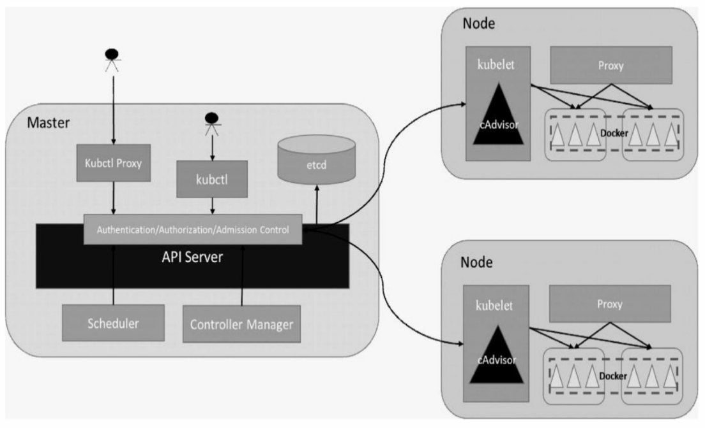

# 深入掌握Service
## Kubernetes API Server原理解析
总体来看，Kubernetes API Server的核心功能是􏰀供Kubernetes各类资源对象(如Pod、RC、Service等)的增、删、改、查及Watch等HTTP Rest接口，成为集群内各个功能模块之间数据交互和通信的中心枢纽，是整个系统的数据总线和数据中心。除此之外，它还有以下一些功能特 性。
- 是集群管理的API入口。
- 是资源配额控制的入口。
- 提供了完备的集群安全机制。

### Kubernetes API Server概述
Kubernetes API Server通过一个名为kube-apiserver的进程提供服务，该进程运行在Master上。在默认情况下，kube-apiserver进程在本机的8080端口(对应参数--insecure-port)提供REST服务。我们可以同时启动HTTPS安全端口(--secure-port=6443)来启动安全机制，加强 REST API访问的安全性。
```
curl localhost:8080/api
curl localhost:8080/api/v1
```

使用场景：
- 运行在Pod里的用户进程调用Kubernetes API，通常用来实现分布式集群搭建的目标。
- 开发基于Kubernetes的管理平台。比如调用 Kubernetes API来完成Pod、Service、RC等资源对象的图形化创建和管理界面，此时可以使用Kubernetes及各开源社区为开发人员􏰀供的各种语言版本的 Client Library。

### API Server架构解析
- API层:主要以REST方式提供各种API接口，除了有 Kubernetes资源对象的CRUD和Watch等主要API，还有健康检查、UI、 日志、性能指标等运维监控相关的API。Kubernetes从1.11版本开始废弃 Heapster监控组件，转而使用Metrics Server提供Metrics API接口，进一步完善了自身的监控能力。
- 访问控制层:当客户端访问API接口时，访问控制层负责对用户身份鉴权，验明用户身份，核准用户对Kubernetes资源对象的访问权限，然后根据配置的各种资源访问许可逻辑(Admission Control)，判断是否允许访问。
- 注册表层:Kubernetes把所有资源对象都保存在注册表 (Registry)中，针对注册表中的各种资源对象都定义了:资源对象的类型、如何创建资源对象、如何转换资源的不同版本，以及如何将资源编码和解码为JSON或ProtoBuf格式进行存储。
- etcd数据库:用于持久化存储Kubernetes资源对象的KV数据库。etcd的watch API接口对于API Server来说至关重要，因为通过这个接口，API Server 创新性地设计了List-Watch这种高性能的资源对象实时同步机制，使Kubernetes可以管理超大规模的集群，及时响应和快速处理集群中的各种事件。


- 首先，借助etcd提供的Watch API接口，API Server可以监听 (Watch)在etcd上发生的数据操作事件，比如Pod创建事件、更新事件、删除事件等，在这些事件发生后，etcd会及时通知API Server。图 5.3中API Server与etcd之间的交互箭头表明了这个过程:当一个 ReplicaSet对象被创建并被保存到etcd中后(图中的2.Create RepliatSet箭头)，etcd会立即发送一个对应的Create事件给API Server(图中的 3.Send RepliatSet Create Event箭头)，与其类似的6、7、10、11箭头都是针对Pod的创建、更新事件的。
- 然后，为了让Kubernetes中的其他组件在不访问底层etcd数据库的情况下，也能及时获取资源对象的变化事件，API Server模仿etcd的 Watch API接口提供了自己的Watch接口，这样一来，这些组件就能近乎实时地获取它们感兴趣的任意资源对象的相关事件通知了。图5.3中 controller-manager、scheduler、kublet等组件与API Server之间的3个标记有List-Watch的虚框表明了这个过程。同时，在监听自己感兴趣的资源的时候，客户端可以增加过滤条件，以List-Watch 3为例，node1节点上的kubelet进程只对自己节点上的Pod事件感兴趣。
- 最后，Kubernetes List-Watch用于实现数据同步的代码逻辑。客户 端首先调用API Server的List接口获取相关资源对象的全量数据并将其缓 存到内存中，然后启动对应资源对象的Watch协程，在接收到Watch事件后，再根据事件的类型(比如新增、修改或删除)对内存中的全量资源对象列表做出相应的同步修改，从实现上来看，这是一种全量结合增量的、高性能的、近乎实时的数据同步方式。

API Server针对每种资源对象都引入了一个相对不变的internal版本，每个版本只要支持转换为internal版本，就能够与其他版本进行间接转换。


根据Kubernetes的设计，每种官方内建的资源对象如Node、 Pod、Service等的实现都包含以下主要功能。

- 资源对象的元数据(Schema)的定义:可以将其理解为数据库Table的定义，定义了对应资源对象的数据结构，官方内建资源对象的元数据定义是固化在源码中的。
- 资源对象的校验逻辑:确保用户提交的资源对象的属性的合法性。
- 资源对象的CRUD操作代码:可以将其理解为数据库表的 CRUD代码，但比后者更难，因为API Server对资源对象的CRUD操作都会保存到etcd数据库中，对处理性能的要求也更高，还要考虑版本兼容性和版本转换等复杂问题。
- 资源对象相关的“自动控制器”(如RC、Deployment等资源对象背后的控制器):这是很重要的一个功能。因为Kubernetes是一个以自动化为核心目标的平台，用户给出期望的资源对象声明，运行过程中则由资源背后的“自动控制器”负责，确保对应资源对象的数量、状态、行为都始终符合用户的预期。

### 独特的Kubernetes Proxy API接口
Kubernetes API Server最主要的REST接口是资源对象的 增、删、改、查接口，除此之外，它还􏰀供了一类很特殊的REST接口 Kubernetes Proxy API接口，这类接口的作用是代理REST请求，即 Kubernetes API Server把收到的REST请求转发到某个Node上的kubelet守护进程的REST端口，由该kubelet进程负责响应。

### 集群功能模块之间的通信


常见的一个交互场景是kubelet进程与API Server的交互。每个Node 上的kubelet每隔一个时间周期，就会调用一次API Server的REST接口报告自身状态，API Server在接收到这些信息后，会将节点状态信息更新到etcd中。此外，kubelet也通过API Server的Watch接口监听Pod信息，如果监听到新的Pod副本被调度绑定到本节点，则执行Pod对应的容器创建和启动逻辑;如果监听到Pod对象被删除，则删除本节点上相应的Pod 容器;如果监听到修改Pod的信息，kubelet就会相应地修改本节点的Pod 容器。

另一个交互场景是kube-controller-manager进程与API Server的交互。kube-controller-manager中的Node Controller模块通过API Server提供的Watch接口实时监控Node的信息，并做相应处理。

还有一个比较重要的交互场景是kube-scheduler与API Server的交互。Scheduler通过API Server的Watch接口监听到新建Pod副本的信息后，会检索所有符合该Pod要求的Node列表，开始执行Pod调度逻辑，在调度成功后将Pod绑定到目标节点上。

为了缓解集群各模块对API Server的访问压力，各功能模块都采用缓存机制来缓存数据。各功能模块定时从API Server获取指定的资源对象信息(通过List-Watch方法)，然后将这些信息保存到本地缓存中，功能模块在某些情况下不直接访问API Server，而是通过访问缓存数据来间接访问API Server。

## Controller Manager原理解析
Controller Manager内部包含8种Controller，每种Controller都负责一种特定资源 的控制流程，而Controller Manager正是这些Controller的核心管理者。
- Replication Controller
- Node Controlle
- ResourceQuota Controlle
- Namespace Controller
- ServiceAccount Controller
- Token Controller
- Service Controller
- Endpoint Controller


### Replication Controller
Replication Controller的核心作用是确保在任何时候集群中某个RC 关联的Pod副本数量都保持预设值。如果发现Pod的副本数量超过预期值，则Replication Controller会销毁一些Pod副本;反之，Replication Controller会自动创建新的Pod副本，直到符合条件的Pod副本数量达到预设值。需要注意:只有当Pod的重启策略是Always时 (RestartPolicy=Always)，Replication Controller才会管理该Pod的操作(例如创建、销毁、重启等)。在通常情况下，Pod对象被成功创建后 不会消失，唯一的例外是当Pod处于succeeded或failed状态的时间过长 (超时参数由系统设定)时，该Pod会被系统自动回收，管理该Pod的副本控制器将在其他工作节点上重新创建、运行该Pod副本。

Replication Controller的职责：
- 确保在当前集群中有且仅有N个Pod实例，N是在RC中定义的 Pod副本数量。
- 通过调整RC的spec.replicas属性值来实现系统扩容或者缩容。
- 通过改变RC中的Pod模板(主要是镜像版本)来实现系统的滚动升级。

使用场景：
- 重新调度(Rescheduling)。如前面所述，不管想运行1个副本还是1000个副本，副本控制器都能确保指定数量的副本存在于集群
中，即使发生节点故障或Pod副本被终止运行等意外状况。
- 弹性伸缩(Scaling)。手动或者通过自动扩容代理修改副本控制器的spec.replicas属性值，非常容易实现增加或减少副本的数量。
- 滚动更新(Rolling Updates)。副本控制器被设计成通过逐个替换Pod的方式来辅助服务的滚动更新。推荐的方式是创建一个只有一个副本的新RC，若新RC副本数量加1，则旧RC的副本数量减1，直到这个旧RC的副本数量为0，然后删除该旧RC。通过上述模式，即使在滚动更新的过程中发生了不可预料的错误，Pod集合的更新也都在可控范围内。在理想情况下，滚动更新控制器需要将准备就绪的应用考虑在内，并保证在集群中任何时刻都有足够数量的可用Pod。

### Node Controller
kubelet进程在启动时通过API Server注册自身的节点信息，并定时向API Server汇报状态信息，API Server在接收到这些信息后，会将这些 信息更新到etcd中。在etcd中存储的节点信息包括节点健康状况、节点资源、节点名称、节点地址信息、操作系统版本、Docker版本、kubelet 版本等。节点健康状况包含“就绪”(True)“未就绪”(False)和“未知”(Unknown)三种。


### ResourceQuota Controller
作为完备的企业级的容器集群管理平台，Kubernetes也提供了ResourceQuota Controller(资源配额管理)这一高级功能，资源配额管 理确保了指定的资源对象在任何时候都不会超量占用系统物理资源，避免了由于某些业务进程的设计或实现的缺陷导致整个系统运行紊乱甚至意外宕机，对整个集群的平稳运行和稳定性有非常重要的作用。
- 容器级别，可以对CPU和Memory进行限制。
- Pod级别，可以对一个Pod内所有容器的可用资源进行限制。
- Namespace级别，为Namespace(多租户)级别的资源限制， 包括:
  - Pod数量;
  - Replication Controller数量;
  - Service数量; 
  - ResourceQuota数量; 
  - Secret数量; 
  - 可持有的PV数量。
 
 Kubernetes的配额管理是通过Admission Control(准入控制)来控制 的，Admission Control当前提供了两种方式的配额约束，分别是 LimitRanger与ResourceQuota。其中LimitRanger作用于Pod和Container， ResourceQuota则作用于Namespace，限定一个Namespace里的各类资源的使用总额。
 如果在Pod定义中同时声明了LimitRanger，则用户通过API Server请求创建或修改资源时，Admission Control会计算当前配额的使用情况，如果不符合配额约束，则创建对象失败。对于定义了 ResourceQuota的Namespace，ResourceQuota Controller组件则负责定期统计和生成该Namespace下的各类对象的资源使用总量，统计结果包括 Pod、Service、RC、Secret和Persistent Volume等对象实例个数，以及该 Namespace下所有Container实例所使用的资源量(目前包括CPU和内 存)，然后将这些统计结果写入etcd的resourceQuotaStatusStorage目录 (resourceQuotas/status)下。写入resourceQuotaStatusStorage的内容包含 Resource名称、配额值(ResourceQuota对象中spec.hard域下包含的资源 的值)、当前使用值(ResourceQuota Controller统计出来的值)。随后这些统计信息被Admission Control使用，以确保相关Namespace下的资源配额总量不会超过ResourceQuota中的限定值。


### Namespace Controller
用户通过API Server可以创建新的Namespace并将其保存在etcd中， Namespace Controller定时通过API Server读取这些Namespace的信息。如果Namespace被API标识为优雅删除(通过设置删除期限实现，即设置 DeletionTimestamp属性)，则将该Namespace的状态设置成Terminating 并保存到etcd中。同时Namespace Controller删除该Namespace下的 ServiceAccount、RC、Pod、Secret、PersistentVolume、ListRange、 ResourceQuota和Event等资源对象。
在Namespace的状态被设置成Terminating后，由Admission Controller的NamespaceLifecycle插件来阻止为该Namespace创建新的资源。同时，在Namespace Controller删除该Namespace中的所有资源对象后，Namespace Controller对该Namespace执行finalize操作，删除Namespace的spec.finalizers域中的信息。
如果Namespace Controller观察到Namespace设置了删除期限，同时 Namespace的spec.finalizers域值是空的，那么Namespace Controller将通过API Server删除该Namespace资源。

### Service Controller与Endpoints Controller
Endpoints表示一个Service对应的所有Pod副本的访问地址，Endpoints Controller就是负责生成和维护所有Endpoints对象的控制器。

它负责监听Service和对应的Pod副本的变化，如果监测到Service被删除，则删除和该Service同名的Endpoints对象。如果监测到新的Service 被创建或者修改，则根据该Service信息获得相关的Pod列表，然后创建或者更新Service对应的Endpoints对象。如果监测到Pod的事件，则更新它所对应的Service的Endpoints对象(增加、删除或者修改对应的 Endpoint条目)。
Service Controller的作用，它其实是属于Kubernetes集群与外部的云平台之间的一个接口控制器。Service Controller监听Service 的变化，如果该Service是一个LoadBalancer类型的 Service(externalLoadBalancers=true)，则Service Controller确保在外部的云平台上该Service对应的LoadBalancer实例被相应地创建、删除及更新路由转发表(根据Endpoints的条目)。

## Scheduler原理解析
Kubernetes Scheduler在整个系统中承担了“承上启下”的重要功能，“承上”是指它负责接收Controller Manager创建的新Pod，为其安排一个落脚的“家”--目标Node;“启下”是指安置工作完成后，目标Node上的kubelet服务进程接管后继工作，负责Pod生命周期中的“下半生”。
具体来说，Kubernetes Scheduler的作用是将待调度的Pod(API新创建的Pod、Controller Manager为补足副本而创建的Pod等)按照特定的调度算法和调度策略绑定(Binding)到集群中某个合适的Node上，并将绑定信息写入etcd中。在整个调度过程中涉及三个对象，分别是待调度 Pod列表、可用Node列表，以及调度算法和策略。简单地说，就是通过调度算法调度为待调度Pod列表中的每个Pod从Node列表中选择一个最适合的Node。
随后，目标节点上的kubelet通过API Server监听到Kubernetes Scheduler产生的Pod绑定事件，然后获取对应的Pod清单，下载Image镜 像并启动容器。

调度流程：
- 预选调度过程，即遍历所有目标Node，筛选出符合要求的候选节点。为此，Kubernetes内置了多种预选策略(xxx Predicates)供用户选择。
- 确定最优节点，在第1步的基础上，采用优选策略(xxx Priority)计算出每个候选节点的积分，积分最高者胜出。

Scheduler中可用的预选策略包含:NoDiskConflict、 PodFitsResources、PodSelectorMatches、PodFitsHost、 CheckNodeLabelPresence、CheckServiceAffinity和PodFitsPorts策略等。 其默认的AlgorithmProvider加载的预选策略Predicates包括: PodFitsPorts(PodFitsPorts)、PodFitsResources(PodFitsResources)、 NoDiskConflict(NoDiskConflict)、 MatchNodeSelector(PodSelectorMatches)和 HostName(PodFitsHost)，即每个节点只有通过前面提及的5个默认预选策略后，才能初步被选中，进入下一个流程。

Scheduler中可用的预选策略：
- NoDiskConflict: 判断备选Pod的gcePersistentDisk或AWSElasticBlockStore和备选的节点中已存在的Pod是否存在冲突。
- PodFitsResources: 判断备选节点的资源是否满足备选Pod的需求。
- PodSelectorMatches: 判断备选节点是否包含备选Pod的标签选择器指定的标签。
- PodFitsHost: 判断备选Pod的spec.nodeName域所指定的节点名称和备选节点的名称是否一致，如果一致，则返回true，否则返回false。
- CheckNodeLabelPresence: 如果用户在配置文件中指定了该策略，则Scheduler会通过 RegisterCustomFitPredicate方法注册该策略。该策略用于判断策略列出的标签在备选节点中存在时，是否选择该备选节点。
- CheckServiceAffinity: 如果用户在配置文件中指定了该策略，则Scheduler会通过 RegisterCustomFitPredicate方法注册该策略。该策略用于判断备选节点是否包含策略指定的标签，或包含和备选Pod在相同Service和Namespace 下的Pod所在节点的标签列表。如果存在，则返回true，否则返回false。
- PodFitsPorts: 判断备选Pod所用的端口列表中的端口是否在备选节点中已被占用，如果被占用，则返回false，否则返回true。

优选策略的详细说明：
- LeastRequestedPriority: 该优选策略用于从备选节点列表中选出资源消耗最小的节点。
- CalculateNodeLabelPriority: 如果用户在配置文件中指定了该策略，则scheduler会通过 RegisterCustomPriorityFunction方法注册该策略。该策略用于判断策略列出的标签在备选节点中存在时，是否选择该备选节点。如果备选节点的标签在优选策略的标签列表中且优选策略的presence值为true，或者备选节点的标签不在优选策略的标签列表中且优选策略的presence值为 false，则备选节点score=10，否则备选节点score=0。
- BalancedResourceAllocation: 该优选策略用于从备选节点列表中选出各项资源使用率最均衡的节点。

## kubelet运行机制解析
在Kubernetes集群中，在每个Node(又称Minion)上都会启动一个 kubelet服务进程。该进程用于处理Master下发到本节点的任务，管理 Pod及Pod中的容器。每个kubelet进程都会在API Server上注册节点自身的信息，定期向Master汇报节点资源的使用情况，并通过cAdvisor监控容器和节点资源。

### 节点管理
节点通过设置kubelet的启动参数“--register-node”，来决定是否向 API Server注册自己。如果该参数的值为true，那么kubelet将试着通过 API Server注册自己。

### Pod管理
kubelet通过以下几种方式获取自身Node上要运行的Pod清单。
- 文件:kubelet启动参数“--config”指定的配置文件目录下的文件(默认目录为“/etc/ kubernetes/manifests/”)。通过--file-check-frequency设置检查该文件目录的时间间隔，默认为20s。
- HTTP端点(URL):通过“--manifest-url”参数设置。通过--http-check-frequency设置检查该HTTP端点数据的时间间隔，默认为 20s。
- API Server:kubelet通过API Server监听etcd目录，同步Pod列表。

所有以非API Server方式创建的Pod都叫作Static Pod。kubelet将 Static Pod的状态汇报给API Server，API Server为该Static Pod创建一个 Mirror Pod和其相匹配。Mirror Pod的状态将真实反映Static Pod的状态。 当Static Pod被删除时，与之相对应的Mirror Pod也会被删除。

kubelet读取监听到的信息，如果是创建和修改Pod任务，则做如下处理。
- 为该Pod创建一个数据目录。
- 从API Server读取该Pod清单。
- 为该Pod挂载外部卷(External Volume)。
- 下载Pod用到的Secret。
- 检查已经运行在节点上的Pod，如果该Pod没有容器或Pause容器(“kubernetes/pause”镜像创建的容器)没有启动，则先停止Pod里所有容器的进程。如果在Pod中有需要删除的容器，则删除这些容器。
- 用“kubernetes/pause”镜像为每个Pod都创建一个容器。该Pause 容器用于接管Pod中所有其他容器的网络。每创建一个新的Pod，kubelet 都会先创建一个Pause容器，然后创建其他容器。“kubernetes/pause”镜像 大概有200KB，是个非常小的容器镜像。
- 为Pod中的每个容器做如下处理。
  - 为容器计算一个Hash值，然后用容器的名称去查询对应Docker 容器的Hash值。若查找到容器，且二者的Hash值不同，则停止Docker中容器的进程，并停止与之关联的Pause容器的进程;若二者相同，则不做任何处理。
  - 如果容器被终止了，且容器没有指定的restartPolicy(重启策略)，则不做任何处理。
  - 调用Docker Client下载容器镜像，调用Docker Client运行容器。

### 容器健康检查
Pod通过两类探针来检查容器的健康状态。
一类是LivenessProbe探针，用于判断容器是否健康并反馈给kubelet。如果LivenessProbe探针探测到容器不健康，则kubelet将删除该容器，并根据容器的重启策略做相应的处理。如果一个容器不包含LivenessProbe探针，那么kubelet认为该容器的LivenessProbe探针返回的值永远是Success;
另一类是 ReadinessProbe探针，用于判断容器是否启动完成，且准备接收请求。如果ReadinessProbe探针检测到容器启动失败，则Pod的状态将被修改， Endpoint Controller将从Service的Endpoint中删除包含该容器所在Pod的IP 地址的Endpoint条目。

LivenessProbe实现方式：
- ExecAction: 在容器内部执行一个命令，如果该命令的退出状态码为0，则表明容器健康。
- TCPSocketAction: 通过容器的IP地址和端口号执行TCP检查，如果端口能被访问，则表明容器健康。
- HTTPGetAction: 通过容器的IP地址和端口号及路径调用 HTTP Get方法，如果响应的状态码大于等于200且小于等于400，则认为容器状态健康。

## kube-proxy运行机制解析
在Kubernetes集群的每个Node上都会运行一个kube-proxy服务进程，我们可以把这个进程看作Service的透明代理兼负载均衡器，其核心功能是将到某个Service的访问请求转发到后端的多个Pod实例上。此外，Service的Cluster IP与NodePort等概念是kube-proxy服务通过iptables 的NAT转换实现的，kube-proxy在运行过程中动态创建与Service相关的 iptables规则，这些规则实现了将访问服务(Cluster IP或NodePort)的请求负载分发到后端Pod的功能。由于iptables机制针对的是本地的kube-proxy端口，所以在每个Node上都要运行kube-proxy组件，这样一来，在 Kubernetes集群内部，我们可以在任意Node上发起对Service的访问请求。综上所述，由于kube-proxy的作用，在Service的调用过程中客户端无须关心后端有几个Pod，中间过程的通信、负载均衡及故障恢复都是
透明的。
起初，kube-proxy进程是一个真实的TCP/UDP代理，类似HAProxy，负责从Service到Pod的访问流量的转发，这种模式被称为 userspace(用户空间代理)模式。如图5.13所示，当某个Pod以Cluster IP方式访问某个Service的时候，这个流量会被Pod所在本机的iptables转发到本机的kube-proxy进程，然后由kube-proxy建立起到后端Pod的 TCP/UDP连接，随后将请求转发到某个后端Pod上，并在这个过程中实现负载均衡功能。


如图5.15所示，Kubernetes从1.2版本开始，将iptables作为kube-proxy的默认模式。iptables模式下的kube-proxy不再起到Proxy的作用，其核心功能:通过API Server的Watch接口实时跟踪Service与Endpoint的变更信息，并更新对应的iptables规则，Client的请求流量则通过iptables 的NAT机制“直接路由”到目标Pod。


iptables模式虽然实现起来简单，但存在无法避免的缺陷:在集群中的Service和Pod大量增加以后，iptables中的规则会急速膨胀，导致性能显著下降，在某些极端情况下甚至会出现规则丢失的情况，并且这种故障难以重现与排查，于是Kubernetes从1.8版本开始引入第3代的 IPVS(IP Virtual Server)模式，如图5.16所示。IPVS在Kubernetes 1.11 中升级为GA稳定版。


iptables与IPVS虽然都是基于Netfilter实现的，但因为定位不同，二者有着本质的差别:iptables是为防火墙而设计的;IPVS则专门用于高性能负载均衡，并使用更高效的数据结构(Hash表)，允许几乎无限的规模扩张，因此被kube-proxy采纳为第三代模式。
与iptables相比，IPVS拥有以下明显优势: 
- 为大型集群􏰀供了更好的可扩展性和性能;
- 支持比iptables更复杂的复制均衡算法(最小负载、最少连接、加权等);
- 支持服务器健康检查和连接重试等功能;
- 可以动态修改ipset的集合，即使iptables的规则正在使用这个集合。

由于IPVS无法提供包过滤、airpin-masquerade tricks(地址伪装)、 SNAT等功能，因此在某些场景(如NodePort的实现)下还要与iptables 搭配使用。在IPVS模式下，kube-proxy又做了重要的升级，即使用 iptables的扩展ipset，而不是直接调用iptables来生成规则链。

## 参考
1. [架构](https://www.kubernetes.org.cn/kubernetes%E8%AE%BE%E8%AE%A1%E6%9E%B6%E6%9E%84)