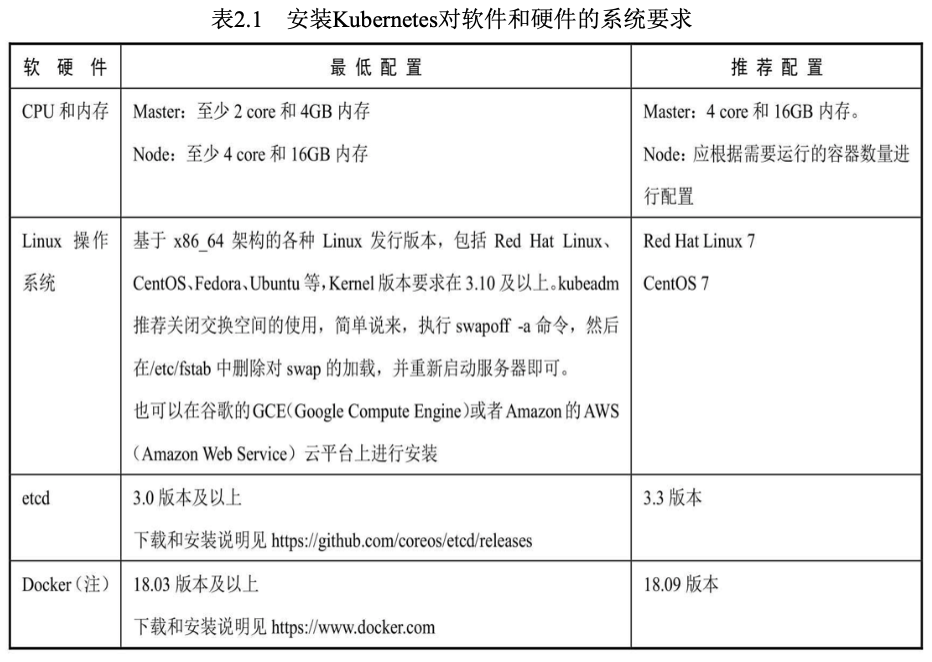

# Kubernetes安装
## 系统要求
Linux(Master Node)
Etcd
Docker(Containerd CRI-O frakti)

### 运行kubeadm init命令安装Master
### 安装Node，加入集群
### 安装网络插件
#### Master上的etcd、kube-apiserver、kube-controller-manager、kube-sheduler服务
#### Node上的kubelet、kube-proxy服务
## Kubernetes集群的安装设置
### 基于CA签名的双向数字证书认证方式
基于CA签名的双向数字证书的生成过程如下。
- 为kube-apiserver生成一个数字证书，并用CA证书签名。
- 为kube-apiserver进程配置证书相关的启动参数，包括CA证书 (用于验证客户端证书的签名真伪)、自己的经过CA签名后的证书及 私钥。
- 为每个访问Kubernetes API Server的客户端(如kube- controller-manager、kube-scheduler、kubelet、kube-proxy及调用API Server的客户端程序kubectl等)进程都生成自己的数字证书，也都用CA 证书签名，在相关程序的启动参数里增加CA证书、自己的证书等相关参数。
### 基于HTTP Base或Token的简单认证方式

## Kubernetes集群的网络配置
在多个Node组成的Kubernetes集群内，跨主机的容器间网络互通是 Kubernetes集群能够正常工作的前提条件。Kubernetes本身并不会对跨主机的容器网络进行设置，这需要额外的工具来实现。除了谷歌公有云 GCE平台提供的网络设置，一些开源的工具包括Flannel、Open vSwitch、Weave、Calico等都能够实现跨主机的容器间网络互通。随着 CNI网络模型的逐渐成熟，Kubernetes将优先使用CNI网络插件打通跨主 机的容器网络

## Kubernetes的版本升级
## CRI详解
归根结底，Kubernetes Node(kubelet)的主要功能就是启动和停止 容器的组件，我们称之为容器运行时(Container Runtime)，其中最知 名的就是Docker了。为了更具扩展性，Kubernetes从1.5版本开始就加入 了容器运行时插件API，即Container Runtime Interface，简称CRI

### CRI的主要组件
kubelet使用gRPC框架通过UNIX Socket与容器运行时(或CRI代 理)进行通信。在这个过程中kubelet是客户端，CRI代理(shim)是服务端

Protocol Buffers API包含两个gRPC服务:ImageService和RuntimeService。
ImageService提供了从仓库拉取镜像、查看和移除镜像的功能。
RuntimeService负责Pod和容器的生命周期管理，以及与容器的交互 (exec/attach/port-forward)。rkt和Docker这样的容器运行时可以使用一个Socket同时提供两个服务，在kubelet中可以用--container-runtime-endpoint和--image-service-endpoint参数设置这个Socket

### Pod和容器的生命周期管理
Pod由一组应用容器组成，其中包含共有的环境和资源约束。在 CRI里，这个环境被称为PodSandbox。Kubernetes有意为容器运行时留 下一些发挥空间，它们可以根据自己的内部实现来解释PodSandbox。对 于Hypervisor类的运行时，PodSandbox会具体化为一个虚拟机。其他例 如Docker，会是一个Linux命名空间。在v1alpha1 API中，kubelet会创建 Pod级别的cgroup传递给容器运行时，并以此运行所有进程来满足 PodSandbox对Pod的资源保障。

### 面向容器级别的设计思路
### 尝试使用新的Docker-CRI来创建容器
### CRI的进展
## kubectl命令行工具用法详解
### kubectl用法概述

### 小结