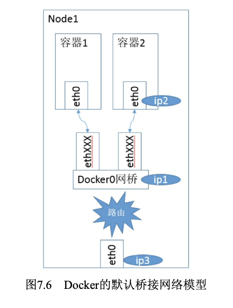
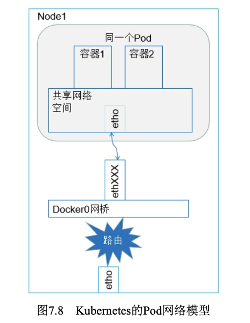
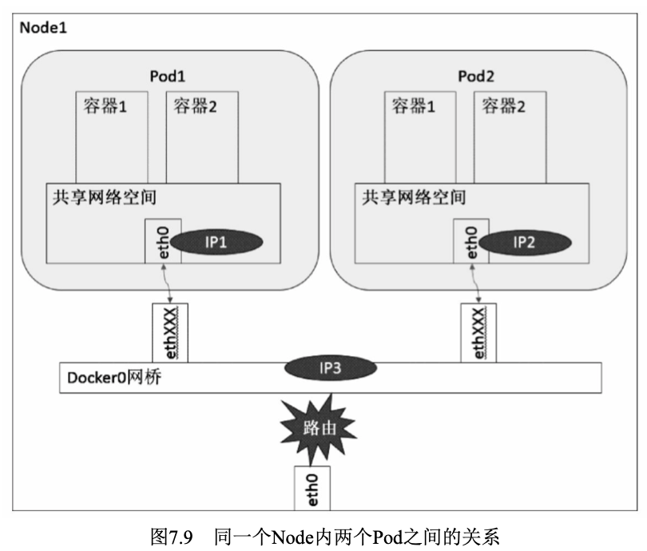
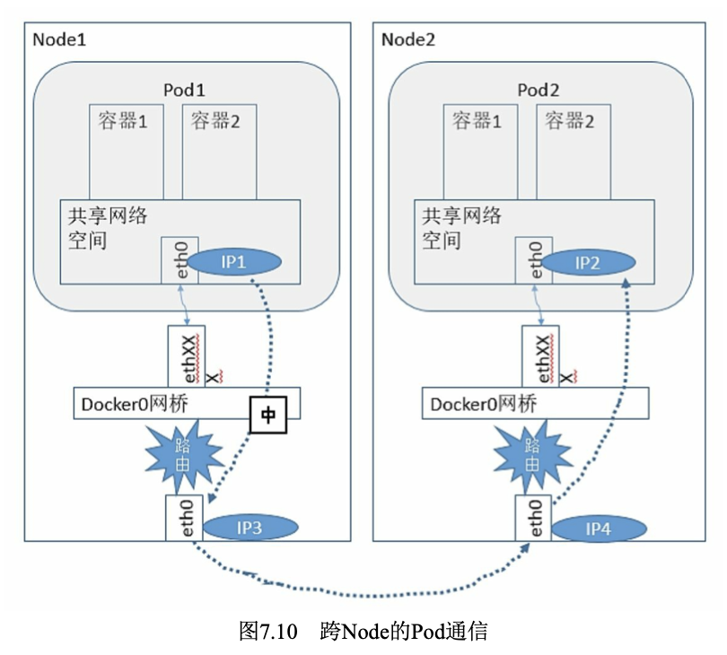
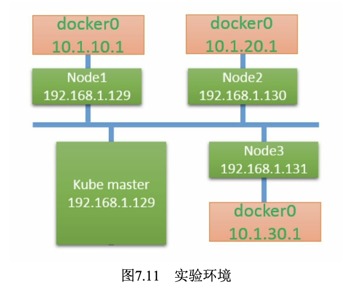
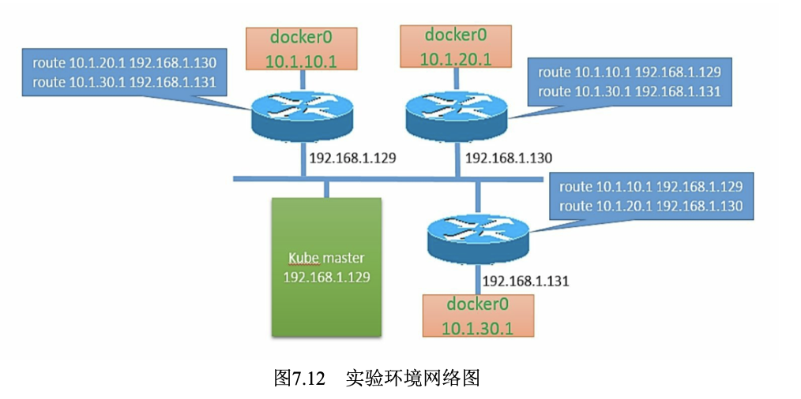
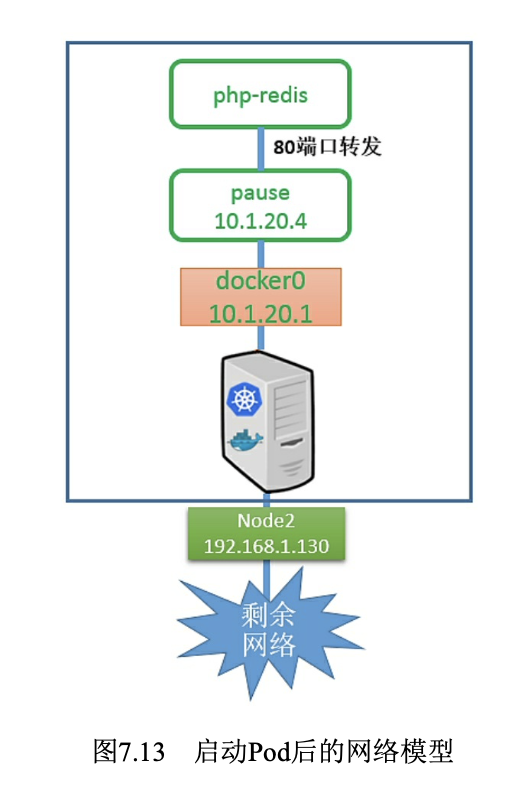
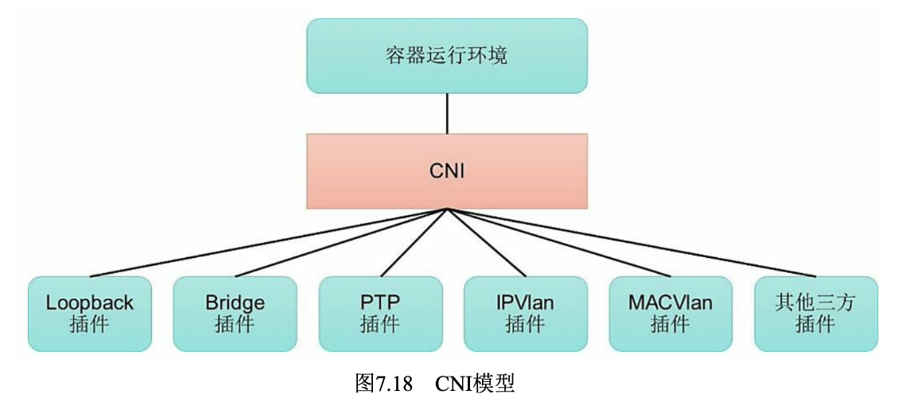
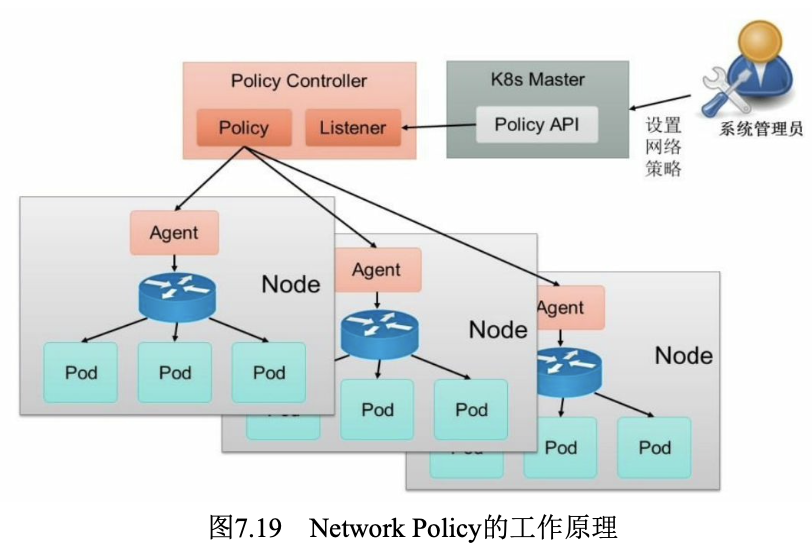
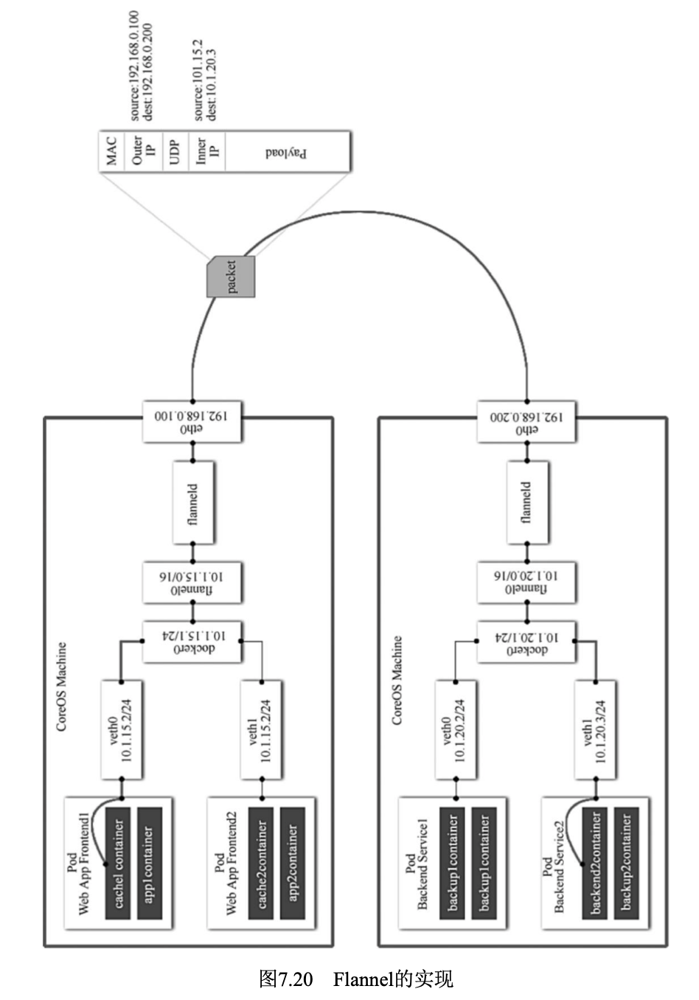

# 网络原理
## Kubernetes网络模型
Kubernetes对集群网络有如下要求。
- 所有容器都可以在不用NAT的方式下同别的容器通信。
- 所有节点都可以在不用NAT的方式下同所有容器通信，反之亦然。
- 容器的地址和别人看到的地址是同一个地址。

## Docker网络基础
这些技术有:网络命名空间 (Network Namespace)、Veth设备对、网桥、ipatables和路由。
### 网络命名空间
为了支持网络协议栈的多个实例，Linux在网络栈中引入了网络命名空间，这些独立的协议栈被隔离到不同的命名空间中。处于不同命名空间中的网络栈是完全隔离的，彼此之间无法通信，就好像两个“平行宇宙”。通过对网络资源的隔离，就能在一个宿主机上虚拟多个不同的 网络环境。Docker正是利用了网络的命名空间特性，实现了不同容器之间的网络隔离。
### Veth设备对
引入Veth设备对是为了在不同的网络命名空间之间通信，利用它可以直接将两个网络命名空间连接起来。由于要连接两个网络命名空间，所以Veth设备都是成对出现的，很像一对以太网卡，并且中间有一根直连的网线。既然是一对网卡，那么我们将其中一端称为另一端的peer。
### 网桥
Linux可以支持多个不同的网络，它们之间能够相互通信，如何将这些网络连接起来并实现各网络中主机的相互通信呢?可以用网桥。网桥是一个二层的虚拟网络设备，把若干个网络接口“连接”起来，以使得网络接口之间的报文能够互相转发。网桥能够解析收发的报文，读取目标MAC地址的信息，和自己记录的MAC表结合，来决策报文的转发目标网络接口。为了实现这些功能，网桥会学习源MAC地址(二层网桥转发的依据就是MAC地址)。在转发报文时，网桥只需要向特定的网口进行转发，来避免不必要的网络交互。如果它遇到一个自己从未学习到的地址，就无法知道这个报文应该向哪个网络接口转发，就将报文广播给所有的网络接口(报文来源的网络接口除外)。
### iptables和Netfilter
在Linux网络协议栈中有一组回调函数挂接点，通过这些挂接点挂接的钩子函数可以在Linux网络栈处理数据包的过程中对数据包进行一些操作，例如过滤、修改、丢弃等。整个挂接点技术叫作Netfilter和 iptables。
Netfilter负责在内核中执行各种挂接的规则，运行在内核模式中; 而iptables是在用户模式下运行的进程，负责协助和维护内核中Netfilter 的各种规则表。二者互相配合来实现整个Linux网络协议栈中灵活的数据包处理机制。
### 路由

## Docker的网络实现
标准的Docker支持以下4类网络模式。
- host模式:使用--net=host指定。
- container模式:使用--net=container:NAME_or_ID指定。
- none模式:使用--net=none指定。
- bridge模式:使用--net=bridge指定，为默认设置。

在bridge模式下，Docker Daemon第1次启动时会创建一个虚拟的网桥，默认的名称是docker0，然后按照RPC1918的模型在私有网络空间中给这个网桥分配一个子网。针对由Docker创建的每一个容器，都会创建一个虚拟的以太网设备(Veth设备对)，其中一端关联到网桥上，另一端使用Linux的网络命名空间技术，映射到容器内的eth0设备，然后从网 桥的地址段内给eth0接口分配一个IP地址。

其中ip1是网桥的IP地址，Docker Daemon会在几个备选地址段里给它选一个地址，通常是以172开头的一个地址。这个地址和主机的IP地址是不重叠的。ip2是Docker在启动容器时，在这个地址段选择的一个没有使用的IP地址分配给容器。相应的MAC地址也根据这个IP地址，在 02:42:ac:11:00:00和02:42:ac:11:ff:ff的范围内生成，这样做可以确保不会有ARP冲突。
启动后，Docker还将Veth对的名称映射到eth0网络接口。ip3就是主机的网卡地址。
在一般情况下，ip1、ip2和ip3是不同的IP段，所以在默认不做任何特殊配置的情况下，在外部是看不到ip1和ip2的。
这样做的结果就是，在同一台机器内的容器之间可以相互通信，不同主机上的容器不能相互通信，实际上它们甚至有可能在相同的网络地址范围内(不同主机上的docker0的地址段可能是一样的)。
为了让它们跨节点互相通信，就必须在主机的地址上分配端口，然后通过这个端口路由或代理到容器上。这种做法显然意味着一定要在容器之间小心谨慎地协调好端口的分配，或者使用动态端口的分配技术。在不同应用之间协调好端口分配是十分困难的事情，特别是集群水平扩展时。而动态的端口分配也会带来高度复杂性，例如:每个应用程序都只能将端口看作一个符号(因为是动态分配的，所以无法􏰀前设置)。而且API Server要在分配完后，将动态端口插入配置的合适位置，服务也必须能互相找到对方等。这些都是Docker的网络模型在跨主机访问时面临的问题。

## Kubernetes的网络实现
Kubernetes网络的设计主要致力于解决以下问题。
- 容器到容器之间的直接通信。
- 抽象的Pod到Pod之间的通信。
- Pod到Service之间的通信。
- 集群外部与内部组件之间的通信。

### 容器到容器的通信

阴影部分所示，在Node上运行着一个Pod实例。在我们的例子中，容器就是图中的容器1和容器2。容器1和容器2共享一个网络的命名空间，共享一个命名空间的结果就是它们好像在一台机器上运行，它们打开的端口不会有冲突，可以直接使用Linux的本地IPC进行通信(例如消息队列或者管道)。其实，这和传统的一组普通程序运行的环境是完全一样的，传统程序不需要针对网络做特别的修改就可以移植了，它们之间的互相访问只需要使用localhost就可以。例如，如果容器2运行的是MySQL，那么容器1使用localhost:3306就能直接访问这个运行在容器2上的MySQL了。
### Pod之间的通信
Pod容器既有可能在同一个Node上运行，也有可能在不同的Node上运行，所以通信也分为两类:同一个Node内Pod之间的通信和不同Node 上Pod之间的通信。
#### 同一个Node内Pod之间的通信

可以看出，Pod1和Pod2都是通过Veth连接到同一个docker0网桥上的，它们的IP地址IP1、IP2都是从docker0的网段上动态获取的，它们和网桥本身的IP3是同一个网段的。
另外，在Pod1、Pod2的Linux协议栈上，默认路由都是docker0的地址，也就是说所有非本地地址的网络数据，都会被默认发送到docker0 网桥上，由docker0网桥直接中转。
综上所述，由于它们都关联在同一个docker0网桥上，地址段相同，所以它们之间是能直接通信的。
#### 不同Node上Pod之间的通信
Pod的地址是与docker0在同一个网段的，我们知道docker0网段与宿主机网卡是两个完全不同的IP网段，并且不同Node之间的通信只能通过宿主机的物理网卡进行，因此要想实现不同Node上Pod容器之间的通信，就必须想办法通过主机的这个IP地址进行寻址和通信。
另一方面，这些动态分配且藏在docker0之后的所谓“私有”IP地址也是可以找到的。Kubernetes会记录所有正在运行的Pod的IP分配信息，并将这些信息保存在etcd中(作为Service的Endpoint)。这些私有IP信息对于Pod到Pod的通信也是十分重要的，因为我们的网络模型要求Pod到 Pod使用私有IP进行通信。所以首先要知道这些IP是什么。
之前提到，Kubernetes的网络对Pod的地址是平面的和直达的，所以这些Pod的IP规划也很重要，不能有冲突。只要没有冲突，我们就可以想办法在整个Kubernetes的集群中找到它。
综上所述，要想支持不同Node上Pod之间的通信，就要满足两个条件:
(1)在整个Kubernetes集群中对Pod的IP分配进行规划，不能有冲突;
(2)找到一种办法，将Pod的IP和所在Node的IP关联起来，通过这个关联让Pod可以互相访问。

根据条件1的要求，我们需要在部署Kubernetes时对docker0的IP地址进行规划，保证每个Node上的docker0地址都没有冲突。我们可以在规划后手工配置到每个Node上，或者做一个分配规则，由安装的程序自己去分配占用。例如，Kubernetes的网络增强开源软件Flannel就能够管理资源池的分配。
根据条件2的要求，Pod中的数据在发出时，需要有一个机制能够知道对方Pod的IP地址挂在哪个具体的Node上。也就是说先要找到Node对应宿主机的IP地址，将数据发送到这个宿主机的网卡，然后在宿主机上将相应的数据转发到具体的docker0上。一旦数据到达宿主机Node，则那个Node内部的docker0便知道如何将数据发送到Pod。如图。

## Pod和Service网络实战
Docker给我们带来了不同的网络模式，Kubernetes也以一种不同的 方式来解决这些网络模式的挑战，但其方式有些难以理解，特别是对于 刚开始接触Kubernetes的网络的开发者来说。我们在前面学习了 Kubernetes、Docker的理论，本节将通过一个完整的实验，从部署一个 Pod开始，一步一步地部署那些Kubernetes的组件，来剖析Kubernetes在 网络层是如何实现及工作的。

在Kubernetes的网络模型中，每台主机上的docker0网桥都是可以被路由到的。也就是说，在部署了一个Pod时，在同一个集群内，各主机都可以访问其他主机上的Pod IP，并不需要在主机上做端口映射。综上所述，我们可以在网络层将Kubernetes的节点看作一个路由器。

## CNI网络模型
随着容器技术在企业生产系统中的逐步落地，用户对容器云的网络特性要求也越来越高。跨主机容器间的网络互通已经成为基本要求，更高的要求包括容器固定IP地址、一个容器多个IP地址、多个子网隔离、 ACL控制策略、与SDN集成等。目前主流的容器网络模型主要有Docker 公司提出的Container Network Model(CNM)模型和CoreOS公司提出的 Container Network Interface(CNI)模型。

### CNM模型
CNM模型主要通过Network Sandbox、Endpoint和Network这3个组件进行实现。
- Network Sandbox:容器内部的网络栈，包括网络接口、路由表、DNS等配置的管理。Sandbox可用Linux网络命名空间、FreeBSD Jail等机制进行实现。一个Sandbox可以包含多个Endpoint。
- Endpoint:用于将容器内的Sandbox与外部网络相连的网络接口。可以使用veth对、Open vSwitch的内部port等技术进行实现。一个 Endpoint仅能够加入一个Network。
- Network:可以直接互连的Endpoint的集合。可以通过Linux网桥、VLAN等技术进行实现。一个Network包含多个Endpoint。
![CNM模型]](./../assets/images/2022022809.png)

### CNI模型

CNI􏰀供了一种应用容器的插件化网络解决方案，定义对容器网络进行操作和配置的规范，通过插件的形式对CNI接口进行实现。CNI是由rkt Networking Proposal发展而来的，试图提供一种普适的容器网络解决方案。CNI仅关注在创建容器时分配网络资源，和在销毁容器时删除网络资源，这使得CNI规范非常轻巧、易于实现，得到了广泛的支持。
- 容器(Container):是拥有独立Linux网络命名空间的环境，例如使用Docker或rkt创建的容器。关键之处是容器需要拥有自己的 Linux网络命名空间，这是加入网络的必要条件。
- 网络(Network):表示可以互连的一组实体，这些实体拥有各自独立、唯一的IP地址，可以是容器、物理机或者其他网络设备(比如路由器)等。

### 在Kubernetes中使用网络插件

## Kubernetes网络策略
Network Policy的主要功能是对Pod间的网络通信进行限制和准入控制，设置方式为将Pod的Label作为查询条件，设置允许访问或禁止访问的客户端Pod列表。目前查询条件可以作用于Pod和Namespace级别。
为了使用Network Policy，Kubernetes引入了一个新的资源对象 NetworkPolicy，供用户设置Pod间网络访问的策略。但仅定义一个网络策略是无法完成实际的网络隔离的，还需要一个策略控制器(Policy Controller)进行策略的实现。策略控制器由第三方网络组件提供，目前 Calico、Cilium、Kube-router、Romana、Weave Net等开源项目均支持网 络策略的实现。

## 开源的网络组件
Kubernetes的网络模型假定了所有Pod都在一个可以直接连通的扁平网络空间中。这在GCE里面是现成的网络模型，Kubernetes假定这个网络已经存在。而在私有云里搭建Kubernetes集群，就不能假定这种网络已经存在了。我们需要自己实现这个网络假设，将不同节点上的Docker 容器之间的互相访问先打通，然后运行Kubernetes。

### Flannel

### Open vSwitch

### 直接路由

### Calico容器网络和网络策略实战

## 参考