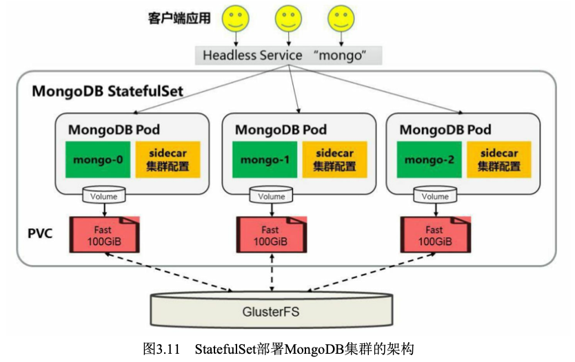

# 深入掌握Pod
Kubernetes权威指南-第四版本，笔记整理：

第三篇：深入掌握Pod

Pod和容器的使用、应用配置管理、Pod的控制和调度管理、Pod的升级和回滚，以及Pod的扩缩容机制等内容
## Pod定义详解

## Pod的基本用法
Pod可以由1个或多个容器组合而成

## 静态Pod
静态Pod是由kubelet进行管理的仅存在于特定Node上的Pod。它们不能通过API Server进行管理，无法与ReplicationController、Deployment 或者DaemonSet进行关联，并且kubelet无法对它们进行健康检查。静态 Pod总是由kubelet创建的，并且总在kubelet所在的Node上运行

创建方式：
- 配置文件方式
- HTTP方式

## Pod容器共享Volume
同一个Pod中的多个容器能够共享Pod级别的存储卷Volume。Volume可以被定义为各种类型，多个容器各自进行挂载操作，将一个Volume挂载为容器内部需要的目录


## Pod的配置管理
应用部署的一个最佳实践是将应用所需的配置信息与程序进行分离，这样可以使应用程序被更好地复用，通过不同的配置也能实现更灵活的功能。将应用打包为容器镜像后，可以通过环境变量或者外挂文件的方式在创建容器时进行配置注入，但在大规模容器集群的环境中，对多个容器进行不同的配置将变得非常复杂。从Kubernetes 1.2开始提供了一种统一的应用配置管理方案—ConfigMap。本节对ConfigMap的概念和用法进行详细描述。

### ConfigMap概述
用法
- 生成为容器内的环境变量
- 设置容器启动命令的启动参数(需设置为环境变量)
- 以Volume的形式挂载为容器内部的文件或目录

### 创建ConfigMap资源对象
- 通过YAML配置文件方式创建
```yaml
# appvars.yaml
apiVersion: v1
kind: ConfigMap
metadata:
  name: apploglevel: info
  appdatadir: /var/data
```
```
kubectl create -f appvars.yaml
kubectl get configmap
kubectl describe configmap appvars.yaml
```

- 通过kubectl命令行方式创建
```
kubectl create configmap NAME --from-file=[key=]source
```

使用ConfigMap方式
- 通过环境变量获取ConfigMap中的内容
- 通过Volume挂载的方式将ConfigMap中的内容挂载为容器内部的文件或目录

### 在Pod中使用ConfigMap
- 通过环境变量方式使用ConfigMap

```yaml
apiVersion: v1
kind: ConfigMap
metadata:
  name: cm-appvars
data:
  apploglevel: info
  appdatadir: /var/data

---
apiVersion: v1
kind: Pod
...
    - name: cm-test
      image: busybox
      env:
      - name: APPLOGLEVEL
        valueFrom:
          configMapKeyRef:
            name: cm-appvars
            key: apploglevel
      - name: APPDATADIR
        valueFrom:
          configMapKeyRef:
            name: cm-appvars
            key: appdatadir
...
```

- 通过volumeMount使用ConfigMap

```yaml
apiVersion: v1
kind: ConfigMap
metadata:
  name: cm-appvars
data:
  apploglevel: info
  appdatadir: /var/data
---
apiVersion: v1
kind: Pod
...
    - name: cm-test
      image: busybox
      volumeMounts:
      - name: serverxml
        mountPath: /configfiles
    volumes:
    - name: serverxml
      configMap:
        name: appconfigfiles
        items:
        - key: apploglevel
          path: server.xml
        - key: appdatadir
          path: logging.properties
...
```

```
cat /configfiles/server.xml
cat /configfiles/logging.properties
```
如果在引用ConfigMap时不指定items，则使用volumeMount方式在容器内的目录下为每个item都生成一个文件名为key的文件

### 使用ConfigMap的限制条件
- ConfigMap必须在Pod之前创建。
- ConfigMap受Namespace限制，只有处于相同Namespace中的 Pod才可以引用它。
- ConfigMap中的配额管理还未能实现。
- kubelet只支持可以被API Server管理的Pod使用ConfigMap。kubelet在本Node上通过 --manifest-url或--config自动创建的静态Pod将无法引用ConfigMap。
- 在Pod对ConfigMap进行挂载(volumeMount)操作时，在容器内部只能挂载为“目录”，无法挂载为“文件”。在挂载到容器内部后，在 目录下将包含ConfigMap定义的每个item，如果在该目录下原来还有其 他文件，则容器内的该目录将被挂载的ConfigMap覆盖。如果应用程序 需要保留原来的其他文件，则需要进行额外的处理。可以将ConfigMap 挂载到容器内部的临时目录，再通过启动脚本将配置文件复制或者链接 到(cp或link命令)应用所用的实际配置目录下

## 在容器内获取Pod信息（Downward API）
- 环境变量:用于单个变量，可以将Pod信息和Container信息注入容器内部。
- Volume挂载:将数组类信息生成为文件并挂载到容器内部。下面通过几个例子对Downward API的用法进行说明。

### 环境变量方式：将Pod信息注入为环境变量
通过Downward API将Pod的IP、名称和所在Namespace 注入容器的环境变量中，容器应用使用env命令将全部环境变量打印到标准输出中
```yaml
...
  containers:
    - name: test-container
      image: busybox
      command: [ "/bin/sh", "-c", "env" ]
      env:
        - name: MY_POD_NAME
          valueFrom:
            fieldRef:
              fieldPath: metadata.name
        - name: MY_POD_NAMESPACE
          valueFrom:
            fieldRef:
              fieldPath: metadata.namespace
        - name: MY_POD_IP
          valueFrom:
            fieldRef:
              fieldPath: status.podIP
...
```
### 环境变量方式：将容器资源信息注入为环境变量
通过Downward API将Container的资源请求和限制信息注入容器的环境变量中，容器应用使用printenv命令将设置的资源请求 和资源限制环境变量打印到标准输出中
```yaml
...
  containers:
    - name: test-container
      image: busybox
      command: [ "/bin/sh", "-c" ]
      args:
      - while true; do
          echo -en '\n';
          printenv MY_CPU_REQUEST MY_CPU_LIMIT;
          printenv MY_MEM_REQUEST MY_MEM_LIMIT;
          sleep 3600;
        done;
      reources:
        requests:
          memory: "32Mi"
          cpu: "125m"
        limits:
          memory: "64Mi"
          cpu: "250m"
      env:
        - name: MY_CPU_REQUEST
          valueFrom:
            resourcefieldRef:
              containerName: test-container
              resource: requests.cpu
        - name: MY_CPU_LIMIT
          valueFrom:
            resourcefieldRef:
              containerName: test-container
              resource: limits.cpu
        - name: MY_MEM_REQUEST
          valueFrom:
            resourcefieldRef:
              containerName: test-container
              resource: requests.memory
        - name: MY_MEM_LIMIT
          valueFrom:
            resourcefieldRef:
              containerName: test-container
              resource: limits.memory
...
```
注意valueFrom这种特殊的Downward API语法，目前resourceFieldRef可以将容器的资源请求和资源限制等配置设置为容器内部的环境变量

### Volume挂载方式
通过Downward API将Pod的Label、Annotation列表通过 V olume挂载为容器中的一个文件，容器应用使用echo命令将文件的内容打印到标准输出中
```yaml
metadata:
  name: test
  labels:
    zone: us-est-coast
    cluster: test-cluster1
    rack: rack-22
  annotations:
    build: two
    builder: john-doe
...
  containers:
    - name: test-container
      image: busybox
      command: [ "/bin/sh", "-c" ]
      args:
      - while true; do
          echo -en '\n';
          printenv MY_CPU_REQUEST MY_CPU_LIMIT;
          printenv MY_MEM_REQUEST MY_MEM_LIMIT;
          sleep 3600;
        done;
      volumeMounts:
        - name: podinfo
          mountPath: /etc
          readOnly: false
      env:
  volumes:
    - name: podinfo
      downwardAPI:
        items:
          - path: "labels"
            fieldRef:
              fieldPath: metadata.labels
          - path: "annotations"
            fieldRef:
              fieldPath: metadata.annotations
...
```
这里要注意“volumes”字段中downwardAPI的特殊语法，通过items 的设置，系统会根据path的名称生成文件。根据上例的设置，系统将在 容器内生成/etc/labels和/etc/annotations两个文件。在/etc/labels文件中将包含metadata.labels的全部Label列表，在/etc/annotations文件中将包含 metadata.annotations的全部Label列表

Downward API使用场景：
在某些集群中，集群中的每个节点都需要将自身的标识(ID)及进程绑定的IP地址等信息事先写入配置文件中，进程在启动时会读取这些信息，然后将这些信息发布到某个类似服务注册中心的地方，以实现集群节点的自动发现功能

## Pod声明周期和重启策略

Pod的重启策略(RestartPolicy)应用于Pod内的所有容器，并且仅在Pod所处的Node上由kubelet进行判断和重启操作。当某个容器异常退出或者健康检查(详见下节)失败时，kubelet将根据RestartPolicy的设 置来进行相应的操作

重启策略：
- Always:当容器失效时，由kubelet自动重启该容器。
- OnFailure:当容器终止运行且退出码不为0时，由kubelet自动重启该容器。
- Never:不论容器运行状态如何，kubelet都不会重启该容器。
kubelet重启失效容器的时间间隔以sync-frequency乘以2n来计算，例如1、2、4、8倍等，最长延时5min，并且在成功重启后的10min后重置该时间。

Pod的重启策略与控制方式息息相关，当前可用于管理Pod的控制器包括ReplicationController、Job、DaemonSet及直接通过kubelet管理(静 态Pod)。每种控制器对Pod的重启策略要求如下。
- Deployment和DaemonSet: 必须设置为Always，需要保证该容器持续运行。
- Job:OnFailure或Never，确保容器执行完成后不再重启。 
- kubelet: 在Pod失效时自动重启它，不论将RestartPolicy设置为什么值，也不会对Pod进行健康检查


## Pod健康检查和服务可用性检查
Kubernetes 对Pod的健康状态可以通过两类探针来检查: LivenessProbe和ReadinessProbe，kubelet定期执行这两类探针来诊断容器的健康状况

- LivenessProbe探针:用于判断容器是否存活(Running状态)，如果LivenessProbe探针探测到容器不健康，则kubelet将杀掉该容器，并根据容器的重启策略做相应的处理。如果一个容器不包含 LivenessProbe探针，那么kubelet认为该容器的LivenessProbe探针返回的值永远是Success。
- ReadinessProbe探针:用于判断容器服务是否可用(Ready状态)，达到Ready状态的Pod才可以接收请求。对于被Service管理的 Pod，Service与Pod Endpoint的关联关系也将基于Pod是否Ready进行设置。如果在运行过程中Ready状态变为False，则系统自动将其从Service 的后端Endpoint列表中隔离出去，后续再把恢复到Ready状态的Pod加回后端Endpoint列表。这样就能保证客户端在访问Service时不会被转发到服务不可用的Pod实例上

实现方式：
- ExecAction:在容器内部执行一个命令，如果该命令的返回码为0，则表明容器健康
- TCPSocketAction:通过容器的IP地址和端口号执行TCP检查，如果能够建立TCP连接，则表明容器健康
- HTTPGetAction:通过容器的IP地址、端口号及路径调用 HTTP Get方法，如果响应的状态码大于等于200且小于400，则认为容器健康

参数设置：
- initialDelaySeconds:启动容器后进行首次健康检查的等待时间，单位为s
- timeoutSeconds:健康检查发送请求后等待响应的超时时间，单位为s。当超时发生时，kubelet会认为容器已经无法提供服务，将会重启该容器

Kubernetes的ReadinessProbe机制可能无法满足某些复杂应用对容器内服务可用状态的判断，所以Kubernetes从1.11版本开始，引入Pod Ready++特性对Readiness探测机制进行扩展，在1.14版本时达到GA稳定版，称其为Pod Readiness Gates
新增的自定义Condition的状态(status)将由用户自定义的外部控制器设置，默认值为False。Kubernetes将在判断全部readinessGates条件都为True时，才设置Pod为服务可用状态(Ready为True)

## 玩转Pod调度
背景：
- 不同Pod之间的亲和性(Affinity)。比如MySQL数据库与Redis中间件不能被调度到同一个目标节点上，或者两种不同的Pod必须被调度到同一个Node上，以实现本地文件共享或本地网络通信等特殊需求，这就是PodAffinity要解决的问题。
- 有状态集群的调度。对于ZooKeeper、Elasticsearch、 MongoDB、Kafka等有状态集群，虽然集群中的每个Worker节点看起来都是相同的，但每个Worker节点都必须有明确的、不变的唯一ID(主机 名或IP地址)，这些节点的启动和停止次序通常有严格的顺序。此外，由于集群需要持久化保存状态数据，所以集群中的Worker节点对应的 Pod不管在哪个Node上恢复，都需要挂载原来的Volume，因此这些Pod 还需要捆绑具体的PV。针对这种复杂的需求，Kubernetes提供了 StatefulSet这种特殊的副本控制器来解决问题，在Kubernetes 1.9版本发 布后，StatefulSet才可用于正式生产环境中。
- 在每个Node上调度并且仅仅创建一个Pod副本。这种调度通常用于系统监控相关的Pod，比如主机上的日志采集、主机性能采集等进程需要被部署到集群中的每个节点，并且只能部署一个副本，这就是 DaemonSet这种特殊Pod副本控制器所解决的问题。
- 对于批处理作业，需要创建多个Pod副本来协同工作，当这些 Pod副本都完成自己的任务时，整个批处理作业就结束了。这种Pod运行且仅运行一次的特殊调度，用常规的RC或者Deployment都无法解决， 所以Kubernates引入了新的Pod调度控制器Job来解决问题，并继续延伸了定时作业的调度控制器CronJob。

### Deployment或RC：全自动调度
Deployment或RC的主要功能之一就是自动部署一个容器应用的多份副本，以及持续监控副本的数量，在集群内始终维持用户指定的副本数量。

### NodeSelector：定向调度
Kubernetes Master上的Scheduler服务(kube-scheduler进程)负责实现Pod的调度，整个调度过程通过执行一系列复杂的算法，最终为每个Pod都计算出一个最佳的目标节点，这一过程是自动完成的，通常我们无法知道Pod最终会被调度到哪个节点上。在实际情况下，也可能需要将Pod调度到指定的一些Node上，可以通过Node的标签(Label)和Pod 的nodeSelector属性相匹配，来达到上述目的
```
kubectl label nodes <node-name> <label-key>=<label-value>
kubectl label nodes <node-name> <label-key>-
kubectl label nodes <node-name> <label-key>=<label-value> --overwrite
```

步骤：
- 首先通过kubectl label命令给目标Node打上一些标签
- 然后，在Pod的定义中加上nodeSelector的设置

```yaml
apiVersion: v1
kind: Deployment
...
spec:
  ...
  template:
    ...
    spec:
      containers:
      - name: master
        image: kubeguide/redis-master
      nodeSelector:
        zone: north
...
```

### NodeAffinity：Node亲和性调度
NodeAffinity意为Node亲和性的调度策略，是用于替换NodeSelector的全新调度策略。目前有两种节点亲和性表达。
- RequiredDuringSchedulingIgnoredDuringExecution:必须满足指定的规则才可以调度Pod到Node上(功能与nodeSelector很像，但是使用的是不同的语法)，相当于硬限制。
- PreferredDuringSchedulingIgnoredDuringExecution：强调优先满
足指定规则，调度器会尝试调度Pod到Node上，但并不强求，相当于软限制。多个优先级规则还可以设置权重(weight)值，以定义执行的先后顺序

```yaml
apiVersion: v1
kind: Pod
...
spec:
  ...
  affinity:
    nodeAffinity:
      requiredDuringSchedulingIgnoredDuringExecution:
        nodeSelectorTerms:
        - matchExpressions:
          - key: beta.kubernetes.io/arch
            operator: In
            values:
            - amd64
      preferredDuringSchedulingIgnoredDuringExecution:
      - weight: 1
        preference:
          matchExpressions:
          - key: disk-type
            operator: In
            values:
            - ssd
  containers:
  - name: master
    image: kubeguide/redis-master
...
```

NodeAffinity语法支持的操作符包括In、NotIn、Exists、DoesNotExist、Gt、Lt。

### PodAffinity：Pod亲和与互斥调度策略
Pod间的亲和与互斥从Kubernetes 1.4版本开始引入。这一功能让用户从另一个角度来限制Pod所能运行的节点：根据在节点上正在运行的 Pod的标签而不是节点的标签进行判断和调度，要求对节点和Pod两个条件进行匹配。这种规则可以描述为：如果在具有标签X的Node上运行了一个或者多个符合条件Y的Pod，那么Pod应该(如果是互斥的情况，那么就变成拒绝)运行在这个Node上。

这里X指的是一个集群中的节点、机架、区域等概念，通过 Kubernetes内置节点标签中的key来进行声明。这个key的名字为 topologyKey，意为表达节点所属的topology范围
- kubernetes.io/hostname
- failure-domain.beta.kubernetes.io/zone
- failure-domain.beta.kubernetes.io/region

与节点不同的是，Pod是属于某个命名空间的，所以条件Y表达的 是一个或者全部命名空间中的一个Label Selector。

示例：
1. 创建参照目标Pod：创建一个名为pod-flag的Pod，带有标签security=S1和 app=nginx，后面的例子将使用pod-flag作为Pod亲和与互斥的目标Pod
```yaml
apiVersion: v1
kind: Pod
metadata:
  name: pod-flag
  labels:
    security: "S1"
    app: "nginx"
spec:
  containers:
  - name: nginx
    image: nginx
```

2. 创建第2个Pod来说明Pod的亲和性调度，这里定义的亲和标签 是security=S1，对应上面的Pod“pod-flag”，topologyKey的值被设置 为“kubernetes.io/hostname”

```yaml
apiVersion: v1
kind: Pod
...
spec:
  affinity:
    podAffinity:
      requiredDuringSchedulingIgnoredDuringExecution:
      - labelSelector:
        matchExpressions:
        - key: security
          operator: In
          values:
          - S1
        topologyKey: kubernetes.io/hostname
  containers:
...
```

创建Pod之后，使用`kubectl get pods -o wide`命令可以看到，这两个Pod在同一个Node上运行;
如果在创建这个Pod之前，删掉这个节点的kubernetes.io/hostname标签，重复上面的创建步骤，将会发现Pod一直处于Pending状态，这是因为找不到满足条件的Node了

3. Pod的互斥性调度

```yaml
apiVersion: v1
kind: Pod
...
spec:
  affinity:
    podAffinity:
      requiredDuringSchedulingIgnoredDuringExecution:
      - labelSelector:
        matchExpressions:
        - key: security
          operator: In
          values:
          - S1
        topologyKey: failure-domain.beta.kubernetes.io/zone
    podAntiAffinity:
      requiredDuringSchedulingIgnoredDuringExecution:
      - labelSelector:
        matchExpressions:
        - key: app
          operator: In
          values:
          - nginx
        topologyKey: kubernetes.io/hostname
  containers:
...
```

这里要求这个新Pod与security=S1的Pod为同一个zone，但是不与 app=nginx的Pod为同一个Node。创建Pod之后，同样用kubectl get pods -o wide来查看，会看到新的Pod被调度到了同一Zone内的不同Node上

与节点亲和性类似，Pod亲和性的操作符也包括In、NotIn、Exists、 DoesNotExist、Gt、Lt

### Taints和Tolerations（污点和容忍）
前面介绍的NodeAffinity节点亲和性，是在Pod上定义的一种属性，使得Pod能够被调度到某些Node上运行(优先选择或强制要求)。Taint 则正好相反，它让Node拒绝Pod的运行。

Taint需要和Toleration配合使用，让Pod避开那些不合适的Node。在 Node上设置一个或多个Taint之后，除非Pod明确声明能够容忍这些污点，否则无法在这些Node上运行。Toleration是Pod的属性，让Pod能够 (注意，只是能够，而非必须)运行在标注了Taint的Node上

示例：
1. 这个设置为node1加上了一个Taint。该Taint的键为key，值为 value，Taint的效果是NoSchedule。这意味着除非Pod明确声明可以容忍 这个Taint，否则就不会被调度到node1上

```
kubectl taint nodes node1 key=value:NoSchedule
```

2. 然后，需要在Pod上声明Toleration。下面的两个Toleration都被设置 为可以容忍(Tolerate)具有该Taint的Node，使得Pod能够被调度到 node1上

```yaml
tolerations:
- key: "key"
  operator: "Equal"
  value: "value"
  effect: "NoSchedule"
```
或者

```yaml
tolerations:
- key: "key"
  operator: "Exists"
  effect: "NoSchedule"
```
一般来说，如果给Node加上effect=NoExecute的Taint，那么在该 Node上正在运行的所有无对应Toleration的Pod都会被立刻驱逐，而具有 相应Toleration的Pod永远不会被驱逐。不过，系统允许给具有NoExecute 效果的Toleration加入一个可选的tolerationSeconds字段，这个设置表明 Pod可以在Taint添加到Node之后还能在这个Node上运行多久(单位为 s)

使用场景：
- 独占节点：如果想要拿出一部分节点专门给一些特定应用使用，则可以为节点添加这样的Taint
- 具备特殊硬件设备的节点：在集群里可能有一小部分节点安装了特殊的硬件设备(如GPU芯 片)，用户自然会希望把不需要占用这类硬件的Pod排除在外，以确保对这类硬件有需求的Pod能够被顺利调度到这些节点
- 定义Pod驱逐行为，以应对节点故障：
  - 没有设置Toleration的Pod会被立刻驱逐。
  - 配置了对应Toleration的Pod，如果没有为tolerationSeconds赋 值，则会一直留在这一节点中。
  - 配置了对应Toleration的Pod且指定了tolerationSeconds值，则会在指定时间后驱逐

### Pod Priority Preemption: Pod优先级调度
对于运行各种负载(如Service、Job)的中等规模或者大规模的集群来说，出于各种原因，我们需要尽可能提高集群的资源利用率。而提 高资源利用率的常规做法是采用优先级方案，即不同类型的负载对应不 同的优先级，同时允许集群中的所有负载所需的资源总量超过集群可提 供的资源，在这种情况下，当发生资源不足的情况时，系统可以选择释 放一些不重要的负载(优先级最低的)，保障最重要的负载能够获取足 够的资源稳定运行。

维度：
- Priority优先级
- QoS服务质量等级
- 系统定义的其他度量指标

优先级抢占调度策略的核心行为分别是驱逐(Eviction)与抢占 (Preemption)，这两种行为的使用场景不同，效果相同。
- Eviction是 kubelet进程的行为，即当一个Node发生资源不足(under resource pressure)的情况时，该节点上的kubelet进程会执行驱逐动作，此时 Kubelet会综合考虑Pod的优先级、资源申请量与实际使用量等信息来计算哪些Pod需要被驱逐;当同样优先级的Pod需要被驱逐时，实际使用的资源量超过申请量最大倍数的高耗能Pod会被首先驱逐。对于QoS等级为“Best Effort”的Pod来说，由于没有定义资源申请(CPU/Memory Request)，所以它们实际使用的资源可能非常大。
- Preemption则是 Scheduler执行的行为，当一个新的Pod因为资源无法满足而不能被调度时，Scheduler可能(有权决定)选择驱逐部分低优先级的Pod实例来满 足此Pod的调度目标，这就是Preemption机制

### DaemonSet：在每个Node上都调度一个Pod
DaemonSet是Kubernetes 1.2版本新增的一种资源对象，用于管理在 集群中每个Node上仅运行一份Pod的副本实例


DaemonSet的Pod调度策略与RC类似，除了使用系统内置的算法在 每个Node上进行调度，也可以在Pod的定义中使用NodeSelector或 NodeAffinity来指定满足条件的Node范围进行调度

需求场景：
- 在每个Node上都运行一个GlusterFS存储或者Ceph存储的 Daemon进程。
- 在每个Node上都运行一个日志采集程序，例如Fluentd或者 Logstach。
- 在每个Node上都运行一个性能监控程序，采集该Node的运行 性能数据，例如Prometheus Node Exporter、collectd、New Relic agent或 者Ganglia gmond等。

下面的例子定义为在每个Node上都启动一个fluentd容器，配置文件 fluentd-ds.yaml的内容如下，其中挂载了物理机的两个目 录“/var/log”和“/var/lib/docker/containers”

```yaml
apiVersion: apps/v1
kind: DaemonSet
...
spec:
  template:
    metadata:
    ...
    spec:
      containers:
        - name: fluentd-cloud-logging
          image: gcr.io/google_containers/fluentd-elasticsearch:1.17
          ...
          volumeMounts:
          - name: varlog
            mountPath: /var/log
            readOnly: false
          - name: containers:
            mountPath: /var/lib/docker/containers
            readOnly: false
        volumes:
        - name: containers
          hostPath:
            path: /var/lib/docker/containers
        - name: varlog
          hostpath:
            path: /var/log
```

```
kubectl create -f fluentd-ds.yaml
kubectl get daemonset --namespace=kube-system
kubectl get pods --namespace=kube-system
kubectl get pod xxx --namespace=kube-system -oyaml
kubectl get pod xxx --namespace=kube-system -o jsonpath={.status.podIP}
```

在Kubernetes 1.6以后的版本中，DaemonSet也能执行滚动升级了， 即在更新一个DaemonSet模板的时候，旧的Pod副本会被自动删除，同 时新的Pod副本会被自动创建，此时DaemonSet的更新策略 (updateStrategy)为RollingUpdate

### Job：批处理调度
Kubernetes从1.2版本开始支持批处理类型的应用，我们可以通过 Kubernetes Job资源对象来定义并启动一个批处理任务。批处理任务通常并行(或者串行)启动多个计算进程去处理一批工作项(work item)， 处理完成后，整个批处理任务结束

模式：
- Job Template Expansion模式:一个Job对象对应一个待处理的 Work item，有几个Work item就产生几个独立的Job，通常适合Work item数量少、每个Work item要处理的数据量比较大的场景，比如有一个 100GB的文件作为一个Work item，总共有10个文件需要处理。
  - 在这种模式下每个Work item对应一个Job实例，所以这种模式首先定义一个Job模板，模板里的 主要参数是Work item的标识，因为每个Job都处理不同的Work item
- Queue with Pod Per Work Item模式:采用一个任务队列存放 Work item，一个Job对象作为消费者去完成这些Work item，在这种模式下，Job会启动N个Pod，每个Pod都对应一个Work item。
  - 在这种模式下 需要一个任务队列存放Work item，比如RabbitMQ，客户端程序先把要 处理的任务变成Work item放入任务队列，然后编写Worker程序、打包 镜像并定义成为Job中的Work Pod。Worker程序的实现逻辑是从任务队 列中拉取一个Work item并处理，在处理完成后即结束进程


- Queue with Variable Pod Count模式:也是采用一个任务队列存放Work item，一个Job对象作为消费者去完成这些Work item，但与上面的模式不同，Job启动的Pod数量是可变的。
  - 这种模式下，Worker程序需要知道队列中是否还有等待处理的 Work item，如果有就取出来处理，否则就认为所有工作完成并结束进程，所以任务队列通常要采用Redis或者数据库来实现

- Single Job with Static Work Assignment的模式，也是一个Job产生多个Pod，但它采用程序静态方式分配任务项，而不是采用队列模式进行动态分配。


类型：
- Non-parallel Jobs。通常一个Job只启动一个Pod，除非Pod异常，才会重启该Pod，一旦此Pod正常结束，Job将结束。
- Parallel Jobs with a fixed completion count。并行Job会启动多个Pod，此时需要设定Job的.spec.completions参数为一个正数，当正常结束的Pod数量达至此参数设定的值后，Job结束。 此外，Job的.spec.parallelism参数用来控制并行度，即同时启动几个Job 来处理Work Item。
- Parallel Jobs with a work queue
任务队列方式的并行Job需要一个独立的Queue，Work item都在一个Queue中存放，不能设置Job的.spec.completions参数，此时Job有以下特性。
  - 每个Pod都能独立判断和决定是否还有任务项需要处理。
  - 如果某个Pod正常结束，则Job不会再启动新的Pod。
  - 如果一个Pod成功结束，则此时应该不存在其他Pod还在工作的情况，它们应该都处于即将结束、退出的状态。
  - 如果所有Pod都结束了，且至少有一个Pod成功结束，则整个 Job成功结束。

示例：


### Cronjob：定时任务
Cron Job的定时表达式，它基本上照搬了LinuxCron的表达式，区别是第1位是分钟而不是秒
```
Minutes Hours DayofMonth Month DayofWeek Year
```

```yaml
apiVersion: batch/v1
kind: CronJob
...
spec:
  schedule: "*/1 * * * *"
  jobTemplate:
    spec:
      template:
        spec:
          containers:
          - name: hello
            image: busybox
            args:
            - /bin/sh
            - -c
            - date; echo Hello from the Kubernetes cluster
          restartPolicy: OnFailure
```

```
kubectl get cronjob hello
kubectl get jobs --watch
kubectl delete cronjob hello
```

### 自定义调度器
xxx

## Init Container(初始化容器)
背景：
- 等待其他关联组件正确运行(例如数据库或某个后台服务)。
- 基于环境变量或配置模板生成配置文件。
- 从远程数据库获取本地所需配置，或者将自身注册到某个中央数据库中。
- 下载相关依赖包，或者对系统进行一些预配置操作。


init container与应用容器在本质上是一样的，但它们是仅运行一次就结束的任务，并且必须在成功执行完成后，系统才能继续执行下一个容器。根据Pod的重启策略(RestartPolicy)，当init container执行失败，而且设置了RestartPolicy=Never时，Pod将会 启动失败;而设置RestartPolicy=Always时，Pod将会被系统自动重启

```yaml
apiVersion: v1
kind: Pod
metadata:
  name: nginx
  annotations:
spec:
  initContainers:
  - name: install
    image: busybox
    command:
    - wget
    - "-O"
    - "/work-dir/index.html"
    - http://kubernetes.io
    volumeMounts:
    - name: workdir
      mountPath: "/work-dir"
  containers:
  - name: nginx
    image: nginx
    ports:
    - containerPort: 80
    volumeMounts:
    - name: workdir
      mountPath: /usr/share/nginx/html
  dnsPolicy: Default
  volumes:
  - name: workdir
    emptyDir: {}
```

init container与应用容器的区别：
- init container的运行方式与应用容器不同，它们必须先于应用容器执行完成，当设置了多个init container时，将按顺序逐个运行，并且只有前一个init container运行成功后才能运行后一个init container。当所有init container都成功运行后，Kubernetes才会初始化Pod的各种信息，并开始创建和运行应用容器。
- 在init container的定义中也可以设置资源限制、Volume的使用和安全策略，等等。但资源限制的设置与应用容器略有不同。
  - 如果多个init container都定义了资源请求/资源限制，则取最大的值作为所有init container的资源请求值/资源限制值。
  - Pod的有效(effective)资源请求值/资源限制值取以下二者中的较大值。
    - 所有应用容器的资源请求值/资源限制值之和。
    - init container的有效资源请求值/资源限制值。
  - 调度算法将基于Pod的有效资源请求值/资源限制值进行计算，也就是说init container可以为初始化操作预留系统资源，即使后续应用容器无须使用这些资源。
  - Pod的有效QoS等级适用于init container和应用容器。 
  - 资源配额和限制将根据Pod的有效资源请求值/资源限制值计算生效。
  - Pod级别的cgroup将基于Pod的有效资源请求/限制，与调度机制一致。
- init container不能设置readinessProbe探针，因为必须在它们成功运行后才能继续运行在Pod中定义的普通容器。
  - init container的镜像被更新时，init container将会重新运行，导致Pod重启。仅更新应用容器的镜像只会使得应用容器被重启。
  - Pod的infrastructure容器更新时，Pod将会重启。
  - 若Pod中的所有应用容器都终止了，并且 RestartPolicy=Always，则Pod会重启。

## Pod的升级和回滚

### Deployment的升级
初始创建Deployment时，系统创建了一个ReplicaSet(nginx-deployment-4087004473)，并按用户的需求创建了 3个Pod副本。当更新Deployment时，系统创建了一个新的 ReplicaSet(nginx-deployment-3599678771)，并将其副本数量扩展到 1，然后将旧的ReplicaSet缩减为2。之后，系统继续按照相同的更新策略对新旧两个ReplicaSet进行逐个调整。最后，新的ReplicaSet运行了3个新版本Pod副本，旧的ReplicaSet副本数量则缩减为0。


更新策略：
- Recreate:设置spec.strategy.type=Recreate，表示Deployment在更新Pod时，会先杀掉所有正在运行的Pod，然后创建新的Pod。
- RollingUpdate:设置spec.strategy.type=RollingUpdate，表示 Deployment会以滚动更新的方式来逐个更新Pod。同时，可以通过设置 spec.strategy.rollingUpdate下的两个参数(maxUnavailable和maxSurge) 来控制滚动更新的过程。
  - spec.strategy.rollingUpdate.maxUnavailable:用于指定 Deployment在更新过程中不可用状态的Pod数量的上限。该 maxUnavailable的数值可以是绝对值(例如5)或Pod期望的副本数的百分比(例如10%)，如果被设置为百分比，那么系统会先以向下取整的方式计算出绝对值(整数)。而当另一个参数maxSurge被设置为0时，maxUnavailable则必须被设置为绝对数值大于0(从Kubernetes 1.6开始，maxUnavailable的默认值从1改为25%)。举例来说，当maxUnavailable 被设置为30%时，旧的ReplicaSet可以在滚动更新开始时立即将副本数缩 小到所需副本总数的70%。一旦新的Pod创建并准备好，旧的ReplicaSet 会进一步缩容，新的ReplicaSet又继续扩容，整个过程中系统在任意时 刻都可以确保可用状态的Pod总数至少占Pod期望副本总数的70%。
  - spec.strategy.rollingUpdate.maxSurge:用于指定在Deployment 更新Pod的过程中Pod总数超过Pod期望副本数部分的最大值。该 maxSurge的数值可以是绝对值(例如5)或Pod期望副本数的百分比(例 如10%)。如果设置为百分比，那么系统会先按照向上取整的方式计算 出绝对数值(整数)。从Kubernetes 1.6开始，maxSurge的默认值从1改为25%。举例来说，当maxSurge的值被设置为30%时，新的ReplicaSet可以在滚动更新开始时立即进行副本数扩容，只需要保证新旧ReplicaSet 的Pod副本数之和不超过期望副本数的130%即可。一旦旧的Pod被杀 掉，新的ReplicaSet就会进一步扩容。在整个过程中系统在任意时刻都能确保新旧ReplicaSet的Pod副本总数之和不超过所需副本数的130%。

这里需要注意多重更新(Rollover)的情况。如果Deployment的上一次更新正在进行，此时用户再次发起Deployment的更新操作，那么 Deployment会为每一次更新都创建一个ReplicaSet，而每次在新的 ReplicaSet创建成功后，会逐个增加Pod副本数，同时将之前正在扩容的 ReplicaSet停止扩容(更新)，并将其加入旧版本ReplicaSet列表中，然后开始缩容至0的操作。
例如，假设我们创建一个Deployment，这个Deployment开始创建5个Nginx:1.7.9的Pod副本，在这个创建Pod动作尚未完成时，我们又将 Deployment进行更新，在副本数不变的情况下将Pod模板中的镜像修改为Nginx:1.9.1，又假设此时Deployment已经创建了3个Nginx:1.7.9的Pod 副本，则Deployment会立即杀掉已创建的3个Nginx:1.7.9 Pod，并开始创建Nginx:1.9.1 Pod。Deployment不会在等待Nginx:1.7.9的Pod创建到5个之后再进行更新操作。

### Deployment的回滚
```
kubectl rollout history deployment/xxx
kubectl rollout undo deployment/xxx
kubectl rollout undo deployment/xxx --to-revision=2
```

### 暂停和回复Deployment的部署操作，以完成复杂的修改
对于一次复杂的Deployment配置修改，为了避免频繁触发 Deployment的更新操作，可以先暂停Deployment的更新操作，然后进行配置修改，再恢复Deployment，一次性触发完整的更新操作，就可以避免不必要的Deployment更新操作了。
```
kubectl get deployments
kubectl get rs
kubectl rollout pause deployment/xxx
kubectl set image deployment/xxx xxx=xxx:x.x.x
kubectl rollout resume deploy/xxx
kubectl get rs
```


### 其他管理对象的更新策略
Kubernetes从1.6版本开始，对DaemonSet和StatefulSet的更新策略也引入类似于Deployment的滚动升级，通过不同的策略自动完成应用的版本升级。
1. DaemonSet的更新策略
目前DaemonSet的升级策略包括两种:OnDelete和RollingUpdate。
  - OnDelete: DaemonSet的默认升级策略，与1.5及以前版本的 Kubernetes保持一致。当使用OnDelete作为升级策略时，在创建好新的 DaemonSet配置之后，新的Pod并不会被自动创建，直到用户手动删除旧版本的Pod，才触发新建操作。
  - RollingUpdate:从Kubernetes 1.6版本开始引入。当使用 RollingUpdate作为升级策略对DaemonSet进行更新时，旧版本的Pod将被自动杀掉，然后自动创建新版本的DaemonSet Pod。整个过程与普通 Deployment的滚动升级一样是可控的。不过有两点不同于普通Pod的滚动升级:
    - 一是目前Kubernetes还不支持查看和管理DaemonSet的更新历史记录;
    - 二是DaemonSet的回滚(Rollback)并不能如同Deployment一样直接通过kubectl rollback命令来实现，必须通过再次提交旧版本配置的方式实现。
2. StatefulSet的更新策略
Kubernetes从1.6版本开始，针对StatefulSet的更新策略逐渐向 Deployment和DaemonSet的更新策略看齐，也将实现RollingUpdate、 Paritioned和OnDelete这几种策略，以保证StatefulSet中各Pod有序地、逐个地更新，并且能够保留更新历史，也能回滚到某个历史版本。

## Pod的扩缩容
Kubernetes对Pod的扩缩容操作提供了手动和自动两种模式，手动模式通过执行kubectl scale命令或通过RESTful API对一个Deployment/RC进行Pod副本数量的设置，即可一键完成。自动模式则需要用户根据某个性能指标或者自定义业务指标，并指定Pod副本数量的范围，系统将自动在这个范围内根据性能指标的变化进行调整。

### 手动扩缩容机制
```
kubectl scale deployment xxxx --replicas num
```

### 自动扩缩容机制
Kubernetes从1.1版本开始，新增了名为Horizontal Pod Autoscaler(HPA)的控制器，用于实现基于CPU使用率进行自动Pod扩缩容的功能。HPA控制器基于Master的kube-controller-manager服务启动参数--horizontal-pod-autoscaler-sync-period定义的探测周期(默认值为 15s)，周期性地监测目标Pod的资源性能指标，并与HPA资源对象中的扩缩容条件进行对比，在满足条件时对Pod副本数量进行调整。

1. HPA的工作原理
Kubernetes中的某个Metrics Server(Heapster或自定义Metrics Server)持续采集所有Pod副本的指标数据。HPA控制器通过Metrics Server的API(Heapster的API或聚合API)获取这些数据，基于用户定义的扩缩容规则进行计算，得到目标Pod副本数量。当目标Pod副本数量与当前副本数量不同时，HPA控制器就向Pod的副本控制器(Deployment、RC或ReplicaSet)发起scale操作，调整Pod的副本数量，完成扩缩容操作。图3.9描述了HPA体系中的关键组件和工作流程。


2. 指标类型
  - Pod资源使用率:Pod级别的性能指标，通常是一个比率值，例如CPU使用率。
  - Pod自定义指标:Pod级别的性能指标，通常是一个数值，例如接收的请求数量。
  - Object自定义指标或外部自定义指标:通常是一个数值，需要容器应用以某种方式提供，例如通过HTTP URL“/metrics”提供，或者使用外部服务提供的指标采集URL。

Kubernetes从1.11版本开始，弃用基于Heapster组件完成Pod的CPU 使用率采集的机制，全面转向基于Metrics Server完成数据采集。Metrics Server将采集到的Pod性能指标数据通过聚合API(Aggregated API)如 metrics.k8s.io、custom.metrics.k8s.io和external.metrics.k8s.io提供给HPA 控制器进行查询。

3. 扩缩容算法详解
Autoscaler控制器从聚合API获取到Pod性能指标数据之后，基于下面的算法计算出目标Pod副本数量，与当前运行的Pod副本数量进行对比，决定是否需要进行扩缩容操作:
```
desiredReplicas = ceil[currentReplicas * ( currentMetricValue / desiredMetricValue )]
```

即当前副本数×(当前指标值/期望的指标值)，将结果向上取整。
以CPU请求数量为例，如果用户设置的期望指标值为100m，当前实际使用的指标值为200m，则计算得到期望的Pod副本数量应为两个 (200/100=2)。如果设置的期望指标值为50m，计算结果为0.5，则向上取整值为1，得到目标Pod副本数量应为1个。

此外，存在几种Pod异常的情况，如下所述。 
- Pod正在被删除(设置了删除时间戳):将不会计入目标Pod副本数量。
- Pod的当前指标值无法获得:本次探测不会将这个Pod纳入目标Pod副本数量，后续的探测会被重新纳入计算范围。
- 如果指标类型是CPU使用率，则对于正在启动但是还未达到Ready状态的Pod，也暂时不会纳入目标副本数量范围。可以通过kube-controller-manager服务的启动参数--horizontal-pod-autoscaler-initial-readiness-delay设置首次探测Pod是否Ready的延时时间，默认值为30s。另一个启动参数--horizontal-pod-autoscaler-cpuinitialization-period设置首次采集Pod的CPU使用率的延时时间。

在计算“当前指标值/期望的指标值”(currentMetricV alue / desiredMetricV alue)时将不会包括上述这些异常Pod。当存在缺失指标的Pod时，系统将更保守地重新计算平均值。系统会假设这些Pod在需要缩容(Scale Down)时消耗了期望指标值的 100%，在需要扩容(Scale Up)时消耗了期望指标值的0%，这样可以抑制潜在的扩缩容操作。此外，如果存在未达到Ready状态的Pod，并且系统原本会在不考虑缺失指标或NotReady的Pod情况下进行扩展，则系统仍然会保守地假设 这些Pod消耗期望指标值的0%，从而进一步抑制扩容操作。

4. HorizontalPodAutoscaler配置详解
（省略）

5. 基于自定义指标的HPA实践


## 使用StatefulSet搭建MongoDB集群
本节以MongoDB为例，使用StatefulSet完成MongoDB集群的创建，为每个MongoDB实例在共享存储中(这里采用GlusterFS)都申请一片存储空间，以实现一个无单点故障、高可用、可动态扩展的MongoDB集群。

(需要PVC)


### 创建StatefulSet
- 一个StorageClass，用于StatefulSet自动为各个应用Pod申请 PVC。
- 一个Headless Service，用于维护MongoDB集群的状态。
- 一个StatefulSet。

```yaml
# storageclass-fast.yaml
apiVersion: storage.k8s.io/v1
kind: StorageClass
metadata:
  name: fast
provisioner: kubernetes.io/glusterfs
parameters:
  resturl: "http://<heketi-rest-uri>"
---
# mongo-headless-service.yaml
apiVersion: v1
kind: Service
metadata:
  name: mongo
  labels:
    name: mongo
spec:
  ports:
  - port: 27017
    targetPort: 27017
  clusterIP: None
  selector:
    role: mongo
---
# statefulset-mongo.yaml
apiVersion: apps/v1
king: StatefulSet
metadata:
  name: mongo
spec:
  serviceName: "mongo"
  replicas: 3
  template:
    metadata:
      labels:
        role: mongo
        environment: test
    spec:
      terminationGracePeriodSeconds: 10
      containers:
      - name: mongo
        image: mongo
        command:
        - mongod
        - "--replSet"
        - rs0
        - "--smallfiles"
        - "--noprealloc"
        ports:
        - containerPort: 27017
        volumeMounts:
        - name: mongo-persistent-storage
          mountPath: /data/db
      - name: mongo-sidecar
        image: cvallance/mongo-k8s-sidecar
        env:
        - name: MONGO_SIDECAR_POD_LABELS
          value: "role=mongo,environment=test"
        - name: KUBERNETES_MONGO_SERVICE_NAME
          value: "mongo"
  volumeClaimTemplates:
  - metadata:
      name: mongo-persistent-storage
      annotations:
        volume.beta.kubernetes.io/storage-class: "fast"
    spec:
      accessModes: ["ReadWriteOnce"]
      resources:
        requests:
          storage: 10Gi

```

### 查看MongoDB集群的状态
- mongo-0.mongo.default.svc.cluster.local 
- mongo-1.mongo.default.svc.cluster.local 
- mongo-2.mongo.default.svc.cluster.local

```
kubectl exec -it mongo-0 -- mongo
rs.status()
```

对于需要访问这个mongo集群的Kubernetes集群内部客户端来说，可以通过Headless Service“mongo”获取后端的所有Endpoints列表，并组合为数据库链接串，例如“mongodb://mongo-0.mongo, mongo-1.mongo,mongo-2.mongo:27017/dbname_?”。

### StatfulSet的创建应用场景
1. MongoDB集群的扩容

```
kubectl scale --replicas=4 statefulset mongo
kubectl get pod -l role=mongo
kubectl exec -it mongo-0 -- mongo
rs.status()
```
2. 自动故障恢复（MongoDB集群的高可用）
假设在系统运行过程中，某个mongo实例或其所在主机发生故障，则StatefulSet将会自动重建该mongo实例，并保证其身份(ID)和使用 的数据(PVC)不变。

## 小结
- initContainer
- volume、pv、pvc
- pod扩缩容
- StatefulSet