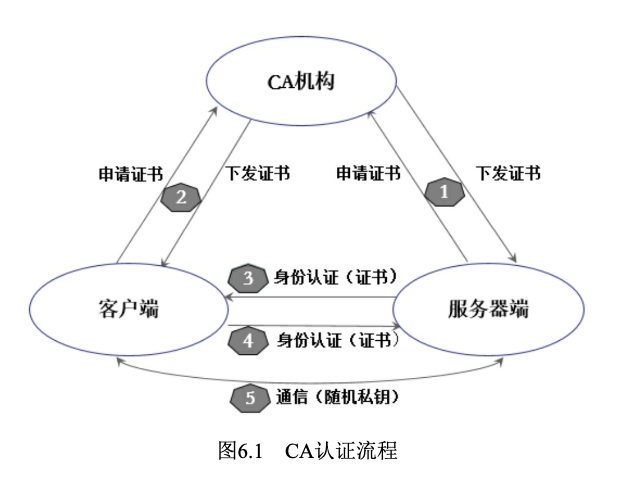
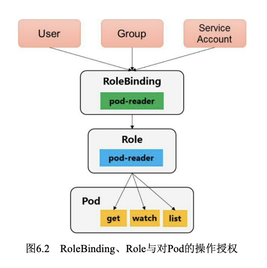
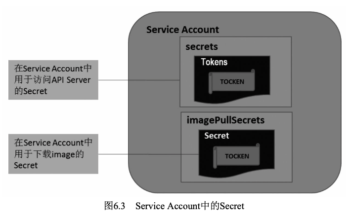

# 深入分析集群安全机制

### API Server认证管理
认证方式：
- 最严格的HTTPS证书认证:基于CA根证书签名的双向数字证书认证方式。
- HTTP Token认证:通过一个Token来识别合法用户。
- HTTP Base认证:通过用户名+密码的方式认证。

CA认证大概包含下面几个步骤。
- HTTPS通信双方的服务器端向CA机构申请证书，CA机构是可信的第三方机构，它可以是一个公认的权威企业，也可以是企业自身。企业内部系统一般都用企业自身的认证系统。CA机构下发根证书、服务端证书及私钥给申请者。
- HTTPS通信双方的客户端向CA机构申请证书，CA机构下发根证书、客户端证书及私钥给申请者。
- 客户端向服务器端发起请求，服务端下发服务端证书给客户端。客户端接收到证书后，通过私钥解密证书，并利用服务器端证书中的公钥认证证书信息比较证书里的消息，例如，比较域名和公钥与服务器刚刚发送的相关消息是否一致，如果一致，则客户端认可这个服务器的合法身份。
- 客户端发送客户端证书给服务器端，服务端在接收到证书后，通过私钥解密证书，获得客户端证书公钥，并用该公钥认证证书信息，确认客户端是否合法。
- 客户端通过随机密钥加密信息，并发送加密后的信息给服务端。在服务器端和客户端协商好加密方案后，客户端会产生一个随机的密钥，客户端通过协商好的加密方案加密该随机密钥，并发送该随机密钥到服务器端。服务器端接收这个密钥后，双方通信的所有内容都通过该随机密钥加密。


HTTP Token的认证是用一个很长的特殊编码方式的并且难以被模仿的字符串—Token来表明客户身份的一种方式。在通常情况下，Token 是一个很复杂的字符串，比如我们用私钥签名一个字符串后的数据就可以被当作一个Token。此外，每个Token对应一个用户名，存储在API Server能访问的一个文件中。当客户端发起API调用请求时，需要在 HTTP Header里放入Token，这样一来，API Server就能识别合法用户和非法用户了。

HTTP Base认证是把“用户名+冒号+密码”用BASE64算法进行编码后的字符串放在HTTP Request中的Header Authorization域里发送给服务端，服务端在收到后进行解码，获取用户名及密码，然后进行用户身份鉴权。

## API Server授权管理
当客户端发起API Server调用时，API Server内部要先进行用户认证，然后执行用户授权流程，即通过授权策略来决定一个API调用是否合法。对合法用户进行授权并且随后在用户访问时进行鉴权，是权限与安全系统的重要一环。简单地说，授权就是授予不同的用户不同的访问权限。API Server目前支持以下几种授权策略(通过API Server的启动参 数“--authorization-mode”设置)。
- AlwaysDeny:表示拒绝所有请求，一般用于测试。
- AlwaysAllow:允许接收所有请求，如果集群不需要授权流程，则可以采用该策略，这也是Kubernetes的默认配置。
- ABAC(Attribute-Based Access Control):基于属性的访问控 制，表示使用用户配置的授权规则对用户请求进行匹配和控制。
- Webhook:通过调用外部REST服务对用户进行授权。
- RBAC:Role-Based Access Control，基于角色的访问控制。
- Node:是一种专用模式，用于对kubelet发出的请求进行访问控制。

API Server在接收到请求后，会读取该请求中的数据，生成一个访问策略对象，如果在该请求中不带某些属性(如Namespace)，则这些属性的值将根据属性类型的不同，设置不同的默认值(例如，为字符串类型的属性设置一个空字符串;为布尔类型的属性设置false;为数值类型的属性设置0)。然后将这个访问策略对象和授权策略文件中的所有访问策略对象逐条匹配，如果至少有一个策略对象被匹配，则该请求被鉴权通过，否则终止API调用流程，并返回客户端的错误调用码。

### ABAC授权模式详解
在API Server启用ABAC模式时，需要指定授权策略文件的路径和名称(--authorization- policy-file=SOME_FILENAME)，授权策略文件里的每一行都以一个Map类型的JSON对象进行设置，这被称为“访问策略对象”。通过设置访问策略对象中的apiVersion、kind、spec属性来确定具体的授权策略，其中，apiVersion当前版本为 abac.authorization.kubernetes.io/v1beta1;kind被设置为Policy;spec指详细的策略设置，包括主题属性、资源属性、非资源属性这三个字段，如下所述。
- 主体属性: user、 group
- 资源属性: apiGroup、namespace、resource
- 非资源属性: nonResourcePath、readonly

API Server进行ABAC授权的算法为:在API Server收到请求之后，首先识别出请求携带的策略对象的属性，然后根据在策略文件中定义的策略对这些属性进行逐条匹配，以判定是否允许授权。如果有至少一条 匹配成功，那么这个请求就通过了授权(不过还是可能在后续其他授权校验中失败)

示例
```
// 允许用户alice对所有资源做任何操作
{"apiVersion":"abac.authorization.kubernetes.io/v1beta1","kind":"Policy","spec":{"user":"alice","namespace":"*","resource":"*","apiGroup":"*"}}
// kubelete可以读写Event对象
{"apiVersion":"abac.authorization.kubernetes.io/v1beta1","kind":"Policy","spec":{"user":"kubelet","namespace":"*","resource":"events"}}
```

### Webhook授权模式详解
Webhook定义了一个HTTP回调接口，实现Webhook的应用会在指定事件发生时，向一个URL地址发送(POST)通知信息。启用 Webhook授权模式后，Kubernetes会调用外部REST服务对用户进行授权。

Webhook模式用参数--authorization-webhook-config-file=SOME_FILENAME来设置远端授权服务的信息。
配置文件使用的是kubeconfig文件的格式。文件里user一节的内容指的是API Server。相对于远程授权服务来说，API Server是客户端，也就是用户;cluster一节的内容指的是远程授权服务器的配置。

### RBAC授权模式详解
RBAC(Role-Based Access Control，基于角色的访问控制)在 Kubernetes的1.5版本中引入，在1.6版本时升级为Beta版本，在1.8版本时升级为GA。作为kubeadm安装方式的默认选项，足见其重要程度。相对于其他访问控制方式，新的RBAC具有如下优势。
- 对集群中的资源和非资源权限均有完整的覆盖。
- 整个RBAC完全由几个API对象完成，同其他API对象一样，可以用kubectl或API进行操作。
- 可以在运行时进行调整，无须重新启动API Server。

#### RBAC的API资源对象说明
RBAC引入了4个新的顶级资源对象:Role、ClusterRole、 RoleBinding和ClusterRoleBinding。同其他API资源对象一样，用户可以使用kubectl或者API调用等方式操作这些资源对象。
- 角色: 一个角色就是一组权限的集合，这里的权限都是许可形式的，不存在拒绝的规则。在一个命名空间中，可以用角色来定义一个角色，如果是集群级别的，就需要使用ClusterRole了。
```yaml
# 角色只能对命名空间内的资源进行授权，在下面例子中定义的角色具备读取Pod的权限
apiVersion: rbac.authorization.k8s.io/v1
kind: Role
metadata:
  namespace: default
  name: pod-reader
rules:
- apiGroups: [""] # ""空字符串表示核心API群
  resources: ["pods"]
  verbs: ["get", "watch", "list"]
```
- 集群角色: 集群角色除了具有和角色一致的命名空间内资源的管理能力，因其集群级别的范围，还可以用于以下特殊元素的授权。
```yaml
# 下面的集群角色可以让用户有权访问任意一个或所有命名空间的 secrets(视其绑定方式而定)
apiVersion: rbac.authorization.k8s.io/v1
kind: ClusterRole
metadata:
# CLusterRole不受限于命名空间，所以不设置Namespace名称
  name: secret-reader
rules:
- apiGroups: [""] # ""空字符串表示核心API群
  resources: ["secrets"]
  verbs: ["get", "watch", "list"]
```
- 角色绑定: 角色绑定或集群角色绑定用来把一个角色绑定到一个目标上，绑定目标可以是User(用户)、Group(组)或者Service Account。使用 RoleBinding为某个命名空间授权，使用ClusterRoleBinding为集群范围内授权。
```yaml
# RoleBinding将 在default命名空间中把pod-reader角色授予用户jane，jane读取default命名空间中的Pod
apiVersion: rbac.authorization.k8s.io/v1
kind: RoleBinding
metadata:
  name: read-pods
  namespace: default
subjects:
- kind: User
  name: jane
  apiGroup: rbac.authroization.k8s.io
roleRes:
  kind: Role
  name: pod-reader
  apiGroup: rbac.authorization.k8s.io
```
RoleBinding也可以引用ClusterRole，对属于同一命名空间内 ClusterRole定义的资源主体进行授权。一种常见的做法是集群管理员为集群范围预先定义好一组ClusterRole，然后在多个命名空间中重复使用这些ClusterRole
```yaml
# 虽然secret-reader是一个集群角色，但是因为使用了RoleBinding，所以dave只能读取development命名空间中的 secret
apiVersion: rbac.authorization.k8s.io/v1
kind: RoleBinding
metadata:
  name: read-secrets
  namespace: development # 集群角色中，只有development命名空间中的权限才能赋予dave
subjects:
- kind: User
  name: dave
  apiGroup: rbac.authroization.k8s.io
roleRes:
  kind: ClusterRole
  name: secret-reader
  apiGroup: rbac.authorization.k8s.io
```
集群角色绑定中的角色只能是集群角色，用于进行集群级别或者对所有命名空间都生效的授权
```yaml
# 允许manager组的用户读取任意Namespace中的secret
apiVersion: rbac.authorization.k8s.io/v1
kind: ClusterRoleBinding
metadata:
  name: read-secrets-global
subjects:
- kind: Group
  name: manager
  apiGroup: rbac.authroization.k8s.io
roleRes:
  kind: ClusterRole
  name: secret-reader
  apiGroup: rbac.authorization.k8s.io
```



#### 对资源的引用方式
多数资源可以用其名称的字符串来表达，也就是Endpoint中的URL 相对路径，例如pods。然而，某些Kubernetes API包含下级资源，例如 Pod的日志(logs)。Pod日志的Endpoint是GET/ api/v1/namespaces/{namespace}/pods/{name}/log。
```yaml
# Pod是一个命名空间内的资源，log就是一个下级资源。要在一个RBAC角色中体现，就需要用斜线“/”来分隔资源和下级资源
apiVersion: rbac.authorization.k8s.io/v1
kind: Role
metadata:
  namespace: default
  name: pod-and-pod-logs-reader
rules:
- apiGroup: [""]
  resources: ["pods", "pods/log"]
  verbs: ["get", "list"]
```
资源还可以通过名称(ResourceName)进行引用。在指定 ResourceName后，使用get、delete、update和patch动词的请求，就会被限制在这个资源实例范围内。
```yaml
# 让一个主体只能对一个 ConFigmap进行get和update操作
apiVersion: rbac.authorization.k8s.io/v1
kind: Role
metadata:
  namespace: default
  name: configmap-updater
rules:
- apiGroup: [""]
  resources: ["configmap"]
  resourceName: ["my-configmap"]
  verbs: ["get", "update"]
```

#### 常见的角色示例
```yaml
# 允许读取核心API组中的Pod资源
rules:
- apiGroups: [""]
  resources: ["pods"]
  verbs: ["get", "list", "watch"]

# 允许读写extensions和apps两个API组中的deployment资源
rules:
- apiGroups: ["extensions", "apps"]
  resources: ["deployments"]
  verbs: ["get", "list", "watch", "create", "update", "patch", "delete"]

# 允许读取pods及读写jobs
rules:
- apiGroups: [""]
  resources: ["pods"]
  verbs: ["get", "list", "watch"]
- apiGroups: ["batch", "extensions"]
  resources: ["jobs"]
  verbs: ["get", "list", "watch", "watch", "create", "update", "patch", "delete"]

 # 允许读取一个名为my-config的ConfigMap(必须绑定到一个 RoleBinding来限制到一个Namespace下的ConfigMap)
rules:
- apiGroups: [""]
  resources: ["configmaps"]
  resourceNames: ["my-config"]
  verbs: ["get"]
```

#### 默认的角色和橘色绑定
API Server会创建一套默认的ClusterRole和ClusterRoleBinding对象，其中很多是以“system:”为前缀的，以表明这些资源属于基础架构，对这些对象的改动可能造成集群故障。举例来说，system:node这个 ClusterRole为kubelet定义了权限，如果这个集群角色被改动了，kubelet 就会停止工作。
所有默认的ClusterRole和RoleBinding都会用标签 kubernetes.io/bootstrapping=rbac-defaults进行标记。

#### 使用kubectl命令行工具创建资源对象
#### 从旧版本的授权策略升级到RBAC

## Admission Control
突破了之前所说的认证和鉴权两道关卡之后，客户端的调用请求就能够得到API Server的真正响应了吗?答案是:不能!这个请求还需要通过Admission Control(准入控制)所控制的一个准入控制链的层层考验，才能获得成功的响应。Kubernetes官方标准的“关卡”有30多个，还允许用户自定义扩展。

Admission Control配备了一个准入控制器的插件列表，发送给API Server的任何请求都需要通过列表中每个准入控制器的检查，检查不通过，则API Server拒绝此调用请求。

## Service Account
Service Account也是一种账号，但它并不是给Kubernetes集群的用户 (系统管理员、运维人员、租户用户等)用的，而是给运行在Pod里的进程用的，它为Pod里的进程提供了必要的身份证明。

在正常情况下，为了确保Kubernetes集群的安全，API Server都会对客户端进行身份认证，认证失败的客户端无法进行API调用。此外，在 Pod中访问Kubernetes API Server服务时，是以Service方式访问名为 Kubernetes的这个服务的，而Kubernetes服务又只在HTTPS安全端口443 上提供，那么如何进行身份认证呢?
通过查看官方源码，我们发现这是在用一种类似HTTP Token的新认证方式—Service Account Auth，Pod中的客户端调用Kubernetes API 时，在HTTP Header中传递了一个Token字符串，这类似于之前提到的 HTTP Token认证方式，但有以下几个不同之处。

- 这个Token的内容来自Pod里指定路径下的一个文件 (/run/secrets/kubernetes.io/serviceaccount/token)，这种Token是动态生成的，确切地说，是由Kubernetes Controller进程用API Server的私钥(-- service-account-private-key-file指定的私钥)签名生成的一个JWT Secret。
- 在官方提供的客户端REST框架代码里，通过HTTPS方式与API Server建立连接后，会用Pod里指定路径下的一个CA证书 (/run/secrets/kubernetes.io/serviceaccount/ca.crt)验证API Server发来的证书，验证是否为CA证书签名的合法证书。
- API Server在收到这个Token以后，采用自己的私钥(实际上是使用service-accountkey-file参数指定的私钥，如果没有设置此参数，则默认采用tls-private-key-file指定的参数，即自己的私钥)对Token进行合法性验证。



## Secret私密凭据
Secret的主要作用是保管私密数据，比如密码、OAuth Tokens、SSH Keys等信息。将这些私密信息放在Secret对象 中比直接放在Pod或Docker Image中更安全，也更便于使用和分发。

使用方式：
- 在创建Pod时，通过为Pod指定Service Account来自动使用该 Secret。
- 通过挂载该Secret到Pod来使用它。
- 在Docker镜像下载时使用，通过指定Pod的 spc.ImagePullSecrets来引用它。

## Pod的安全策略配置
### PodSecurityPolicy的工作机制
在开启PodSecurityPolicy准入控制器后，Kubernetes默认不允许创建任何Pod，需要创建PodSecurityPolicy策略和相应的RBAC授权策略 (Authorizing Policies)，Pod才能创建成功。
### PodSecutiryPolicy配置详解
### Pod的安全设置详解