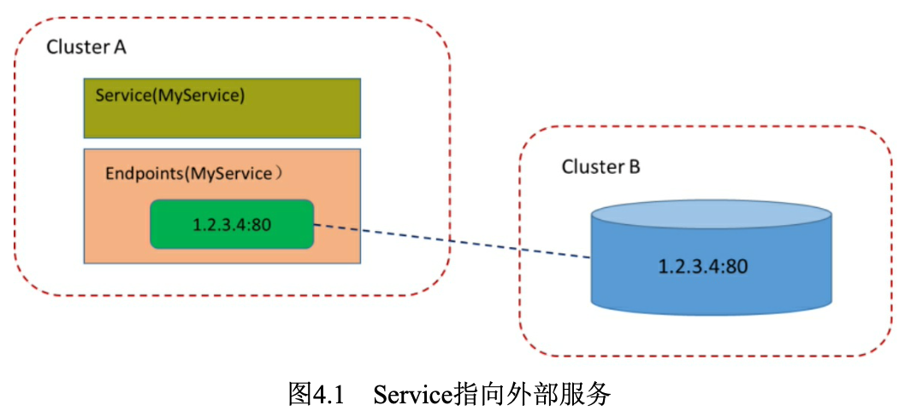
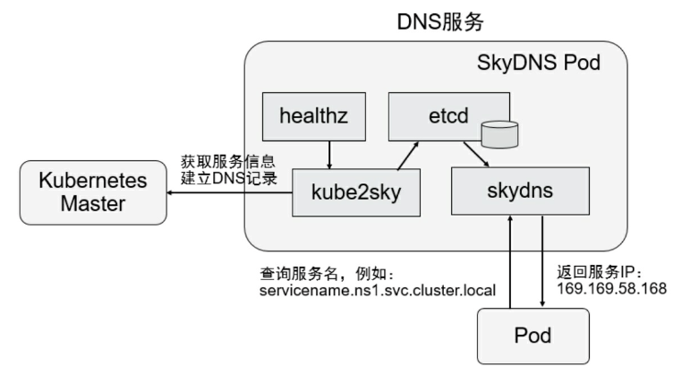
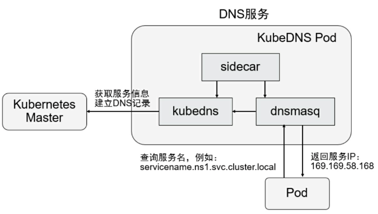
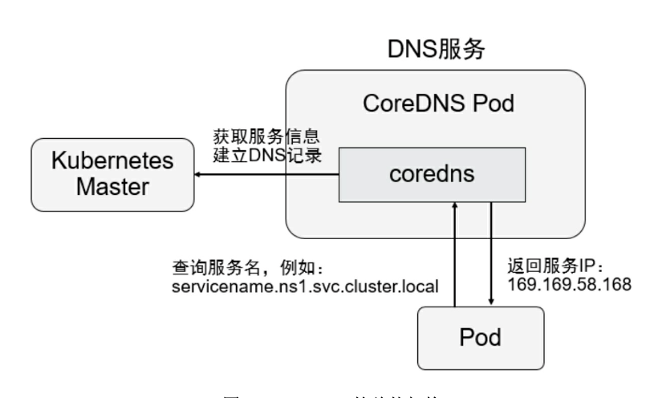

# 深入掌握Service
Service是Kubernetes的核心概念，通过创建Service，可以为一组具有相同功能的容器应用提供一个统一的入口地址，并且将请求负载分发到后端的各个容器应用上。本章对Service的使用进行详细说明，包括 Service的负载均衡机制、如何访问Service、Headless Service、DNS服务的机制和实践、Ingress 7层路由机制等。

## Service定义详解

## Service的基本用法
一般来说，对外提供服务的应用程序需要通过某种机制来实现，对于容器应用最简便的方式就是通过TCP/IP机制及监听IP和端口号来实现。

```yaml
### webapp-deploy.yaml
apiVersion: apps/v1
kind: Deployment
metadata:
  name: webapp
spec:
  replicas: 2
  template:
    metadata:
      name: webapp
      labels:
        app: webapp
    spec:
      containers:
      - name: webapp
        image: tomact
        ports:
        - containerPort: 8080
```

```
kubectl create -f webapp-deply.yaml
kubectl get pods -l app-webapp -oyaml | grep podIP
kubectl expose rc webapp
kubectl get svc
```

```yaml
### webapp-svc.yaml
apiVersion: v1
kind: Service
metadata:
  name: webapp
spec:
 ports:
 - port: 8081
   targetPort: 8080
 selector:
   app: webapp
```

Service定义中的关键字段是ports和selector。本例中ports定义部分指定了Service所需的虚拟端口号为8081，由于与Pod容器端口号8080不一样，所以需要再通过targetPort来指定后端Pod的端口号。selector定义部分设置的是后端Pod所拥有的label:app=webapp。

```
kubectl create -f webapp-svc.yaml
kubectl get svc
```

负载均衡分发策略：
- RoundRobin:轮询模式，即轮询将请求转发到后端的各个Pod上。
- SessionAffinity:基于客户端IP地址进行会话保持的模式，即第 1次将某个客户端发起的请求转发到后端的某个Pod上，之后从相同的客户端发起的请求都将被转发到后端相同的Pod上。

### 多端口Service
有时一个容器应用也可能提供多个端口的服务，那么在Service的定义中也可以相应地设置为将多个端口对应到多个应用服务。

```yaml
### webapp-svc.yaml
apiVersion: v1
kind: Service
metadata:
  name: webapp
spec:
  ports:
  - port: 8080
    targetPort: 8080
    name: web
    protocol: TCP
  - port: 8085
    targetPort: 8085
    name: management
    protocol: TCP
  selector:
    app: webapp
```

### 外部服务Service
在某些环境中，应用系统需要将一个外部数据库作为后端服务进行连接，或将另一个集群或Namespace中的服务作为服务的后端，这时可以通过创建一个无Label Selector的Service来实现:
```yaml
apiVersion: v1
kind: Service
metadata:
  name: my-service
spec:
  ports:
  - protocol: TCP
    port: 80
    targetPort: 80

```
通过该定义创建的是一个不带标签选择器的Service，即无法选择后端的Pod，系统不会自动创建Endpoint，因此需要手动创建一个和该 Service同名的Endpoint，用于指向实际的后端访问地址。创建Endpoint的配置文件内容如下
```yaml
apiVersion: v1
kind: Endpoints
metadata:
  name: my-service
subsets:
- addresses:
  - ip: 1.2.3.4
  ports:
  - port: 80
```


举个例子（参考2）

## Headless Service
在某些应用场景中，开发人员希望自己控制负载均衡的策略，不使用Service提供的默认负载均衡的功能，或者应用程序希望知道属于同组服务的其他实例。Kubernetes提供了Headless Service来实现这种功能，即不为Service设置ClusterIP(入口IP地址)，仅通过Label Selector将后 端的Pod列表返回给调用的客户端。
```yaml
apiVersion: v1
kind: Service
metadata:
  name: nginx
  lebels:
    app: nginx
spec:
  ports:
  - port: 80
  clusterIP: None
  selector:
    app: nginx
```
这样，Service就不再具有一个特定的ClusterIP地址，对其进行访问将获得包含Label“app=nginx”的全部Pod列表，然后客户端程序自行决定如何处理这个Pod列表。例如，StatefulSet就是使用Headless Service为客户端返回多个服务地址的。

举个例子（参考1）

## 从集群外部访问Pod或Service
由于Pod和Service都是Kubernetes集群范围内的虚拟概念，所以集群外的客户端系统无法通过Pod的IP地址或者Service的虚拟IP地址和虚拟端口号访问它们。为了让外部客户端可以访问这些服务，可以将Pod或 Service的端口号映射到宿主机，以使客户端应用能够通过物理机访问容器应用。

### 将容器应用的端口号映射到物理机
1. 通过设置容器级别的hostPort，将容器应用的端口号映射到物理机上，通过物理机的IP地址和8081端口号访问Pod内的容器服务

```yaml
# pod-hostport.yaml
apiVersion: v1
kind: Pod
metadata:
  name: webapp
  labels:
    app: webapp
spec:
  containers:
  - name: webapp
    image: tomact
    ports:
    - containerPort: 8080
      hostPort: 8081
```

2. 通过设置Pod级别的hostNetwork=true，该Pod中所有容器的端口号都将被直接映射到物理机上。在设置hostNetwork=true时需要注意，在容器的ports定义部分如果不指定hostPort，则默认hostPort等于 containerPort，如果指定了hostPort，则hostPort必须等于containerPort的值，通过物理机的IP地址和8080端口号访问Pod内的容器服务

```yaml
# pod-hostnetwork.yaml
apiVersion: v1
kind: Pod
metadata:
  name: webapp
  labels:
    app: webapp
spec:
  hostNetwork: true
  containers:
  - name: webapp
    image: tomact
    ports:
    - containerPort: 8080
```

### 将Service的端口号银蛇到物理机
1. 通过设置nodePort映射到物理机，同时设置Service的类型为NodePort

```yaml
# service-nodeport.yaml
apiVersion: v1
kind: Service
metadata:
  name: webapp
spec:
  type: NodePort
  ports:
  - port: 8080
    targetPort: 8080
    nodePort: 8081
  selector:
    app: webapp
```

2. 通过设置LoadBalancer映射到云服务商提供的LoadBalancer地址。这种用法仅用于在公有云服务提供商的云平台上设置Service的场景。在下面的例子中，status.loadBalancer.ingress.ip设置的146.148.47.155 为云服务商提供的负载均衡器的IP地址。对该Service的访问请求将会通过LoadBalancer转发到后端Pod上，负载分发的实现方式则依赖于云服务商提供的LoadBalancer的实现机制

## DNS服务搭建和配置指南
DNS服务在Kubernetes的发展过程中经历了3个阶段：

在Kubernetes 1.2版本时，DNS服务是由SkyDNS提供的，它由4个容器组成:kube2sky、skydns、etcd和healthz。kube2sky容器监控 Kubernetes中Service资源的变化，根据Service的名称和IP地址信息生成 DNS记录，并将其保存到etcd中；skydns容器从etcd中读取DNS记录，并为客户端容器应用提供DNS查询服务;healthz容器提供对skydns服务的健康检查功能。



从Kubernetes 1.4版本开始，SkyDNS组件便被KubeDNS替换，主要考虑是SkyDNS组件之间通信较多，整体性能不高。KubeDNS由3个容 器组成:kubedns、dnsmasq和sidecar，去掉了SkyDNS中的etcd存储，将 DNS记录直接保存在内存中，以提高查询性能。kubedns容器监控 Kubernetes中Service资源的变化，根据Service的名称和IP地址生成DNS 记录，并将DNS记录保存在内存中;dnsmasq容器从kubedns中获取DNS 记录，提供DNS缓存，为客户端容器应用提供DNS查询服务;sidecar提供对kubedns和dnsmasq服务的健康检查功能。



从Kubernetes 1.11版本开始，Kubernetes集群的DNS服务由CoreDNS 提供。CoreDNS是CNCF基金会的一个项目，是用Go语言实现的高性 能、插件式、易扩展的DNS服务端。CoreDNS解决了KubeDNS的一些问 题，例如dnsmasq的安全漏洞、externalName不能使用stubDomains设 置，等等。



### 在创建DNS服务之前修改每个Node上kubelet的启动参数
### 创建CoreDNS应用
### Pod级别的DNS配置说明

此处省略，后面开一个新的专题将DNS

## Ingress: HTTP7层路由机制
根据前面对Service的使用说明，我们知道Service的表现形式为 IP:Port，即工作在TCP/IP层。而对于基于HTTP的服务来说，不同的 URL地址经常对应到不同的后端服务或者虚拟服务器(Virtual Host)，这些应用层的转发机制仅通过Kubernetes的Service机制是无法实现的。从Kubernetes 1.1版本开始新增Ingress资源对象，用于将不同URL的访问请求转发到后端不同的Service，以实现HTTP层的业务路由机制。Kubernetes使用了一个Ingress策略定义和一个具体的Ingress Controller，两者结合并实现了一个完整的Ingress负载均衡器。
上，这样会跳 过kube-proxy的转发功能，kube-proxy不再起作用。如果Ingress Controller提供的是对外服务，则实际上实现的是边缘路由器的功能。

### 创建Ingress Controller和默认的backend服务

在Kubernetes中，Ingress Controller将以Pod的形式运行，监控API Server的/ingress接口后端的backend services，如果Service发生变化，则 Ingress Controller应自动更新其转发规则。

实现逻辑：
- 监听API Server，获取全部Ingress的定义。
- 基于Ingress的定义，生成Nginx所需的配置文 件/etc/nginx/nginx.conf。
- 执行nginx -s reload命令，重新加载nginx.conf配置文件的内容。

为了让Ingress Controller正常启动，还需要为它配置一个默认的 backend，用于在客户端访问的URL地址不存在时，返回一个正确的404 应答。这个backend服务用任何应用实现都可以，只要满足对根路 径“/”的访问返回404应答，并且提供/healthz路径以使kubelet完成对它的 健康检查。

### 定义Ingress策略

### Ingress的策略配置技巧
1. 转发到单个后端服务上。
基于这种设置，客户端到Ingress Controller的访问请求都将被转发到后端的唯一Service上，在这种情况下Ingress无须定义任何rule。

2. 同一域名下，不同的URL路径被转发到不同的服务上。
这种配置常用于一个网站通过不同的路径提供不同的服务的场景，例如/web表示访问Web页面，/api表示访问API接口，对应到后端的两个服务，通过Ingress的设置很容易就能将基于URL路径的转发规则定义出来。

3. 不同的域名(虚拟主机名)被转发到不同的服务上。
这种配置常用于一个网站通过不同的域名或虚拟主机名􏰀供不同服 务的场景，例如foo.bar.com域名由service1提供服务，bar.foo.com域名由 service2提供服务。

4. 使用域名的转发规则。
这种配置用于一个网站不使用域名直接􏰀供服务的场景，此时通过 任意一台运行ingress-controller的Node都能访问到后端的服务。

（参考3，4，5）
### Ingress的TLS安全设置
为了Ingress提供HTTPS的安全访问，可以为Ingress中的域名进行 TLS安全证书的设置。设置的步骤如下。
- 创建自签名的密钥和SSL证书文件。
- 将证书保存到Kubernetes中的一个Secret资源对象上。
- 将该Secret对象设置到Ingress中。

可以在网上搜一下具体如何做（easy）
### 小结

## 参考
1. [serviceless测试](https://dev.to/kaoskater08/building-a-headless-service-in-kubernetes-3bk8)
2. [service访问外部服务](https://www.kubernetes.org.cn/4317.html)
3. [Ingress部署](https://www.cnblogs.com/nnylee/p/11889163.html)
4. [Ingress部署](https://www.cnblogs.com/saneri/p/14480041.html)
5. [ingress部署](https://www.cnblogs.com/baoshu/p/13255909.html)