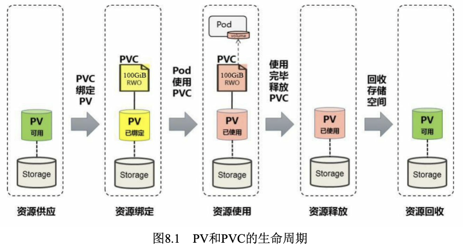
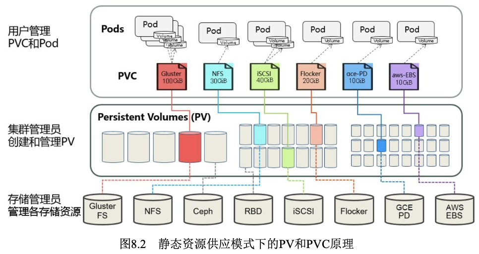
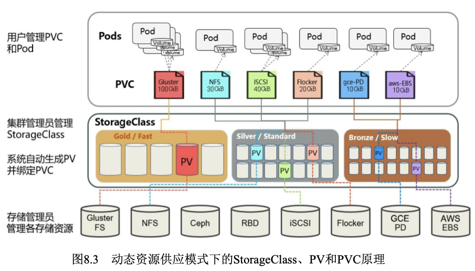
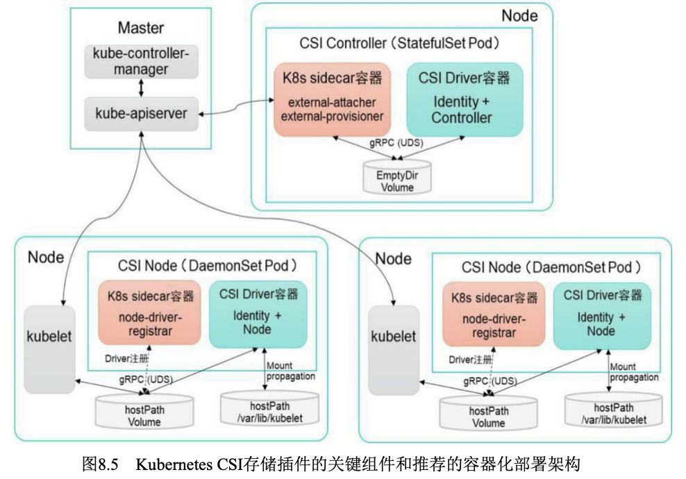

# 共享存储原理
## 共享存储机制概述
PV是对底层网络共享存储的抽象，将共享存储定义为一种“资源”，比如Node也是一种容器应用可以“消费”的资源。PV由管理员创建和配 置，它与共享存储的具体实现直接相关，例如GlusterFS、iSCSI、RBD 或GCE或AWS公有云提供的共享存储，通过插件式的机制完成与共享存储的对接，以供应用访问和使用。
PVC则是用户对存储资源的一个“申请”。就像Pod“消费”Node的资源一样，PVC能够“消费”PV资源。PVC可以申请特定的存储空间和访问模式。
使用PVC“申请”到一定的存储空间仍然不能满足应用对存储设备的各种需求。通常应用程序都会对存储设备的特性和性能有不同的要求， 包括读写速度、并发性能、数据冗余等更高的要求，Kubernetes从1.4版本开始引入了一个新的资源对象StorageClass，用于标记存储资源的特性和性能。到1.6版本时，StorageClass和动态资源供应的机制得到了完善，实现了存储卷的按需创建，在共享存储的自动化管理进程中实现了重要的一步。

## PV详解
PV作为存储资源，主要包括存储能力、访问模式、存储类型、回 收策略、后端存储类型等关键信息的设置。
### PV的关键配置参数
- 存储能力(Capacity)
- 存储卷模式(Volume Mode)
  - AWSElasticBlockStore
  - AzureDisk
  - FC
  - Local volume
  - ...
- 访问模式(Access Modes)
  - ReadWriteOnce(RWO):读写权限，并且只能被单个Node挂载。
  - ReadOnlyMany(ROX):只读权限，允许被多个Node挂载。
  - ReadWriteMany(RWX):读写权限，允许被多个Node挂载。
- 存储类别(Class)
- 回收策略(Reclaim Policy)
  - 保留:保留数据，需要手工处理。
  - 回收空间:简单清除文件的操作(例如执行rm -rf /thevolume/* 命令)。
  -  删除:与PV相连的后端存储完成Volume的删除操作(如AWS EBS、GCE PD、Azure Disk、OpenStack Cinder等设备的内部Volume清理)。
- 挂载参数(Mount Options)
- 节点亲和性(Node Affinity)
### PV生命周期的各个阶段
- Available:可用状态，还未与某个PVC绑定。
- Bound:已与某个PVC绑定。
- Released:绑定的PVC已经删除，资源已释放，但没有被集群回收。
- Failed:自动资源回收失败。

## PVC详解
PVC作为用户对存储资源的需求申请，主要包括存储空间请求、访问模式、PV选择条件和存储类别等信息的设置。下例声明的PVC具有如下属性:申请8GiB存储空间，访问模式为ReadWriteOnce，PV 选择条件为包含标签“release=stable”并且包含条件为“environment In [dev]”的标签，存储类别为“slow”(要求在系统中已存在名为slow的 StorageClass):
```yaml
apiVersion: v1
kind: PersistentVolumeClaim
metadata:
  name: myclaim
spec:
  accessModes: # 用于描述用户应用对存储资源的访问权限。其三种访问模式的设置与PV的设置相同。
    - ReadWriteOnce
  resources: # 用户描述对存储资源的请求，目前仅支持 request.storage的设置，即存储空间大小。
    requests:
      storage: 8Gi
  storageClassName: slow # 在定义时可以设定需要的后端存储 的类别(通过storageClassName字段指定)，以减少对后端存储特性的 详细信息的依赖。只有设置了该Class的PV才能被系统选出，并与该 PVC进行绑定
  selector: # 通过对Label Selector的设置，可使 PVC对于系统中已存在的各种PV进行筛选。系统将根据标签选出合适 的PV与该PVC进行绑定。选择条件可以使用matchLabels和 matchExpressions进行设置，如果两个字段都设置了，则Selector的逻辑 将是两组条件同时满足才能完成匹配。
    matchLabels:
      release: "stable"
    matchExpressions:
      - {key: environment, operator: In, values: [dev]}
```
### PV和PVC的生命周期

### 资源供应
Kubernetes支持两种资源的供应模式:静态模式(Static)和动态模式(Dynamic)。资源供应的结果就是创建好的PV。
- 静态模式:集群管理员手工创建许多PV，在定义PV时需要将后端存储的特性进行设置。
- 动态模式:集群管理员无须手工创建PV，而是通过 StorageClass的设置对后端存储进行描述，标记为某种类型。此时要求 PVC对存储的类型进行声明，系统将自动完成PV的创建及与PVC的绑定。PVC可以声明Class为""，说明该PVC禁止使用动态模式。

### 资源绑定
在用户定义好PVC之后，系统将根据PVC对存储资源的请求(存储 空间和访问模式)在已存在的PV中选择一个满足PVC要求的PV，一旦 找到，就将该PV与用户定义的PVC进行绑定，用户的应用就可以使用 这个PVC了。如果在系统中没有满足PVC要求的PV，PVC则会无限期处 于Pending状态，直到等到系统管理员创建了一个符合其要求的PV。PV 一旦绑定到某个PVC上，就会被这个PVC独占，不能再与其他PVC进行 绑定了。在这种情况下，当PVC申请的存储空间比PV的少时，整个PV 的空间就都能够为PVC所用，可能会造成资源的浪费。如果资源供应使 用的是动态模式，则系统在为PVC找到合适的StorageClass后，将自动创 建一个PV并完成与PVC的绑定。

### 资源使用
Pod使用Volume的定义，将PVC挂载到容器内的某个路径进行使 用。Volume的类型为persistentVolumeClaim，在后面的示例中再进行详 细说明。在容器应用挂载了一个PVC后，就能被持续独占使用。不过， 多个Pod可以挂载同一个PVC，应用程序需要考虑多个实例共同访问一 块存储空间的问题。

### 资源释放
当用户对存储资源使用完毕后，用户可以删除PVC，与该PVC绑定 的PV将会被标记为“已释放”，但还不能立刻与其他PVC进行绑定。通过 之前PVC写入的数据可能还被留在存储设备上，只有在清除之后该PV 才能再次使用。

### 资源回收
对于PV，管理员可以设定回收策略，用于设置与之绑定的PVC释 放资源之后如何处理遗留数据的问题。只有PV的存储空间完成回收， 才能供新的PVC绑定和使用。
在静态资源供应模式下，通过PV和PVC完成绑定，并 供Pod使用的存储管理机制。


在动态资源供应模式下，通过StorageClass和PVC完成 资源动态绑定(系统自动生成PV)，并供Pod使用的存储管理机制。


## StorageClass详解
StorageClass作为对存储资源的抽象定义，对用户设置的PVC申请屏 蔽后端存储的细节，一方面减少了用户对于存储资源细节的关注，另一 方面减轻了管理员手工管理PV的工作，由系统自动完成PV的创建和绑 定，实现了动态的资源供应。基于StorageClass的动态资源供应模式将 逐步成为云平台的标准存储配置模式。

### StorageClass的关键配置参数
### 设置默认的StorageClass

## 动态存储管理实战：ClusterFS

## CSI存储机制详解
Kubernetes从1.9版本开始引入容器存储接口Container Storage Interface(CSI)机制，用于在Kubernetes和外部存储系统之间建立一套 标准的存储管理接口，通过该接口为容器􏰀供存储服务。CSI到 Kubernetes 1.10版本升级为Beta版，到Kubernetes 1.13版本升级为GA 版，已逐渐成熟。

### CSI的设计背景
Kubernetes通过PV、PVC、Storageclass已经提供了一种强大的基于插件的存储管理机制，但是各种存储插件􏰀供的存储服务都是基于一种 被称为“in-true”(树内)的方式提供的，这要求存储插件的代码必须被放进Kubernetes的主干代码库中才能被Kubernetes调用，属于紧耦合的开发模式。这种“in-tree”方式会带来一些问题:
- 存储插件的代码需要与Kubernetes的代码放在同一代码库中，并与Kubernetes的二进制文件共同发布;
- 存储插件代码的开发者必须遵循Kubernetes的代码开发规范;
- 存储插件代码的开发者必须遵循Kubernetes的发布流程，包括添加对Kubernetes存储系统的支持和错误修复;
- Kubernetes社区需要对存储插件的代码进行维护，包括审核、测试等工作;
- 存储插件代码中的问题可能会影响Kubernetes组件的运行，并且很难排查问题;
- 存储插件代码与Kubernetes的核心组件(kubelet和kube- controller-manager)享有相同的系统特权权限，可能存在可靠性和安全性问题。
Kubernetes已有的Flex Volume插件机制试图通过为外部存储暴露一个基于可执行程序(exec)的API来解决这些问题。尽管它允许第三方存储提供商在Kubernetes核心代码之外开发存储驱动，但仍然有两个问题没有得到很好的解决:
- 部署第三方驱动的可执行文件仍然需要宿主机的root权限，存在安全隐患;
- 存储插件在执行mount、attach这些操作时，通常需要在宿主机上安装一些第三方工具包和依赖库，使得部署过程更加复杂，例如部署 Ceph时需要安装rbd库，部署GlusterFS时需要安装mount.glusterfs库，等等。

### CSI存储插件的关键组件和部署架构


#### CSI Controller

### CSI存储插件的使用示例

### CSI的发展

## 参考