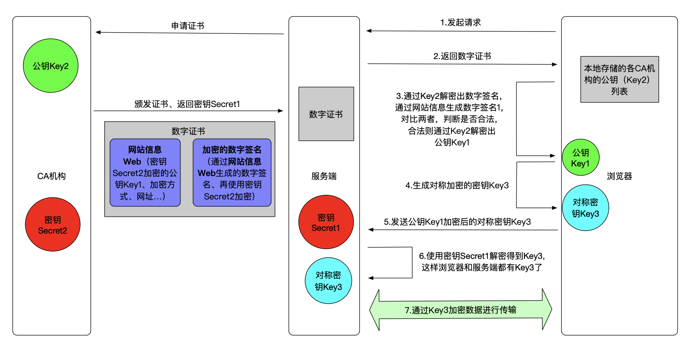

# HTTPS协议

## 简介
超文本传输安全协议（英语：HyperText Transfer Protocol Secure，缩写：HTTPS；常称为HTTP over TLS、HTTP over SSL或HTTP Secure）是一种通过计算机网络进行安全通信的传输协议。HTTPS经由HTTP进行通信，但利用SSL/TLS来加密数据包。HTTPS开发的主要目的，是提供对网站服务器的身份认证，保护交换数据的隐私与完整性。这个协议由网景公司（Netscape）在1994年首次提出，随后扩展到互联网上。

历史上，HTTPS连接经常用于万维网上的交易支付和企业信息系统中敏感信息的传输。在2000年代末至2010年代初，HTTPS开始广泛使用，以确保各类型的网页真实，保护账户和保持用户通信，身份和网络浏览的私密性。

另外，还有一种安全超文本传输协议（S-HTTP）的HTTP安全传输实现，但是HTTPS的广泛应用而成为事实上的HTTP安全传输实现，S-HTTP并没有得到广泛支持。

### 与HTTP差异
- HTTP的URL是由“http://”起始与默认使用端口80
- 而HTTPS的URL则是由“https://”起始与默认使用端口443
- 需要校验证书

### 工作流程
看了很多文档，花了这个图，希望有助于理解


### 补充
#### Nginx配置HTTPS
ssl_certificate配置的是数字证书，ssl_certificate_key是网站的密钥，在第三方云市场申请HTTPS服务时，会有这两个文件（上图中的颁发证书、返回密钥Secret1步骤）。

```
server {
    listen              443 ssl;
    server_name         www.example.com;
    ssl_certificate     www.example.com.crt;
    ssl_certificate_key www.example.com.key;
    ssl_protocols       TLSv1 TLSv1.1 TLSv1.2;
    ssl_ciphers         HIGH:!aNULL:!MD5;
    ...
}
```

#### Why Https?
可以简单阅读以下参考2，大体上就是HTTP无法阻止中间人攻击，使用HTTPS可以防止这一类的攻击（当然，如果你的CA机构都是不靠谱的，那就另当别论，参考4）

## 参考
1. [https://zh.wikipedia.org/wiki/%E8%B6%85%E6%96%87%E6%9C%AC%E4%BC%A0%E8%BE%93%E5%AE%89%E5%85%A8%E5%8D%8F%E8%AE%AE](https://zh.wikipedia.org/wiki/%E8%B6%85%E6%96%87%E6%9C%AC%E4%BC%A0%E8%BE%93%E5%AE%89%E5%85%A8%E5%8D%8F%E8%AE%AE)
2. [https://zhuanlan.zhihu.com/p/57142784](https://zhuanlan.zhihu.com/p/57142784)
3. [http://nginx.org/en/docs/http/configuring_https_servers.html](http://nginx.org/en/docs/http/configuring_https_servers.html)
4. [http://tech.sina.com.cn/roll/2017-07-10/doc-ifyhweua4520682.shtml](http://tech.sina.com.cn/roll/2017-07-10/doc-ifyhweua4520682.shtml)