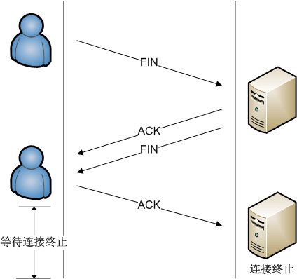

# TCP

## 简介
传输控制协议（英语：Transmission Control Protocol，缩写：TCP）是一种面向连接的、可靠的、基于字节流的传输层通信协议，由IETF的RFC 793定义。在简化的计算机网络OSI模型中，它完成第四层传输层所指定的功能。

应用层向TCP层发送用于网间传输的、用8位字节表示的数据流，然后TCP把数据流分割成适当长度的报文段（通常受该计算机连接的网络的数据链路层的最大传输单元（MTU）的限制）。之后TCP把结果包传给IP层，由它来透过网络将包传送给接收端实体的TCP层。TCP为了保证不发生丢包，就给每个包一个序号，同时序号也保证了传送到接收端实体的包的按序接收。然后接收端实体对已成功收到的包发回一个相应的确认信息（ACK）；如果发送端实体在合理的往返时延（RTT）内未收到确认，那么对应的数据包就被假设为已丢失并进行重传。TCP用一个校验和函数来检验数据是否有错误，在发送和接收时都要计算校验和。

## 格式
### TCP报文首部
- 源端口和目的端口，各占2个字节，分别写入源端口和目的端口；
序号，占4个字节，TCP连接中传送的字节流中的每个字节都按顺序编号。例如，一段报文的序号字段值是 301 ，而携带的数据共有100字段，显然下一个报文段（如果还有的话）的数据序号应该从401开始；
- 确认号，占4个字节，是期望收到对方下一个报文的第一个数据字节的序号。例如，B收到了A发送过来的报文，其序列号字段是501，而数据长度是200字节，这表明B正确的收到了A发送的到序号700为止的数据。因此，B期望收到A的下一个数据序号是701，于是B在发送给A的确认报文段中把确认号置为701；
- 数据偏移，占4位，它指出TCP报文的数据距离TCP报文段的起始处有多远；
- 保留，占6位，保留今后使用，但目前应都位0；
- 紧急URG，当URG=1，表明紧急指针字段有效。告诉系统此报文段中有紧急数据；
- 确认ACK，仅当ACK=1时，确认号字段才有效。TCP规定，在连接建立后所有报文的传输都必须把ACK置1；
- 推送PSH，当两个应用进程进行交互式通信时，有时在一端的应用进程希望在键入一个命令后立即就能收到对方的响应，这时候就将PSH=1；
- 复位RST，当RST=1，表明TCP连接中出现严重差错，必须释放连接，然后再重新建立连接；
- 同步SYN，在连接建立时用来同步序号。当SYN=1，ACK=0，表明是连接请求报文，若同意连接，则响应报文中应该使SYN=1，ACK=1；
- 终止FIN，用来释放连接。当FIN=1，表明此报文的发送方的数据已经发送完毕，并且要求释放；
- 窗口，占2字节，指的是通知接收方，发送本报文你需要有多大的空间来接受；
- 检验和，占2字节，校验首部和数据这两部分；
- 紧急指针，占2字节，指出本报文段中的紧急数据的字节数；
- 选项，长度可变，定义一些其他的可选的参数。

## 工作方式
简化版的TCP状态图（看不懂？？正常正常。。）

- 连接创建(connection establishment)
- 数据传送（data transfer）
- 连接终止（connection termination）

### 连接创建（三次握手）

#### 具体流程
- 客户端通过向服务器端发送一个SYN来创建一个主动打开，客户端把这段连接的序号设定为随机数x。
- 服务器端应当为一个合法的SYN回送一个SYN/ACK(应答)。ACK的确认码应为x+1，SYN/ACK包本身又有一个随机产生的序号y。
- 客户端再发送一个ACK。此时包的序号被设定为x+1，而ACK的确认码则为y+1。当服务端收到这个ACK的时候，就完成了三次握手，并进入了连接创建状态。

#### 注意点（这个知识点很有趣）

如果服务器端接到了客户端发的SYN后回了SYN-ACK后客户端掉线了，服务器端没有收到客户端回来的ACK，那么，这个连接处于一个中间状态，即没成功，也没失败（半连接状态）。于是，服务器端如果在一定时间内没有收到的TCP会重发SYN-ACK。在Linux下，默认重试次数为5次，重试的间隔时间从1s开始每次都翻倍，5次的重试时间间隔为1s, 2s, 4s, 8s, 16s，总共31s，第5次发出后还要等32s才知道第5次也超时了，所以，总共需要 1s + 2s + 4s+ 8s+ 16s + 32s = 63s，TCP才会断开这个连接。使用三个TCP参数来调整行为：tcp_synack_retries 减少重试次数；tcp_max_syn_backlog，增大SYN连接数；tcp_abort_on_overflow决定超出能力时的行为。

### 数据传送

#### 具体流程
- 发送方首先发送第一个包含序列号为1（可变化）和1460字节数据的TCP报文段给接收方。接收方以一个没有数据的TCP报文段来回复（只含报头），用确认号1461来表示已完全收到并请求下一个报文段。
- 发送方然后发送第二个包含序列号为1461，长度为1460字节的数据的TCP报文段给接收方。正常情况下，接收方以一个没有数据的TCP报文段来回复，用确认号2921（1461+1460）来表示已完全收到并请求下一个报文段。发送接收这样继续下去。
- 然而当这些数据包都是相连的情况下，接收方没有必要每一次都回应。比如，他收到第1到5条TCP报文段，只需回应第五条就行了。在例子中第3条TCP报文段被丢失了，所以尽管他收到了第4和5条，然而他只能回应第2条。
- 发送方在发送了第三条以后，没能收到回应，因此当时钟（timer）过时（expire）时，他重发第三条。（每次发送者发送一条TCP报文段后，都会再次启动一次时钟：RTT）。
- 这次第三条被成功接收，接收方可以直接确认第5条，因为4，5两条已收到

#### 超时重传
发送方使用一个保守估计的时间作为收到数据包的确认的超时上限。如果超过这个上限仍未收到确认包，发送方将重传这个数据包。每当发送方收到确认包后，会重置这个重传定时器。

#### 校验和
保证每次传输的数据完整性和正确性（详见维基百科）

### 连接终止（四次挥手）

数据传输完毕后，双方都可释放连接。最开始的时候，客户端和服务器都是处于ESTABLISHED状态，然后客户端主动关闭，服务器被动关闭。

#### 具体流程
参考2

- 断开端发出连接释放报文，并停止发送数据。释放数据报文首部，FIN=1，其序列号为seq=u（随机数），此时，断开端进入FIN-WAIT-1（终止等待1）状态。
- 被断开端收到连接释放报文，发出确认报文，ACK=1，ack=u+1，并且带上自己的序列号seq=v，此时，被断开端就进入了CLOSE-WAIT（关闭等待）状态。被断开端通知高层的应用进程，断开端向被断开端的方向就释放了，这时候处于半关闭状态，即断开端已经没有数据要发送了，但是被断开端若发送数据，断开端依然要接受。断开端收到被断开端的确认请求后，此时，断开端就进入FIN-WAIT-2（终止等待2）状态，等待被断开端发送连接释放报文（在这之前还需要接受被断开端发送的最后的数据）。
- 被断开端将最后的数据发送完毕后，就向断开端发送连接释放报文，FIN=1，ack=u+1，由于在半关闭状态，被断开端很可能又发送了一些数据，假定此时的序列号为seq=w，此时，被断开端就进入了LAST-ACK（最后确认）状态，等待断开端的确认。
- 断开端收到被断开端的连接释放报文后，必须发出确认，ACK=1，ack=w+1，而自己的序列号是seq=u+1，此时，断开端就进入了TIME-WAIT（时间等待）状态。注意此时TCP连接还没有释放，必须经过2*MSL（最长报文段寿命）的时间后，当断开端撤销相应的TCB后，才进入CLOSED状态。被断开端只要收到了断开端发出的确认，立即进入CLOSED状态。同样，撤销TCB后，就结束了这次的TCP连接。

#### 超时机制
断开端会超时等待2*MSL时间，然后关闭连接。在这段超时等待时间内，本地的端口不能被新连接使用；避免延时的包的到达与随后的新连接相混淆。RFC793定义了MSL为2分钟，Linux设置成了30s。参数tcp_max_tw_buckets控制并发的TIME_WAIT的数量，默认值是180000，如果超限，那么，系统会把多的TIME_WAIT状态的连接给destory掉，然后在日志里打一个警告（如：time wait bucket table overflow）。如果被断开端在一定时间内无法得到ACK，则会重新向断开端FIN，这是因为断开端在等待，就会重新发送ACK。（问题3的原因）

## 问题
### 为啥连接是三次握手？
第一次握手，服务端确定客户端发送能力正常，但是不知道客户端接受能力是否正常，客户端啥都确定不了；第二次握手，客户端确定服务端发送能力、接受能力正常，但是服务端还是确定不了客户端接受能力；第三次握手，服务端确定客户端接受能力正常。因此，至少需要三次握手才能确认双方的接收与发送能力是否正常。

### 为啥断开是四次挥手？
由于TCP连接设计之初就是数据是双向传输的，并且具有半关闭的特性（一个方向结束发送数据但是还可以接受数据）。当有一方要关闭连接时，会发送FIN通知对方，这时对方会回一个ACK，此时一个方向的连接关闭。但是任然是可以接受数据的，另一个方向仍然有可能继续发送数据，等到发送完了所有的数据后，会发送一个FIN来通知对方关闭此方向上的连接。接收方发送ACK确认关闭连接（如果不ACK确认，无法保证对方是否收到消息）。因此，至少4次才能保证双方都能够断开数据传输。

### 为什么断开端最后还要等待2*MSL？
断开端第四次挥手时，向被断开端发送了ACK响应，此时有可能因为网络原因，被断开端无法接收得到，被断开端会重新尝试第三次挥手，发出FIN指令，如果不等待2*MSL，则被断开端无法正常关闭。

### SYN攻击
DOS攻击的一种，恶意的向某个服务器端口发送大量的SYN包，从而使服务器打开大量的半开连接，占用过多的服务资源，从而使请求无法得到服务的响应。（半连接队列满了）

### 半连接队列和全连接队列
半连接队列存储的是第二次握手的连接状态（见文章注意点）；全连接队列存储的是第三次握手之后的连接状态

## 实践
如果在Linux下面查看TCP连接？如何优化？

## 参考
1. [https://zh.wikipedia.org/wiki/%E4%BC%A0%E8%BE%93%E6%8E%A7%E5%88%B6%E5%8D%8F%E8%AE%AE](https://zh.wikipedia.org/wiki/%E4%BC%A0%E8%BE%93%E6%8E%A7%E5%88%B6%E5%8D%8F%E8%AE%AE)
2. [https://blog.csdn.net/qzcsu/article/details/72861891](https://blog.csdn.net/qzcsu/article/details/72861891)
3. [https://juejin.im/post/5d9c284b518825095879e7a5](https://juejin.im/post/5d9c284b518825095879e7a5)