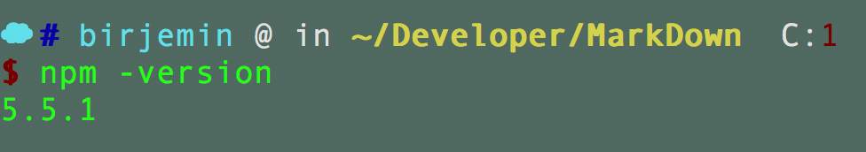
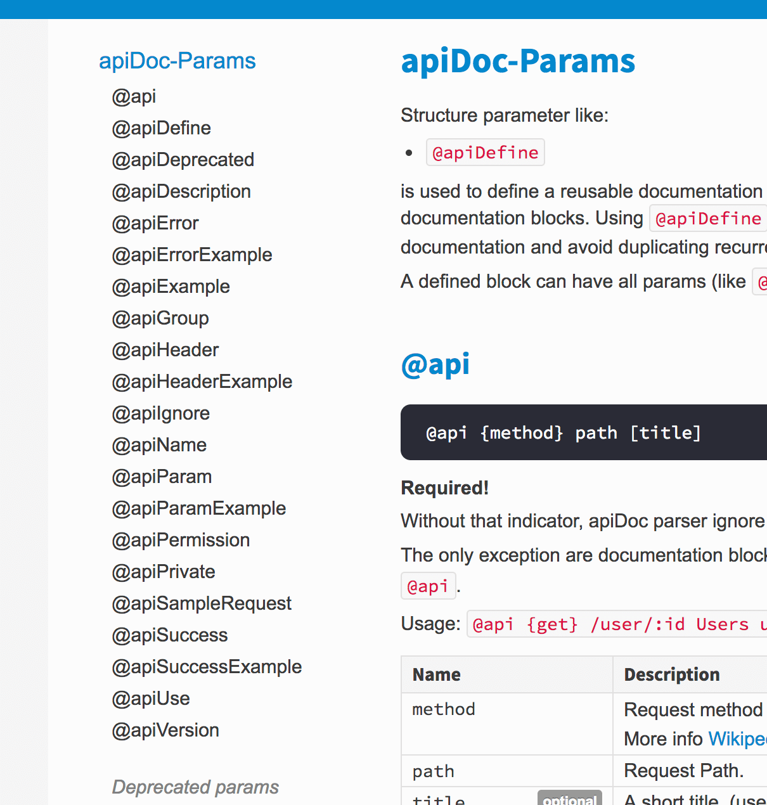

# ApiDoc的使用

## 说明

```
apiDoc creates a documentation from API annotations in your source code
```
apiDoc是一个接口文档，它的创建方式是基于你的源代码的接口备注。我们只需要给接口写好相应的文档，然后使用apiDoc生成接口文档工具生成文档，便于管理和查看。

## 配置方式



1.安装apidoc（npm是啥？？？自己问前端同学吧。。）

```
npm install apidoc -g
```
安装http-server

```
npm install http-server -g 
```

2.给接口添加文档（官方示例），添加在Controller入口方法前面。

```
/**
 * @api {get} /user/:id Request User information
 * @apiName GetUser
 * @apiGroup User
 *
 * @apiParam {Number} id Users unique ID.
 *
 * @apiSuccess {String} firstname Firstname of the User.
 * @apiSuccess {String} lastname  Lastname of the User.
 */
```

3.创建apidoc.json(官方示例)

```
{
  "name": "example",
  "version": "0.1.0",
  "description": "apiDoc basic example",
  "apidoc": {
    "title": "Custom apiDoc browser title",
    "url" : "https://api.github.com/v1"
  }
}
```

4.生成apiDoc

```
apidoc -i app/Http/Controllers -o apidoc/
```

5.运行

```
http-server apidoc
```

## 补充备注



## 参考
1. [http://apidocjs.com/](http://apidocjs.com/)