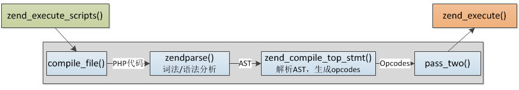

# PHP的编译和执行

## 执行过程
1. Scanning(Lexing) ,将PHP代码转换为语言片段(Tokens)  
2. Parsing, 将Tokens转换成简单而有意义的表达式  
3. Compilation, 将表达式编译成Opocdes  
4. Execution, 顺次执行Opcodes，每次一条，从而实现PHP脚本的功能。 

## 编译过程

PHP代码解析成了若干条opcode数组，每条opcode就是C里面普通的struct结构体，含义对应C程序的机器指令，执行的过程就是引擎依次执行opcode。(opcode含义可以查看：我整理的zend引擎这篇文章)。通俗来说PHP的解析过程就是将PHP代码转化为opcode数组，代码里的所有信息都保存在opcode中，然后将opcode数组交给zend引擎执行，opcode就是内核具体执行的命令，比如赋值、加减操作、函数调用等，每一条opcode都对应一个处理handle，这些handler是提前定义好的C函数。旧的PHP版本直接生成了opcode，PHP7新增了抽象语法树（AST），在语法分析阶段生成AST，然后再生成opcode数组。

## 词法解析和语法解析
PHP编译过程包括词法分析、语法分析，使用re2c、bison完成。
* re2c: 词法分析器，将输入分割为一个个有意义的词块，称为token
* bison: 语法分析器，确定词法分析器分割出的token是如何彼此关联的

## 综述
还没看完 等我看完了看懂了再来填坑

## 参考
1. [https://www.kancloud.cn/nickbai/php7/363273](https://www.kancloud.cn/nickbai/php7/363273)
