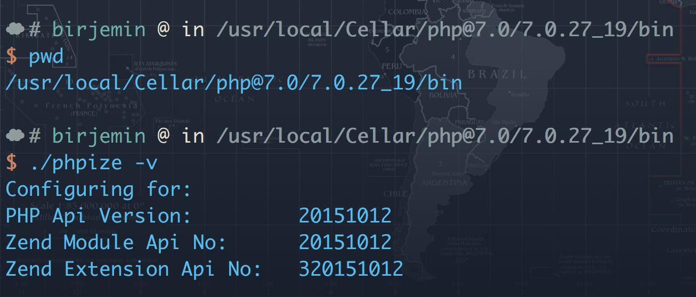

# Php多版本安装

## 引言
lumen和laravel可以使用自带的install进行安装(可参照参考1和参考2)，令人发指的是最新的安装器默认采用的是php7.1,本地的环境是7.0，所以得不失礼貌微笑的说一声：干得漂亮！

## 问题
那么问题来了，我要安装多版本的php了，php7.1

## 步骤

#### 安装php7.1

```
brew install php71
```

#### 修改php-fpm.conf

原因是我有php70,php71,对php70我还是使用之前默认的9000端口，php71更改为9001端口，这样只要在nginx配置站点的时候制定端口就可以使用不同版本的php版本啦！！


#### 启动php-fpm

```
cd /usr/local/Cellar/php@7.0/7.0.27_19/sbin
./php-fpm -D

cd /usr/local/Cellar/php@7.0/7.1.18/sbin
./php-fpm -D
```


#### 配置nginx


1. 比如我为了测试方便，需要打印本地的`phpinfo`，配置了两个一个是`localhost localhost9000.com`，一个是`localhost9001.com`，监听不同的端口，指向的是同一个directory，在`/usr/local/var/www`里面`index.php`,其实就是

```php
echo phpinfo();
```

2. 使用SwitchHost管理本地域名（工作中需要配置各种域名，这个工具棒棒哒），配置了两个

```
127.0.0.1 localhost9000.com
127.0.0.1 localhost9001.com
```

3. 浏览器访问：


#### 切换php版本
Q:lumen安装他用的是php的环境变量，也就是说你不能通过参数告诉他我要用哪个版本来创建lumen,你要指定php环境变量指向的php版本，不然还是无法创建应用。

A:由于运行了两个版本的php-fpm，而且在不同的端口（9000，9001）所以web访问的时候制定端口就好了，但是cli模式访问的时候就比较尴尬了，这里推荐php-version这个东东，不过我遇到了问题，就是切换不了，以至于我只能修改环境变量来制定不同的php版本。（待作者给我答复吧，github~~）

#### 安装redis、xdebug、memcached扩展

感兴趣的可以看一下参考5，大致的意思是brew官方改版tap库了，所以你就别指望`brew install php71-redis`方法来安装redis扩展啦,xdebug,memcached等等统统不支持了，是不是瞬间忧伤成狗了？？？哈哈哈,还有一种方法叫源码安装。（参考4给出了扩展源码地址，下载源码，解压，然后进入目录）

1. 确认phpize目录




2. 进去扩展目录（确认好你的php环境变量是你要编译扩展对应的版本~~）
```
/usr/local/Cellar/php@7.1/7.1.18/bin/phpize
./configure
make
make test
make install
```


3. 引入该扩展(xdebug是zend_extension扩展,redis和memcached是extension扩展)


4. 重启php-fpm

## 备注
原初的目的就是为了装一下lumne5.6，没想到引出了这么多问题。。。。。不过多版本php安装感兴趣的小伙伴可以了解一下~~~

## 参考
1. [https://lumen.laravel.com/docs/master](https://lumen.laravel.com/docs/master)
2. [https://laravel.com/docs/master](https://laravel.com/docs/master)
3. [https://blog.csdn.net/qdujunjie/article/details/38415033](https://blog.csdn.net/qdujunjie/article/details/38415033)
4. [http://pecl.php.net/index.php](http://pecl.php.net/index.php)
5. [https://newsn.net/say/brew-php-redis.html](https://newsn.net/say/brew-php-redis.html)