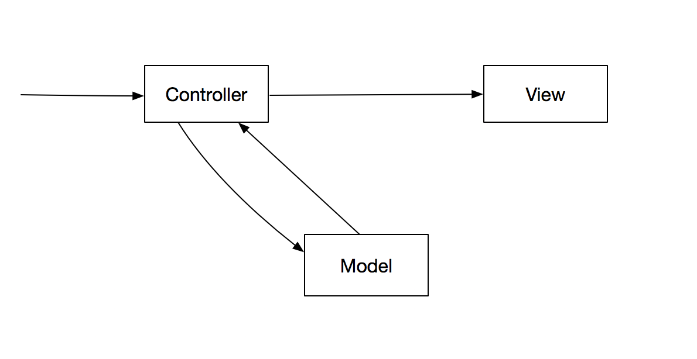
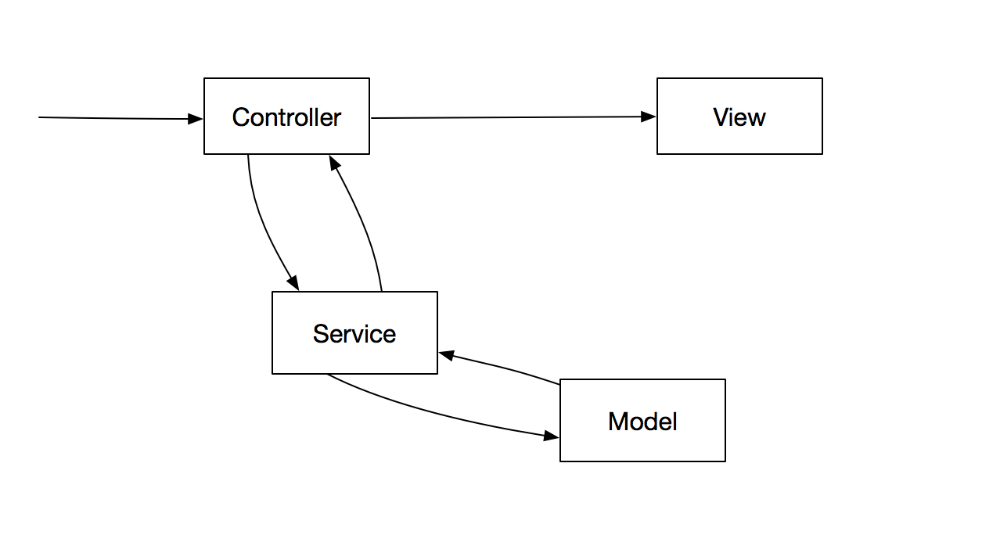
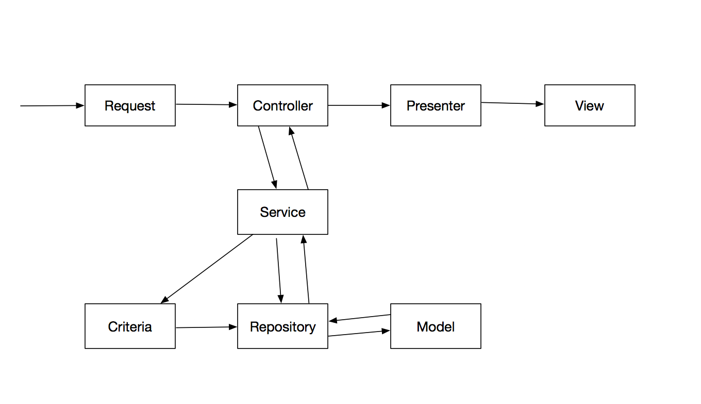

# l5-repository的使用
## 背景

使用l5-repository对mvc进行扩展和分层，尤其是对model进行简化和整理。

## 简介

```
Laravel 5 - Repositories to abstract the database layer
```

## 结构

* 简单的mvc



* 升级



* 使用l5-repository进行扩展



## 说明

1.Request为laravel自带的验证(validate)方式,可以参考（参考3）链接，使用`php artisan make:request SubjectRequest`生成，在Controller里面进行注入，通过validated()方法获取验证通过的参数。

```
namespace App\Http\Requests\Client;

use App\Exceptions\BusinessException;
use App\Support\BusinessErrorConstants;
use Illuminate\Contracts\Validation\Validator;
use Illuminate\Foundation\Http\FormRequest;

class SubjectRequest extends FormRequest
{
    public function authorize()
    {
        return true;
    }
    public function rules()
    {//...
    }

    public function messages()
    {//...
    }
    
    // 可以在Exceptions的Handler.php拦截报错，自定义异常
    protected function failedValidation(Validator $validator)
    {
        throw new BusinessException(
            BusinessErrorConstants::ERR_CLIENT_ALTER_PARAMS_INVALID, $validator->errors()->messages()
        );
    }
}
```

2.Criteria作用不太明显，根据官方说明，是为了增强repository而存在，感觉不太好用，而且repository已经满足了日常的查询语句书写。

3.Validator作用不太明显，因为在Request层已经对参数变量进行了约束，也就没必要在落库的时候再来一次这样的操作。

4.Presenter作用也不太明显，尤其是在前段后分离之后，这个格式化数据是在渲染模板的时候做的，前后端分离之后没有view这一层的渲染。可以使`Transformable`做这件事情

5.Cache这个好用！

## 参考
1. [https://github.com/andersao/l5-repository](https://github.com/andersao/l5-repository)
2. [http://www.cnblogs.com/photo520/p/6834553.html](http://www.cnblogs.com/photo520/p/6834553.html)
3. [http://laravelacademy.org/post/3279.html](http://laravelacademy.org/post/3279.html)