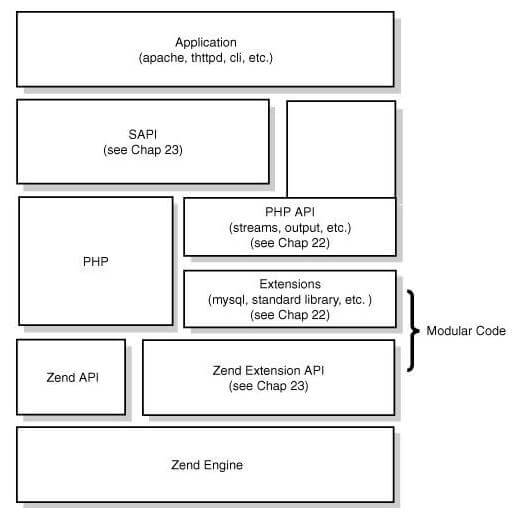
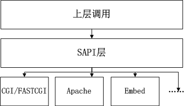
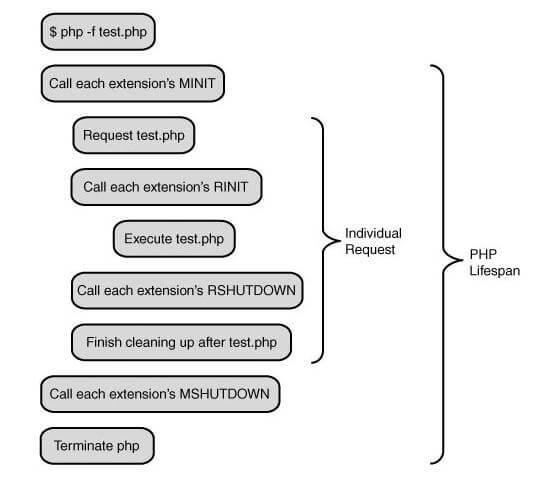
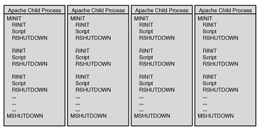
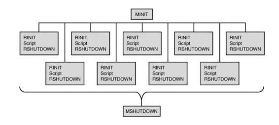

# PHP的生命周期

## PHP的架构图



## SAPI
```
SAPI(Server Application Programming Interfac) is an application programming interface (API) provided by the web server to help other developers in extending the web server capabilities.
```
SAPI是一个用来帮助其他开发程序扩展web服务器功能的应用程序接口（api）。它将外部条件抽象, 为内部的PHP提供一套固定统一的接口, 使得PHP自身实现能够不受外部环境影响，保持一定的独立性。
PHP中常用的SAPI有cli(命令行模式，单进程)、php-fpm、CGI、Apache...
有点像策略模式,使用相同的接口，但是实现会略有不同。



## PHP的启动和终止
* 请求之前的开始阶段：
  * MINIT：模块初始化阶段。初始化一些扩展、常量、类、资源等所有被php脚本用到的东西。（常驻内存,可以被所有请求使用。）
  * PRINT：模块激活阶段。PHP会调用所有模块的RINIT函数，在这个阶段各个模块也可以执行一些相关的操作，比如初始化`本次请求`使用到的变量。
* 请求之后的结束阶段：
  * RSHUTDOWN：这个页面请求执行完毕，或者被用户给die（exit）了， 这时PHP会启动回收程序，回收本次请求使用的资源。这次会执行所有已加载扩展的RSHUTDOWN（俗称Request Shutdown）方法， 这时候扩展可以利用内核中的变量表等做的一些事情。因为PHP一旦把所有扩展的RSHUTDOWN方法执行完，便会释放掉这次请求使用过的所有资源，比如变量表的所有变量、所有在这次请求中申请的内存等。
  * MSHUTDOWN：PHP执行所有扩展的MSHUTDOWN，释放资源。

## PHP的生命周期
1.单进程SAPI生命周期（CLI/CGI）

  

2.多进程SAPI生命周期（Apache2）

  

3.多线程的SAPI生命周期

  

4.Embed

  Embed SAPI是一种比较特殊的sapi，容许你在C/C++语言中调用PHP/ZE提供的函数。（不太了解，明天看一下！ [http://www.laruence.com/2008/09/23/539.html](http://www.laruence.com/2008/09/23/539.html)）

## 综述
理一下PHP的生命周期，以及PHP整个执行过程。还有怎么通过SAPI和PHP模块沟通.
（图片基本是从参考链接那边拿过来的，站在前人的肩膀上。）

## 参考
1. [http://www.laruence.com/2008/08/12/180.html](http://www.laruence.com/2008/08/12/180.html)
2. [https://en.wikipedia.org/wiki/Server_Application_Programming_Interface](https://en.wikipedia.org/wiki/Server_Application_Programming_Interface)
3. [http://www.cunmou.com/phpbook/1.1.md](http://www.cunmou.com/phpbook/1.1.md)
4. [https://foio.github.io/php-sapi/](https://foio.github.io/php-sapi/)
5. [http://www.php-internals.com/book/?p=chapt02/02-01-php-life-cycle-and-zend-engine](http://www.php-internals.com/book/?p=chapt02/02-01-php-life-cycle-and-zend-engine)
