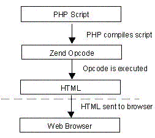
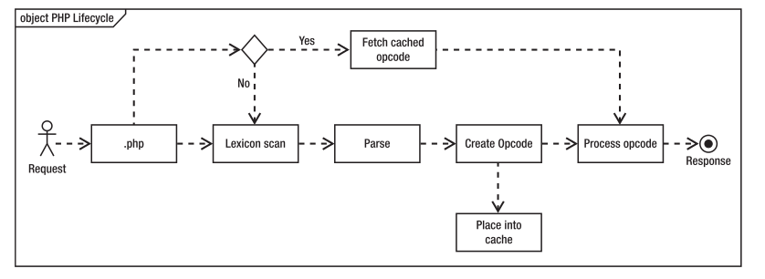

# Zend引擎

## 简介
```
The Zend Engine is the open source scripting engine that interprets the PHP programming language.
```
Zend引擎是开源的解释php语言的脚本引擎。



Zend有两部分组成，即编译器和执行器。编译器负责将PHP代码编译为抽象语法树，然后进一步编译为可执行的opcodes，这个过程相当于GCC的工作，编译器是一个语言实现的基础；执行器负责执行编译器输出的Opcodes，也就是执行PHP脚本中编写的代码逻辑。
Opcode是将PHP代码编译产生的Zend虚拟机可识别的指令，php7共有173个Opcode，定义在zend_vm_opcodes.h中，PHP中的所有语法实现都是由这些opcode组成的。

```
Zend Engine最主要的特性就是把PHP的边解释边执行的运行方式改为先进行预编译(Compile)，然后再执行(Execute)
```

## 详细原理
见链接3（我没看完，不太懂，还是太年轻啊~~）。

## 优缺点
* 执行效率大幅提升
* 降低解耦，可扩展增强
* Zend Engine 将代码分成编译和执行两大部分。一般情况下，我们的代码完成以后就很少再去改变了。但执行时PHP却不得不重新编译，耗时并且浪费资源。（所以才有Opcache呀~）

## Opcode
Opcode是一种PHP脚本编译后的中间语言，就像Java的ByteCode,或者.NET的MSL。PHP执行代码会经过如下4个步骤(确切的来说，应该是PHP的语言引擎Zend):
```
  1.Scanning(Lexing) ,将PHP代码转换为语言片段(Tokens)
  2.Parsing, 将Tokens转换成简单而有意义的表达式
  3.Compilation, 将表达式编译成Opocdes
  4.Execution, 顺次执行Opcodes，每次一条，从而实现PHP脚本的功能。
```
现在有的Cache比如APC、Opcache(APC止步于PHP 5.4，Zend Opcache从PHP 5.5 开始集成，取代APC。),可以使得PHP缓存住Opcodes，这样，每次有请求来临的时候，就不需要重复执行前面3步，从而能大幅的提高PHP的执行速度。
如下图：



## 小插曲
有一次线上发代码了(修改了数据库)，但是数据库里面数据没进来，非常诡异，怀疑是代码没有发成功，后来leader在群里对运维说Opcache（原理就是缓存Opcodes）没有更新。。。小坑小坑

## 参考
1. [http://www.careerride.com/PHP-zend-engine.aspx](http://www.careerride.com/PHP-zend-engine.aspx)
2. [https://www.kancloud.cn/nickbai/php7/363257](https://www.kancloud.cn/nickbai/php7/363257)
3. [https://github.com/pangudashu/php7-internal/blob/master/3/zend_executor.md](https://github.com/pangudashu/php7-internal/blob/master/3/zend_executor.md)
4. [http://www.nowamagic.net/librarys/veda/detail/1291](http://www.nowamagic.net/librarys/veda/detail/1291)
5. [https://www.cnblogs.com/JohnABC/p/4531029.html](https://www.cnblogs.com/JohnABC/p/4531029.html)
6. [http://www.laruence.com/2008/06/18/221.html](http://www.laruence.com/2008/06/18/221.html)
