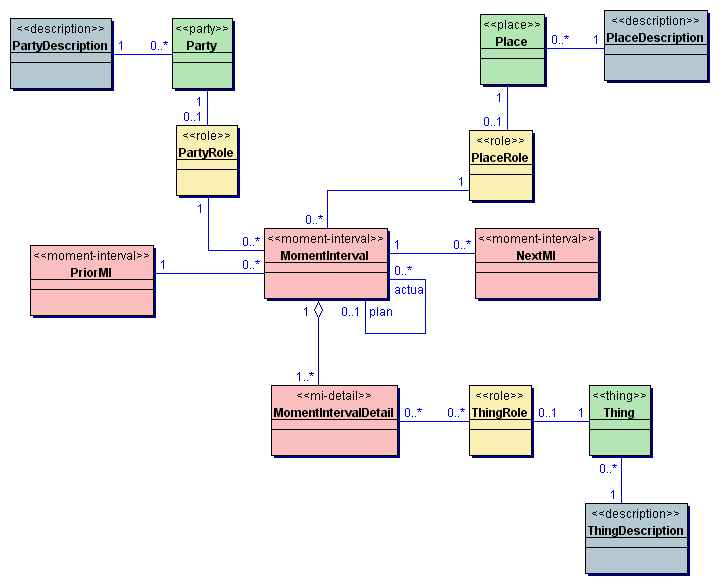

## 领域驱动设计（Domain Driven Design)

### 前言
#### 什么是软件
软件是一种被创建用来帮助我们处理现代生活中复杂问题的工具，它只是到达目的的一种方法（不是一定要使用软件）。
【手机、操作系统、IM、email】

#### 软件的特点
* 软件必须是实际和有用的；
* 软件设计是一门艺术（程序员是一位手艺人）；【木匠、工艺品、刺绣】
* 完成软件设计的方法多种多样；（这里单讲ddd这种方法）

#### 引出问题
```
在启动一个软件项目时，我们应该关注软件涉及的领域。软件的最终目的是增进一个特定的领域。为了达到这个目的，软件需要和他服务的领域相得益彰。
```
为了创建一个好的软件，你必须知道这个软件究竟是什么，主要解决什么领域的问题。

#### 什么是领域（Domain）
一个领域本质上可以理解为一个问题域 。只要确定了软件所属的领域，那么这个领域的核心业务（基本问题）就基本确定了。

#### 最佳实践
让软件成为该领域的映射。通过对领域进行建模（领域模型），对该领域模型进行实现。

### 领域通用语言（Ubiquitous Language）
为了让领域专家，设计人员，开发人员搭建沟通的桥梁。使用一门通用的语言。【UML、SQL】

### 领域驱动设计（Domain-Driven Design）

#### 领域驱动设计

领域驱动设计的核心是建立正确的领域模型。【怎么建立领域模型】

步骤：
```
1. 以一种领域专家、设计人员、开发人员都能理解的通用语言作为相互交流的工具，在交流的过程中发现领域概念，然后将这些概念设计成一个领域模型；
2. 由领域模型驱动软件设计，用代码来实现该领域模型；
```

#### 领域模型（Domain Model）

##### 特点：
1. 对具有某个边界的领域的一个抽象，反映了领域内用户业务需求的本质 。它属于『解决问题空间』。领域模型是有边界的，只反应了我们在领域内所关注的部分，包括 实体概念（如：货物，书本，应聘记录，地址等），以及过程概念（如：资金转账等）；
2. 提高软件的可维护性，业务可理解性以及可重用性。领域模型确保了我们的软件的业务逻辑都在一个模型中，帮助开发人员相对平滑地将领域知识转化为软件构造；
3. 贯穿软件 分析、设计、开发 的整个过程。领域专家、设计人员、开发人员面向同一个模型进行交流，彼此共享知识与信息，所以可以防止需求走样，让软件开发人员做出来的软件真正满足需求；要建立正确的领域模型并不简单，需要领域专家、设计、开发人员积极沟通共同努力，然后才能使大家对领域的认识不断深入，从而不断细化和完善领域模型；
4. 为了让领域模型看的见，使用的常用表达领域模型的方式：图、代码或文字；
5. 重要性：领域模型是整个软件的核心，是软件中最有价值和最具竞争力的部分；设计足够精良且符合业务需求的领域模型能够更快速的响应需求变化；

##### 构成要素


1. 实体（entity）:在整个系统的生命周期中拥有唯一的标识符的对象。（不应该给实体定义太多的属性或行为，而应该寻找关联，将属性或行为转移到其他关联的实体或值对象上。）【用户user拥有唯一标识，大学university拥有唯一的标识】

2. 值对象（value objects）:如果两个对象所有属性的值都相同，我们会认为它们是同一个对象，那么就可以把这种对象设计为值对象。没有标识符的一个对象、不可变 的，即所有属性都是只读的，所以可以被安全的共享。【用户user的地址信息address，大学专业】

3. 领域服务（services）: 领域中的一些概念不太适合建模为对象（实体对象或值对象），因为它们本质上就是一些操作、动作，而不是事物。这些操作往往需要 协调多个领域对象。如果强行将这些操作职责分配给任何一个对象，则被分配的对象就是承担一些不该承担的职责，从而会导致对象的职责不明确很混乱。DDD认为领域服务模式是一个很自然的范式用来对应这种跨多个对象的操作。一般的领域对象都是有状态和行为的，而领域服务没有状态只有行为。【操作的集合，比如加密操作】

4. 模块（moudles）：
对于一个大型的复杂应用而言，领域模型趋向于越来越大，模型到达了一个作为整体很难讨论的点，理解不同部件之间的关系和交互变得很困难。基于此原因，很有必要将模型组织进模块。模块被用来作为 组织相关概念和任务以便降低复杂性的一种方法。而另一个原因则是模块可以提高代码质量和可维护性，比如我们常说的高内聚，低耦合就是要提倡将相关的类内聚在一起实现模块化。
模块应当有对外的统一接口供其他模块调用，比如有三个对象在模块a中，那么模块b不应该直接操作这三个对象，而是操作暴露的接口。模块的命名也很有讲究，最好能够深层次反映领域模型。

5. 聚合（aggregate）:它通过定义对象之间清晰的所属关系和边界来实现领域模型的内聚，并避免了错综复杂的难以维护的对象关系网的形成。聚合定义了一组具有内聚关系的相关对象的集合，我们把聚合看作是一个修改数据的单元。一个聚合中可以包含多个实体和值对象，因此聚合也被称为根实体。【聚合中的对象密不可分】

6. 工厂（Factory）:体现封装思想的模式。用来封装创建一个复杂对象尤其是聚合时所需的知识（变量），工厂的作用是将创建对象的细节隐藏起来。实体和聚合通常会很大很复杂，根实体的构造函数内的创建逻辑也会很复杂。实际上通过构造器努力构建一个复杂的聚合也与领域本身通常做的事情相冲突，在领域中，某些事物通常是由别的事物创建的(例如电器是在组装线上被创建的)【所需即所得】

7. 仓库（Repository）：资源库用于保存和获取聚合对象。【为了数据落地】

8. ...

#### 领域驱动设计的经典分层架构


##### 分层的初衷
专注于展现领域模型。

将一个复杂的程序切分成层开发每一个层中内聚的设计，让每个层仅依赖于它底下的那层。遵照标准的架构模式以提供层之间的低耦合。【将领域模型相关的代码从界面层、应用层和基础设施层分隔出来】

##### 概念
1. 用户界面/展现层
    > 负责向用户展现信息以及解释用户命令。（请求应用层以获取用户所需要展现的数据；发送命令给应用层要求其执行某个用户命令；）

2. 应用层
    > 很薄的一层，定义软件要完成的所有任务。对外为展现层提供各种应用功能（包括查询或命令），对内调用领域层（领域对象或领域服务）完成各种业务逻辑，应用层不包含业务逻辑。

3. 领域层
    > 负责表达业务概念，业务状态信息以及业务规则，领域模型处于这一层，是业务软件的核心。

4. 基础设施层
    > 本层为其他层提供通用的技术能力；提供了层间的通信；为领域层实现持久化机制；总之，基础设施层可以通过架构和框架来支持其他层的技术需求；

### 领域建模的方法
用例分析法、DDD的方法、四色建模法

#### 四色建模法

某个人（Party）的角色（PartyRole）在某个地点（Place）的角色（PlaceRole）用某个东西（Thing）的角色（ThingRole）做了某件事情（MomentInterval）。



```
PartyPlaceThing：简称PPT，用淡绿色表示，常见的PPT有：部门、岗位、人员、地点、物品等。
Description：简称Des，用淡蓝色表示，主要用来对PPT进行描述，常见的Des有：部门类型、岗位层级、人员类型、地点区域、物品分类等。
Role：用淡黄色表示，主要表示PPT在某个场景下扮演的角色，常见的角色有：财务类部门、管理类岗位、请假者、销售点、产品等。
MomentInterval：简称MI，用淡红色表示，主要表示在一刻或一段时间内发生的一件事情，常见的MI有：部门移动、岗位移动、员工离职、产品销售等。
MomentIntervalDetail简称MIDetail，用淡红色表示，主要表示MI的明细，常见的MIDetail有销售明细、入库明细、出库明细等。
```


## 参考
1. [http://www.cnblogs.com/netfocus/archive/2011/10/10/2204949.html](http://www.cnblogs.com/netfocus/archive/2011/10/10/2204949.html)
2. [https://www.cnblogs.com/butterfly100/p/7827870.html](https://www.cnblogs.com/butterfly100/p/7827870.html)
3. [http://www.fanyilun.me/2018/04/08/%E8%B0%88%E8%B0%88%E9%A2%86%E5%9F%9F%E5%BB%BA%E6%A8%A1/](http://www.fanyilun.me/2018/04/08/%E8%B0%88%E8%B0%88%E9%A2%86%E5%9F%9F%E5%BB%BA%E6%A8%A1/)
4. [https://www.cnblogs.com/Leo_wl/p/3866629.html#_label8](https://www.cnblogs.com/Leo_wl/p/3866629.html#_label8)
5. [https://www.jianshu.com/p/b6ec06d6b594](https://www.jianshu.com/p/b6ec06d6b594)
6. [https://infoq.cn/article/xh-four-color-modeling](https://infoq.cn/article/xh-four-color-modeling)
7. [https://www.cnblogs.com/happyframework/archive/2013/04/26/3043515.html](https://www.cnblogs.com/happyframework/archive/2013/04/26/3043515.html)
8. [https://www.imooc.com/learn/1101](https://www.imooc.com/learn/1101)