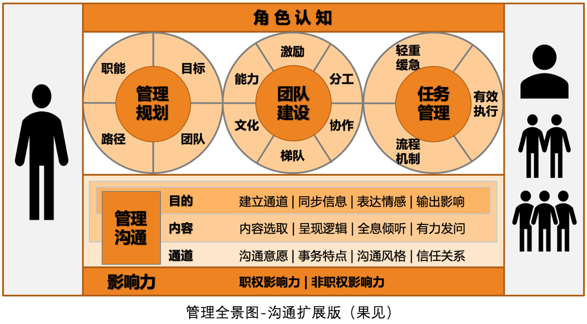
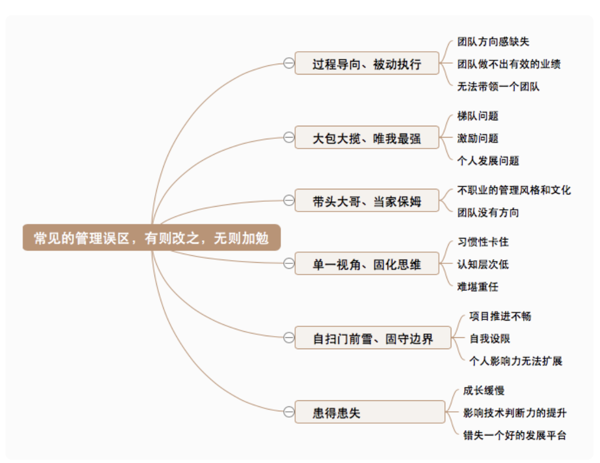

# 技术管理实战36讲-刘建国

## 简介

### 管理方法论和角色认知

身份：管理规划（方向）、团队建设（带人）、任务管理（做事）

误区：

### 管理规划
问题：团队做什么的、想到的成果是什么、需要什么样的团队、需要哪些投入？

1. 明确团队职能（职责和使命）
2. 设定目标（做什么）
3. 盘点团队（团队目标、资源、人才培养，有什么资源）
4. 选择路径（怎么做）

### 团队建设
1. 员工能力（创造学习条件、增强团队交流，激发团队学习动力）
2. 员工激励（马斯洛的需求层次理论，明白团队具体需求是什么）
3. 团队分工（明确每个人的职责）
4. 团队协作（结对编程，提升凝聚力）
5. 梯队培养（设立不同目标，提供发展机会，自主机会）
6. 团队文化（效率、归属、空间、耐力）
7. 绩效反馈（对团队绩效、个人绩效本着平等的心态进行疏通）
8. 团队建设（初衷是什么、角色是什么、目标是什么、什么手段）

### 任务管理
事前梳理轻重缓急、事中推进执行、事后复盘整理

### 沟通管理
了解沟通的本质，问题的本质，明确达到的目标，使用恰当的方式，推进沟通。

## 备注
可以去看一下PMP沟通管理章节的方法论

## 参考