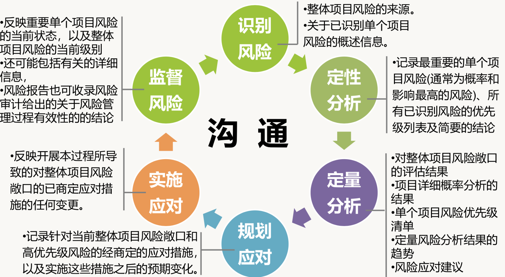

# PMP项目管理

## 简介


### 目录

#### 引论

1.项目管理的五大过程组:启动、规划、执行、监控和收尾

  * 启动过程组:定义一个新项目或现有项目的一个新阶段，授权开始该项目或阶段的一组过程。
  * 规划过程组:明确项目范围，优化目标，为实现目标制定行动方案的一组过程。
  * 执行过程组:完成项目管理计划中确定的工作，以满足项目要求的一组过程。
  * 监控过程组:跟踪、审查和调整项目进展与绩效，识别必要的计划变更并启动相应变更的一 组过程。
  * 收尾过程组:正式完成或结束项目、阶段或合同所执行的过程。

2.项目管理知识领域

* 项目整合管理:包括为识别、定义、组合、统一和协调各项目管理过程组的各个过程和活动而 开展的过程与活动。
* 项目范围管理:包括确保项目做且只做所需的全部工作以成功完成项目的各个过程。
* 项目进度管理:包括为管理项目按时完成所需的各个过程。 uu项目成本管理包括为使项目在批准的预算内完成而对成本进行规划、估算、预算、融资、筹资、管理和控制的各个过程。
* 项目质量管理:包括把组织的质量政策应用于规划、管理、控制项目和产品质量要求，以满足相 关方的期望的各个过程。
* 项目资源管理:包括识别、获取和管理所需资源以成功完成项目的各个过程。 uu项目沟通管理包括为确保项目信息及时且恰当地规划、收集、生成、发布、存储、检索、管理、控制、监督和最终处置所需的各个过程。
* 项目风险管理:包括规划风险管理、识别风险、开展风险分析、规划风险应对、实施风险应对和 监督风险的各个过程。
* 项目采购管理:包括从项目团队外部采购或获取所需产品、服务或成果的各个过程。
* 项目相关方管理:包括用于开展下列工作的各个过程:识别影响或受项目影响的人员、团队或 组织，分析相关方对项目的期望和影响，制定合适的管理策略来有效调动相关方参与项目决 策和执行。

3.项目管理过程组与知识领域


4.区分

* 实体计划(三大基准):范围基准、进度基准和成本基准(告诉我们做什么 的计划); 

* 程序计划:范围管理计划、需求管理计划、进度管理计划、成本管理计划、 质量管理计划、风险管理计划、采购管理计划、变更管理计划、配置管理计 划(告诉我们怎么做的计划);

* 综合计划(与人有关的4个计划):项目管理计划、资源管理计划、沟通管理 计划、相关方参与计划(既包括做什么，也包括怎么做的计划)

5.项目管理办公室( PMO)的主要职责: 对跨项目的沟通进 行协调;对 PMO 所辖的全部项目的共享资源进行管理;

6.项目特点：临时性、独特性、目标性、系统性、渐进明细性

#### 运行环境
事业环境因素
组织过程资产
项目管理办公室（PMO）


#### 项目经理角色

1. 由执行组织委派，领导团队实现项目目标的个人

2. PMI人才三角：领导力、技术项目管理、战略和商务管理

3. 项目经理价值观：责任、尊重、公正和诚实

#### 项目整合管理


变更流程：


#### 项目范围管理


可交付成果演变：


#### 项目进度管理


资源平滑和资源平衡

赶工和快速跟进

#### 项目成本管理


挣值图：


#### 项目质量管理


#### 项目资源管理


冲突管理：

```
• 撤退/回避 :冲突的一方或双方从冲突中撤退，问题没有解决
• 缓和/包容 :强调一致而非差异，各退一步(求同存异)
• 妥协/调解 :各退一步，寻找各方都一定程度上满意的方案
• 强迫/命令 :牺牲其他方为代价，推行某一方的观点(尽量不要使用，但危 急关头时用)
• 合作/解决问题/(面对):综合考虑不同的观点和意见，采取合作的态度和 开放式对话引导各方达成共识和承诺(最推荐)
```

1. 马斯洛的需求层次理论：


2. 赫兹伯格双因素理论：


3. 麦格雷戈的X/Y理论：


4. 弗洛姆的期望理论：


5. 塔克曼团队发展阶段理论：


#### 项目沟通管理


相互沟通、推式沟通、拉式沟通

#### 项目风险管理


应对风险方法：


风险与问题的区别

风险登记册


风险报告


#### 项目采购管理


#### 项目相关方管理


相关方权力 / 利益方格：


## 备注
后期补充