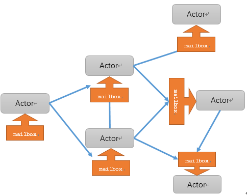
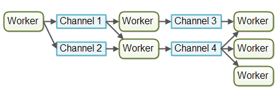
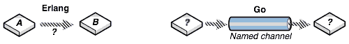

## 并发编程模型
### 释义

### 背景知识

#### 关键词解释

1. 并发：单核cpu上面执行多项任务的`能力`，让cpu将时间分片，以时间片的形式执行多个程序，用户感知为同时执行两个程序。（大猪蹄子）

2. 进程：cpu在切换程序的时，如果不保存上一个程序的状态（即Context，上下文），直接切换下一个程序，就会丢失上一个程序的一系列状态，于是引入了进程这个概念，用以划分好程序运行时所需要的资源。因此进程就是一个程序运行时候的所需要的基本资源单位（也可以说是程序运行的一个`实体`）。

3. 并行：多核cpu，每个核都有进程在同时运行，这就是并行（发挥的是多核的优势）。

4. 用户态与内核态：为了防止用户程序做出一些危险的指令（如关机，更改系统变量，修改别的进程数据），系统将运行状态分为：用户态和内核态。用户态是用户的程序所在的状态，不能随便对内核的底层进行操作。但是内核提供了一种调用内核的接口，如果用户的程序需要使用内核的底层操作，可以调用这些接口（称为系统调用），在进行系统调用的时候，cpu会切换到内核态，才能执行内核的函数。

5. 线程：cpu切换多个进程的时候，会花费不少的时间。因为切换进程需要切换到内核态，而每次调度需要内核态都需要读取用户态的数据，进程一旦多起来，cpu调度会消耗一大堆资源，因此引入了线程的概念（为了降低切换上下文造成的性能损失），线程本身几乎不占有资源，他们共享进程里的资源，内核调度起来不会像进程切换那么耗费资源。

6. 协程：线程还是需要内核去进行调度，切换起来也是需要把用户态的数据写入到内核态，也是需要耗费一定的计算机资源。引入协程就是为了把自己的调度算法交给程序（`用户态`）去进行管理，能以更小的资源去进行并发（为避免内核级别的上下文切换造成的性能损失，进而突破了线程在IO上的性能瓶颈）。

7. 同步异步，阻塞非阻塞：同步和异步关注的是`消息通信机制`。阻塞和非阻塞关注的是程序在等待调用结果（消息，返回值）时的`状态`。

#### 疑问

1. 并发和并行的区别？
```
并发是同一时间应对（dealing with）多件事情的能力；并行是同一时间动手做（doing）多件事情的能力。（并发是单核cpu，逻辑上同时执行；并行是多核cpu，物理上同时执行），一般不会严格区分这两个概念，默认并发就是指并行机制下的并发。
```

2. 进程和线程的区别？
```
进程是cpu资源分配的最小单位，线程是cpu调度的最小单位。以前进程既是资源分配也是调度的最小单位，后来为了更合理的使用cpu(实际上是cpu性能越来越好，寄存器性能落后于cpu)，才将资源分配和调度分开，于是引入线程。线程是建立在进程的基础上的一次程序运行单位。
```

3. 线程和协程的区别？
```
协程就是用户态的线程
```

4. 并发通信方式有哪些？
```
共享内存（share memory）和消息传递(communicating)。
```
 
### 并发编程模型

#### 定义
* 并发模型指定了系统中的线程如何通过协作来完成分配给它们的作业。不同的并发模型采用不同的方式拆分作业，同时线程间的协作和交互方式也不相同。

#### 并发引出的问题
1. 竞态条件（race conditions）： 如果每个任务都是独立的，不需要共享任何资源（完美），但是实际情况下总有一些资源需要共享，比如开发人员和市场人员同时需要和CEO商量一个方案，这时候CEO就成了竞态条件。
2. 依赖关系以及执行顺序：如果线程之间的任务有依赖关系，需要等待以及通知机制来进行协调。比如如果产品和CEO讨论的方案依赖于市场和CEO讨论的方案，这时候就需要协调机制保证顺序。
3. 线程数量。

#### 解决方式
针对上面1,2问题解决方式（参考8）
1. 锁Mutex(Lock) （Go里的sync包, Java的concurrent包）通过互斥量来保护数据，但有了锁，明显就降低了并发度(保护共享资源:一把钥匙，一个房间，第一个人拿了就可进入房间，出来的时候把钥匙交给`队列`中另一个人)。
2. semaphore 通过信号量来控制并发度或者作为线程间信号（signal）通知(调度线程:一些线程生产（increase）同时另一些线程消费（decrease），semaphore可以让生产和消费保持合乎逻辑的执行顺序)。
3. volatile Java专门引入了volatile关键词来，来降低只读情况下的锁的使用(不太了解)。
4. compare-and-swap（CAS）通过硬件提供的CAS机制保证原子性（atomic），也是降低锁的成本的机制（如果内存位置的值与预期原值相匹配，那么处理器会自动将该位置值更新为新值。否则，处理器不做任何操作。无论哪种情况，它都会在 CAS 指令之前返回该位置的值）。

#### 并发模型（不完全记录）
* 针对问题3的处理思路：
1. 线程池：不过并没有解决数量的问题，线程池初始化时还是要设置一个最小和最大线程数，以及任务队列的长度，自管理只是在该范围内的动态调整。另外不同的任务可能有不同的并发需求，为了避免互相影响可能需要多个线程池，最后导致的结果系统里充斥了大量的线程池。
2. 初始化一定数量线程，只做计算(如何处理阻塞？)。
    ```
    异步回调方案：如NodeJS遇到阻塞的情况，比如网络调用、I/O操作，则注册一个回调方法，当前线程被释放，去执行其他任务。待数据准备好，调度器会将结果传递给回调方法然后执行，执行其实已经不在原来发起请求的线程里了，但对用户来说无感知。但这种方式的问题就是很容易遇到callback hell，因为所有的阻塞操作都必须异步，否则系统就卡死了。并且异步的方式有点违反人类思维习惯（人类习惯同步）。
    GreenThread/Coroutine/Fiber方案： 这种方案和上面的方案本质上区别不大，关键在于回调上下文的保存以及执行机制。为了解决回调方法带来的难题，这种方案的思路是写代码的时候还是按顺序写，但遇到IO等阻塞调用时，将当前的代码片段暂停，保存上下文，让出当前线程。等IO事件回来，然后再找个线程让当前代码片段恢复上下文继续执行，写代码的时候感觉好像是同步的，仿佛在同一个线程完成的，但实际上系统可能切换了线程，但对程序无感。
    ```

##### 并行工作者模型


* 并行工作者模型中，委派者（Delegator）将传入的作业分配给不同的工作者。每个工作者完成整个任务。工作者们并行运作在不同的线程上，甚至可能在不同的cpu上。(多线程、多进程实现：apache)
* 线程需要避免竟态，死锁以及很多其他共享状态的并发性问题（线程间通信方式为共享内存）。

##### 事件驱动模型


* 每个工作者只负责作业中的部分工作。当完成了自己的这部分工作时工作者会将作业转发给下一个工作者。每个工作者在自己的线程中运行，并且不会和其他工作者共享状态(流水线)。

* 通常使用非阻塞的IO来设计使用事件驱动模型系统。非阻塞IO意味着，一旦某个工作者开始一个IO操作的时候（比如读取文件或从网络连接中读取数据），这个工作者不会一直等待IO操作的结束。IO操作速度很慢，所以等待IO操作结束很浪费cpu时间。此时cpu可以做一些其他事情。当IO操作完成的时候，IO操作的结果（比如读出的数据或者数据写完的状态）被传递给下一个工作者。（nginx使用epoll()函数来实现I/O 的多路复用，参考11，基于回调的异步IO实现：Nodejs）

* Nodejs缺点：大量回调函数的嵌套，代码可读性不佳。单进程，单线程，只支持单核cpu，不能充分的利用多核cpu服务器。一旦这个进程崩掉，那么整个web服务就崩掉。

##### Actor模型



* 释义：Actor模型由一个个称为Actor的执行体和mailbox组成。用户将消息发送给 Actor，实际上就是将消息放入一个队列中， 然后将其转交给处理被接受消息的一个内部线程。消息让Actor之间解耦。一个Actor 收到其他Actor的消息后，会做出不同的行为，还可能会给其他Actor 发送更进一步的消息。（Erlang）

* 特点：
```
万物皆是Actor
Actor之间完全独立，只允许消息传递，不允许其他”任何”共享
每个Actor最多同时只能进行一样工作
每个Actor都有一个专属的命名Mailbox(非匿名)
消息的传递是完全异步的；
消息是不可变的
```

##### CSP并发模型（协程）



* Channel模型中，worker之间不直接彼此联系，而是通过不同channel进行消息发布和侦听。消息的发送者和接收者之间通过Channel松耦合，发送者不知道自己消息被哪个接收者消费了，接收者也不知道是哪个发送者发送的消息。(基于协程实现go)


#### 疑问：

1. 消息传递和共享内存两个通讯方式的区别：
共享内存：当并行度变高，不确定性就会增加了，需要用锁等机制保证正确性，但锁用得不恰当时易降低性能。并且多线程编程较困难，不太符合人的思维习惯，易出错，易产生死锁。
消息传递（通讯）：提供使用。

2. Actor和CSP模型相似点：
Actor与CSP模型都提倡：`Share memory by communicating, don't communicate by sharing memory`，要通过通讯来共享内存，不要通过共享内存来通讯。（避免了使用锁来对竞态资源进行控制）。Actor模型的重点在于参与交流的实体,而CSP模型的重点在于用于交流的通道。



3. 并发模型与分布式系统相似点：
在并发系统中线程之间可以相互通信。在分布式系统中进程之间也可以相互通信（进程有可能在不同的机器中）

4. Nginx和Apache区别：
事件驱动适合于I/O密集型服务，多进程或线程适合于CPU密集型服务。


### 参考
1. [https://www.zhihu.com/question/25532384](https://www.zhihu.com/question/25532384)
2. [http://www.ruanyifeng.com/blog/2013/04/processes_and_threads.html](http://www.ruanyifeng.com/blog/2013/04/processes_and_threads.html)
3. [https://www.cnblogs.com/fnng/archive/2012/11/08/2761713.html](https://www.cnblogs.com/fnng/archive/2012/11/08/2761713.html)
4. [https://zhuanlan.zhihu.com/p/44917920](https://zhuanlan.zhihu.com/p/44917920)
5. [七周七并发模型](https://book.douban.com/subject/26337939/)
6. [http://ifeve.com/%E5%B9%B6%E5%8F%91%E7%BC%96%E7%A8%8B%E6%A8%A1%E5%9E%8B/](http://ifeve.com/%E5%B9%B6%E5%8F%91%E7%BC%96%E7%A8%8B%E6%A8%A1%E5%9E%8B/)
7. [https://zhuanlan.zhihu.com/p/44917920](https://zhuanlan.zhihu.com/p/44917920)
8. [http://jolestar.com/parallel-programming-model-thread-goroutine-actor/](http://jolestar.com/parallel-programming-model-thread-goroutine-actor/)
9. [http://www.solinx.co/archives/tag/%E5%B9%B6%E5%8F%91%E6%A8%A1%E5%9E%8B](http://www.solinx.co/archives/tag/%E5%B9%B6%E5%8F%91%E6%A8%A1%E5%9E%8B)
10. [https://www.zhihu.com/question/58004055](https://www.zhihu.com/question/58004055)
11. [https://blog.csdn.net/stfphp/article/details/52936490](https://blog.csdn.net/stfphp/article/details/52936490)