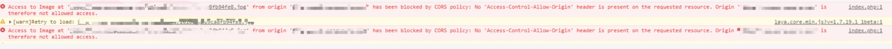
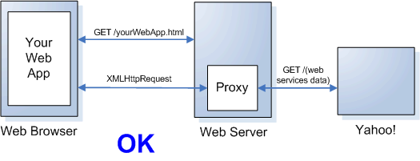

# 跨域访问

## 简介


浏览器出于安全和隐私的原因，对于XMLHttpRequest请求，禁止不同域名，不同端口，不同协议间的脚本相互影响，跨域脚本无效。如上图（摘自参考1）用户在浏览器浏览网站，如果javascript脚本请求了yahoo的接口或者文件，会报类似下图这样的错误。

同源策略：相同域名，相同端口，协议相同。三者有一个不满足，对于XMLHttpRequest来说，就存在跨域问题。



## 剖析
参考4，深度好文。慕课也有一篇翻译的，建议对比着看。

## 解决方式

1.使用web代理的方式处理（详情见参考1）。这也是通用处理方式。（可以配置NGINX服务、或者代码层次上请求）



大致的做法就是在web后端向第三方网站发送http请求，然后“包装”一下，供前端调用。

2.Cross-Origin Resource Sharing(CORS)

通过添加一些特殊的请求头、响应头，使web进行跨域通信

详情可以参考5
```
Access-Control-Allow-Origin: * 
Access-Control-Allow-Credentials: true 
Access-Control-Expose-Headers: FooBar
```

3.jsonp（JSON with Padding）

原理：一种非官方跨域数据交互协议，Web页面上调用js文件时则不受是否跨域的影响（不仅如此，凡是拥有”src”这个属性的标签都拥有跨域的能力，比如<\script>、<\img>、<\iframe>。

说明：ajax和jsonp的原理不一样！jsonp说白了就是后端动态生成数据（可以是json，也可以不是，但是javascript一定要能够解析），前端通过<scirpt>（也可以是<iframe>或者其他支持跨域的标签）标签请求该数据，从而突破浏览器的同源策略的限制。

4.。。。可以参考6

## 总结
第一种和第二种为主流方式，也是个人使用最多的。。（不清楚其他人。）

## 号外
偶然发现慕课上有一个课程（参考7），个人还没看，有空瞄一眼~

## 参考
1. [https://developer.yahoo.com/javascript/howto-proxy.html](https://developer.yahoo.com/javascript/howto-proxy.html)
2. [https://blog.csdn.net/hansexploration/article/details/80314948](https://blog.csdn.net/hansexploration/article/details/80314948)
3. [https://html.spec.whatwg.org/#crossDocumentMessages](https://html.spec.whatwg.org/#crossDocumentMessages)
4. [https://www.html5rocks.com/en/tutorials/cors/](https://www.html5rocks.com/en/tutorials/cors/)
5. [https://mubu.com/doc/1Mdo8geHR8](https://mubu.com/doc/1Mdo8geHR8)
6. [http://www.cnblogs.com/rainman/archive/2011/02/20/1959325.html](http://www.cnblogs.com/rainman/archive/2011/02/20/1959325.html)
7. [https://www.imooc.com/note/947](https://www.imooc.com/note/947)