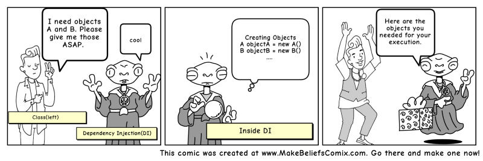

# 依赖注入(控制反转)

## 问题


## 简介

### 控制反转（IoC）：

Inversion of control (IoC) is a programming principle. IoC inverts the flow of control as compared to traditional control flow. In IoC, custom-written portions of a computer program receive the flow of control from a generic framework. A software architecture with this design inverts control as compared to traditional procedural programming: in traditional programming, the custom code that expresses the purpose of the program calls into reusable libraries to take care of generic tasks, but with inversion of control, it is the framework that calls into the custom, or task-specific, code.（维基百科）

理解：如果类A依赖类B（图1），那么在传统的调用方式中，就会出现在类A中实例化类B，这种方式是很普遍的方式，顶多属于硬编码，代码中出现了一些不好的味道（bad smell），不能灵活多变，而且耦合度高，如果类A根据不同的条件分别依赖类B，类C呢？情况将变得更加复杂，所以提出来这么一个思想（图2），对象在被创建的时候，由一个调控系统（引入容器的概念）内所有对象的外界实体，将其所依赖的对象的引用传递(注入)给它（降低耦合，）。这种思想（设计原则）称作控制反转。实现控制反转的方式有：依赖注入（Dependency Injection，简称DI）、“依赖查找”（Dependency Lookup）。




控制反转是对象的角度看待这个问题的，传统的调用中是由对象来主动创建另一个依赖的对象（可以理解为正转），而反转的意思是交由容器来解决对象的创建。（图3，图4对比）


依赖注入是站在容器的角度看待这个问题的，由容器动态的将某个依赖关系注入到组件之中。依赖注入的目的并非为软件系统带来更多功能，而是为了提升组件重用的频率，并为系统搭建一个灵活、可扩展的平台。

### 依赖注入(DI)：

Dependency Injection is where components are given their dependencies through their constructors, methods, or directly into fields.

特点：被动的接收对象，在类A的实例创建过程中即创建了依赖的B对象，通过类型或名称来判断将不同的对象注入到不同的属性中（注入的方式有基于构造函数，基于方法，基于接口，甚至注解）。

### 依赖查找：
特点：主动索取相应类型的对象，获得依赖对象的时间也可以在代码中自由控制(容器提供接口给组件进行调用)。

### 优缺点
#### 优点

A Dependency Injection Container manages objects: from their instantiation to their configuration. The objects themselves do not know that they are managed by a container and know nothing about the container. That's why a container is able to manage any object. It is even better if the objects use dependency injection for their dependencies, but that's not a prerequisite.

  1. Helps in Unit testing.
  2. Boiler plate code is reduced, as initializing of dependencies is done by the injector component.
  3. Extending the application becomes easier.
  4. Helps to enable loose coupling, which is important in application programming.

#### 缺点
  1. It’s a bit complex to learn, and if overused can lead to management issues and other problems.
  2. Many compile time errors are pushed to run-time.
  3. Dependency injection frameworks are implemented with reflection or dynamic programming. This can hinder use of IDE automation, such as “find references”, “show call hierarchy” and safe refactoring.

## 具体实现

```
Spring (Java)
Google Guice (Java)
Unity(.NET)
Symfony(PHP)
Laravel(PHP)
```

## 补充
可以看看参考8,9的小故事

## 参考
1. [https://jinnianshilongnian.iteye.com/blog/1413846](https://jinnianshilongnian.iteye.com/blog/1413846)
2. [https://www.freecodecamp.org/news/a-quick-intro-to-dependency-injection-what-it-is-and-when-to-use-it-7578c84fa88f/](https://www.freecodecamp.org/news/a-quick-intro-to-dependency-injection-what-it-is-and-when-to-use-it-7578c84fa88f/)
3. [http://fabien.potencier.org/what-is-dependency-injection.html](http://fabien.potencier.org/what-is-dependency-injection.html)
4. [http://php-di.org/doc/understanding-di.html](http://php-di.org/doc/understanding-di.html)
5. [https://www.martinfowler.com/articles/injection.html](https://www.martinfowler.com/articles/injection.html)
6. [https://www.tutorialsteacher.com/ioc/inversion-of-control](https://www.tutorialsteacher.com/ioc/inversion-of-control)
7. [https://zh.wikipedia.org/wiki/%E6%8E%A7%E5%88%B6%E5%8F%8D%E8%BD%AC](https://zh.wikipedia.org/wiki/%E6%8E%A7%E5%88%B6%E5%8F%8D%E8%BD%AC)
8. [https://zhuanlan.zhihu.com/p/33492169](https://zhuanlan.zhihu.com/p/33492169)
9. [https://blog.csdn.net/briblue/article/details/75093382](https://blog.csdn.net/briblue/article/details/75093382)
10. [https://learnku.com/laravel/t/2104/understanding-dependency-injection-and-inversion-of-control#5db9fd](https://learnku.com/laravel/t/2104/understanding-dependency-injection-and-inversion-of-control#5db9fd)