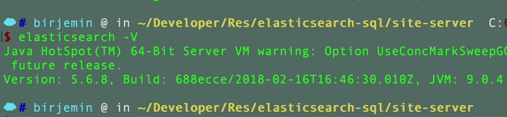
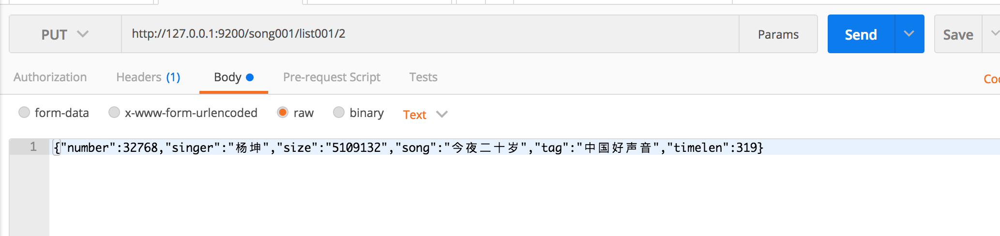
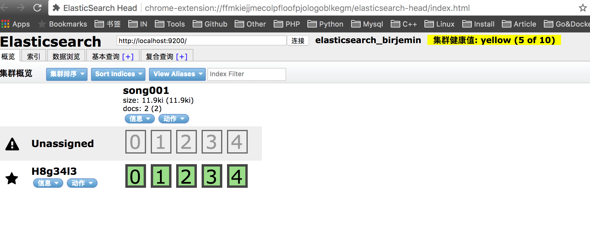
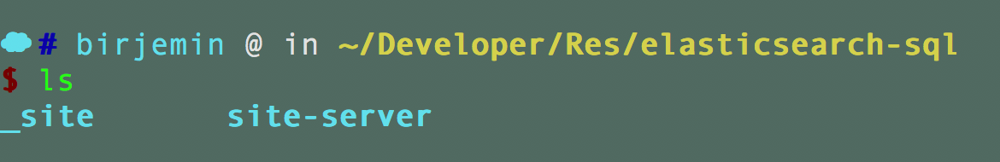
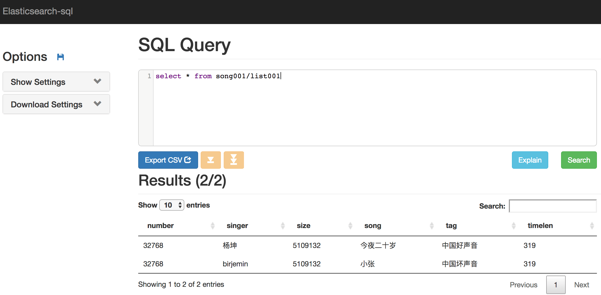

# ElasticSearch的使用


## 简介
ElasticSearch是一个基于Lucene的搜索服务器。它提供了一个分布式多用户能力的全文搜索引擎，基于RESTful web接口。

## 安装elasticsearch
```
brew install elasticsearch@5.6
```

1.结果：



2.开启、关闭、重启es
```
brew services start elasticsearch@5.6
brew services stop elasticsearch@5.6
brew services restart elasticsearch@5.6
```

3.灌入数据方式(测试时我使用的是postman)



## 安装elasticsearch-head

1.目的：用于查看es的状态和信息（也可以查看数据）。

2.github地址: [elasticsearch-head](https://github.com/mobz/elasticsearch-head)

我安装的是chrome extension，安装方法如下：
```
Running as a Chrome extension

Install ElasticSearch Head from the Chrome Web Store.
Click the extension icon in the toolbar of your web browser.
```

3.结果：



## 安装elasticsearch-sql

1.目的：使用一般的sql来对es进行查询和聚合

2.github地址:[elasticsearch-sql](https://github.com/NLPchina/elasticsearch-sql)

3.根据相应的es版本使用手册上面相应的命令安装该插件。
比如我的安装命令是：
```
elasticsearch-plugin install https://github.com/NLPchina/elasticsearch-sql/releases/download/5.6.8.0/elasticsearch-sql-5.6.8.0.zip
```

4.使用方式

* 使用api接口操作  
```
http://localhost:9200/_sql?sql=select * from song001/list001
```

* 使用web视图操作
根据官网介绍

```
On elasticsearch 5.x/6.x, download and extract site.
Then start the web front-end like this:
cd site-server
npm install express --save
node node-server.js 
```
所以下载zip包，解压到自己的目录下面，比如我的目录是这样：



然后按照手册所说运行。（请提前安装好node啦~~）

* web视图需要安装`http-proxy-middleware`代理

github地址：[http-proxy-middleware](https://www.npmjs.com/package/http-proxy-middleware)

修改node-server.js代码之后运行`node node-server.js`

```
var express = require('express');
var proxy = require('http-proxy-middleware');
var app = express();
app.use(express.static('../_site'));
app.use('/_sql', proxy({target: 'http://localhost:9200/', changeOrigin: true}));

app.get('/', function (req, res) {
    res.sendFile("../_site/" + "index.html" );
})
var fs = require('fs');
var siteConfiguration = JSON.parse(fs.readFileSync('site_configuration.json', 'utf8'));
var server = app.listen(siteConfiguration.port)

// var express = require('express');
// var app = express();
// app.listen(3000);
```

* web视图查看数据



## 手册
https://www.elastic.co/guide/en/elasticsearch/guide/master/create-doc.html

## 注意点
* 和sql的区别，比如select id, name from table group by name,得到的数据集合没有id这个字段。
* 对数据分页略麻烦。
* group by多字段时返回得值为树状结构，注意和mysql操作的区别。

## 补充
先占坑，后期会补充在es中的聚合运算和全文搜索。

## 参考
1. [https://github.com/NLPchina/elasticsearch-sql](https://github.com/NLPchina/elasticsearch-sql)
2. [https://www.elastic.co/guide/en/elasticsearch/guide/master/create-doc.html](https://www.elastic.co/guide/en/elasticsearch/guide/master/create-doc.html)
3. [https://github.com/mobz/elasticsearch-head](https://github.com/mobz/elasticsearch-head)