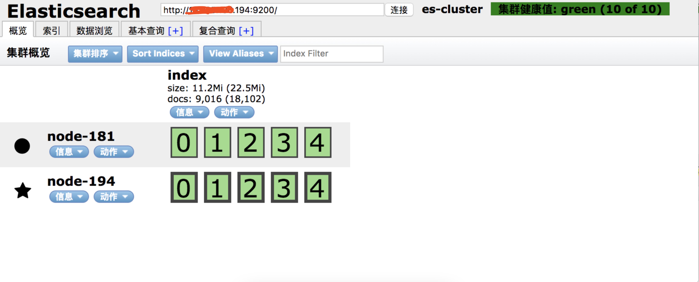
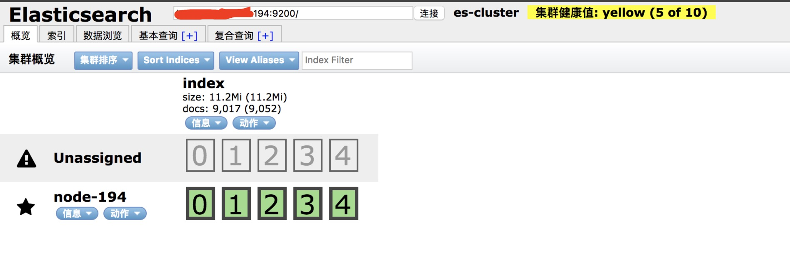

# ElasticSearch的集群搭建


## 简介
记录一下搭建一个两台集群的ES的笔记。

## 安装elasticsearch

1.条件：两台Centos服务器（194， 181）。

2.安装Java: ES5.0以上版本需要java8，安装java8: `yum -y install java-1.8*`，通过`java -version`查看是否安装成功。

3.Centos安装ES可以查看参考1，步骤为先wget下载相应的es的rpm安装包，然后`sudo rpm --install elasticsearch-6.3.0.rpm`进行安装即可。

4.Centos开启、关闭命令: `sudo service elasticsearch start`, `sudo service elasticsearch stop`。

## 配置集群
通过上一步操作，194和181服务器上面都安装好了相应的软件，接下来就是要更改配置，让他们相互发现，成为一个集群。

1.更改194上面的elasticsearch.yml文件（默认在/etc/elasticsearch目录下面）
```
# 设置集群名称，两台机器的名称必须一样，不然不能相互发现
cluster.name: es-cluster
# 设置节点名称，这里简单点194的机器就设置成194吧
node.name: node-194
# 绑定host，默认为此值
network.host: 0.0.0.0
# 设置集群中master节点的初始列表，可以通过这些节点来自动发现新加入集群的节点。
discovery.zen.ping.unicast.hosts: ["192.168.1.194", "192.168.1.181"]
#开启http网络节点发现
http.cors.enabled: true
#允许所有同网段节点发现
http.cors.allow-origin: "*"
```

2.更改181上面的elasticsearch.yml文件
```
cluster.name: es-cluster
node.name: node-181
network.host: 0.0.0.0
discovery.zen.ping.unicast.hosts: ["192.168.1.194", "192.168.1.181"]
http.cors.enabled: true
http.cors.allow-origin: "*"
```

3.确保两台机器的9200，9300没有被防火墙拦截，因为他们两个要通讯呀~~~

4.重启服务即可，如果你使用的是chrome浏览器，可以安装一个elasticsearch head插件，然后连接其中的一台机器，既可以查看整个集群情况了。（也可以`curl http://ip:9200/_plugin/head/`查看）


5.关闭一台服务，查看集群


## 测试

|序号|测试方式|结果|
|:---:|:---:|:---:|
|1|关闭194，开启181，写数据，开启194，查数据？，关闭181，查数据？|？|
|2|两台都开启，写数据，关闭181，查数据，关闭194，开启181，查数据|？|
|3|194关闭，181开启，写数据，181关闭，194开启，181开启，查数据|？|

## 备注
es的同步是主同步到从，所以如果没有指定master的话，系统会系统选择master,测试3中，由于master变换了，所以导致了数据的丢失~~~，从某种意义上两台机器也会有丢数据的风险。不过对于一般的需求够用啦~~(参考2可以玩玩，试验一下~~~)

## 参考
1. [https://www.elastic.co/guide/en/elasticsearch/reference/current/rpm.html](https://www.elastic.co/guide/en/elasticsearch/reference/current/rpm.html)
2. [http://www.cnblogs.com/dennisit/p/4133131.html](http://www.cnblogs.com/dennisit/p/4133131.html)
3. [http://www.cnblogs.com/huangfox/p/3543351.html](http://www.cnblogs.com/huangfox/p/3543351.html)
4. [https://www.cnblogs.com/sunxucool/p/3799190.html](https://www.cnblogs.com/sunxucool/p/3799190.html)