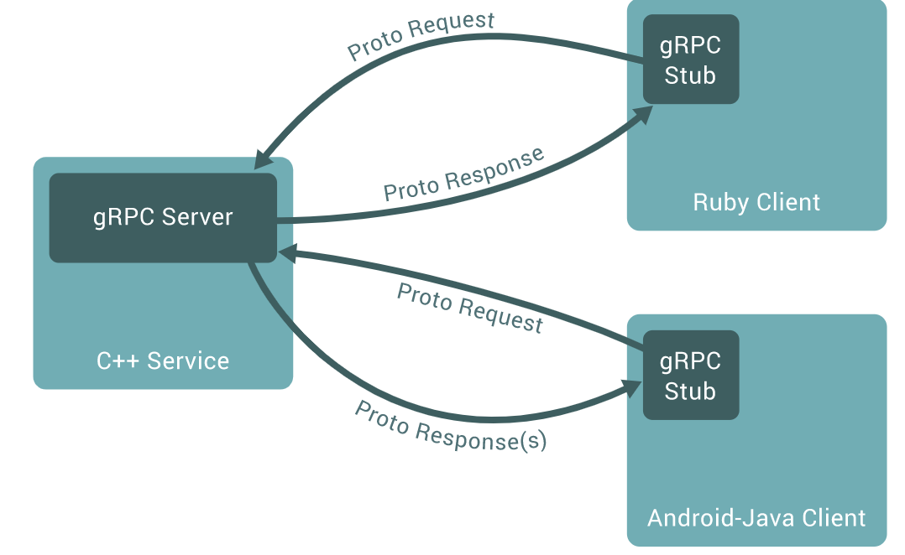

# gRPC简介

## 引入
### 什么是RPC?
```
In distributed computing, a remote procedure call (RPC) is when a computer program causes a procedure 
(subroutine) to execute in a different address space (commonly on another computer on a shared network), 
which is coded as if it were a normal (local) procedure call, without the programmer explicitly coding 
the details for the remote interaction.
```
在分布式计算中，远程过程调用（RPC）是指计算机程序使过程（子程序）在不同的地址空间（通常在共享网络的另一台计算机上）执行时，其编码方式就像是普通的（本地）过程调用一样，而无需程序员为远程交互明确编码细节。换句话说，就是在分布式系统中，实现像本地调用方法一样的能力。

想象一下：一个程序足够庞大就会分出service层，实现一个业务逻辑可能需要很多个service的协同，在单机的情况下无非是直接调用每个service的方法，想象一下这些service如果都是不同团队负责，分布在不同的服务器上运行，那么如果实现调用呢？这就是RPC（远程过程调用），那么RPC和HTTP的区别是啥？（参考12）

### RPC各个服务间如何交互？
RPC使用IDL进行交互，对IDL的实现目前比较流行的有Protocol Buffers（Protobuf）、Thrift...(参考8给出了它们的对比)。

CORBA（Common ObjectRequest Broker Architecture公共对象请求代理体系结构）是对象管理组织（OMG）为解决分布式处理环境(DCE)中，硬件和软件系统的互连而提出的一种解决方案。

IDL（Interface description language接口描述语言）是CORBA规范的一部分，是跨平台开发的基础，是个服务间相互交互的基础，它与服务所使用的语言无关，只负责定义交互的规范。（可理解为一个共识，大家遵循的一个规范。通过详情见参考5、6）

IDL包含四个属性
- 模块
- 接口
- 操作
- 数据类型

## gRPC简介


官网中说：`A high performance, open-source universal RPC framework`，即高性能，开源通用的RPC框架，gRPC

### Protocol Buffers
gRPC默认使用的IDL是Protocal Buffers(Protobuf)，官方说Protocal Buffers是一种灵活的，高效的，拥有自动化的机制的序列化结构化数据。首先定义一下构造数据的方式，然后生成根据您的业务需求，生成对应变成语言的的特殊源代码，可以轻松地实现在各种数据流中写入和读取结构化数据。甚至可以在不破坏已针对“旧”格式编译的已部署程序情况下更新数据结构。说白了其实就是Google推行的一套对IDL规范的实现。（想要学习使用Prototbuf可以查看参考9）

### gRPC尝试
来个简单的小🌰，加深印象（见参考10），简述一下步骤：
- 安装Go、gRPC、Protocol Buffers v3
- 获取示例代码（[代码库](https://github.com/grpc/grpc-go/tree/master/examples/helloworld)）
- 根据helloworld.proto生成gRPC code
- 运行client和service

基本的原理就是：
- 先定义IDL（helloworld.proto结尾的文件）
- 然后生成gRPC code（helloworld.pb.go）
- 然后service实现业务逻辑
- client实现RPC调用service逻辑

## 补充
gRPC还支持跨语言调用，即生成gRPC code时指定相应的变成语言，会实现对应语言的gRPC code(可见参考11)，比如生成php语言的gRPC code，那么client则可以使用php实现对service调用。（此处和thrift类似，可参见:[Thrift](http://birjemin.com/wiki/tech-thrift)）

## 参考
1. [https://grpc.io/](https://grpc.io/)
2. [https://en.wikipedia.org/wiki/Remote_procedure_call](https://en.wikipedia.org/wiki/Remote_procedure_call)
3. [https://grpc.io/blog/principles/](https://grpc.io/blog/principles/)
4. [https://books.studygolang.com/go-rpc-programming-guide/](https://books.studygolang.com/go-rpc-programming-guide/)
5. [https://baike.baidu.com/item/IDL/34727](https://baike.baidu.com/item/IDL/34727)
6. [https://baike.baidu.com/item/%E5%85%AC%E5%85%B1%E5%AF%B9%E8%B1%A1%E8%AF%B7%E6%B1%82%E4%BB%A3%E7%90%86%E4%BD%93%E7%B3%BB%E7%BB%93%E6%9E%84/5926153](https://baike.baidu.com/item/%E5%85%AC%E5%85%B1%E5%AF%B9%E8%B1%A1%E8%AF%B7%E6%B1%82%E4%BB%A3%E7%90%86%E4%BD%93%E7%B3%BB%E7%BB%93%E6%9E%84/5926153)
7. [https://developers.google.com/protocol-buffers/docs/overview](https://developers.google.com/protocol-buffers/docs/overview)
8. [https://yq.aliyun.com/articles/229886](https://yq.aliyun.com/articles/229886)
9. [https://developers.google.com/protocol-buffers/docs/proto3](https://developers.google.com/protocol-buffers/docs/proto3)
10. [https://grpc.io/docs/quickstart/go/](https://grpc.io/docs/quickstart/go/)
11. [https://grpc.io/docs/quickstart/php/](https://grpc.io/docs/quickstart/php/)
12. [https://www.zhihu.com/question/41609070](https://www.zhihu.com/question/41609070)