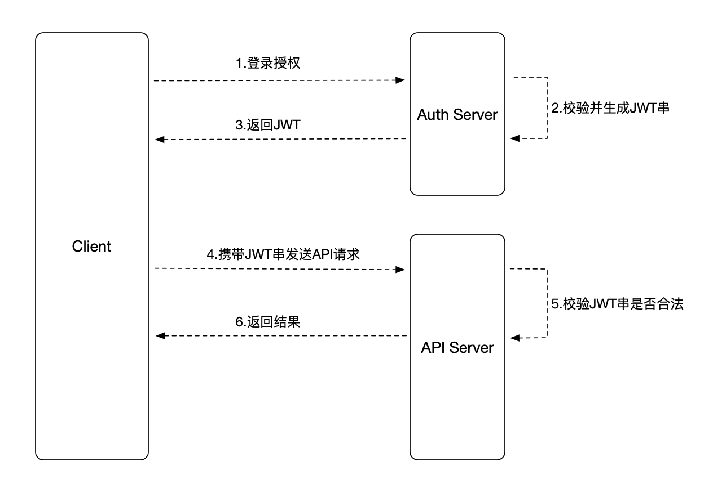

# JWT概述

## 概念

```
JSON Web Token (JWT) is an open standard (RFC 7519) that defines a compact and self-contained way for securely transmitting information between parties as a JSON object. This information can be verified and trusted because it is digitally signed. JWTs can be signed using a secret (with the HMAC algorithm) or a public/private key pair using RSA or ECDSA.
```

JSON Web令牌（JWT）是一个开放标准（RFC 7519），它定义了一种紧凑且独立的方法，用于在各方之间安全地将信息作为JSON对象传输。由于此信息是经过数字签名的，因此可以被验证和信任。可以使用秘密（使用HMAC算法）或使用RSA或ECDSA的公用/专用密钥对对JWT进行签名。

## 内容
JWT授权流程如下：


### 组成
JWT的内容包含三个部分组成。

- Header
- Payload
- Signature

格式举例：

```
xxx.yyyy.xxxxx
```

#### Header
header通常定义了两个部分token的类型（JWT）,加密算法，比如：
```
{
  "alg": "HS256",
  "typ": "JWT"
}
```

#### Payload
声明（Playload）包含实体（entity，通常是用户信息）和额外的数据。通常有注册声明、私有声明、公有声明，值得注意的是这些声明不应当包含敏感信息，比如用户密码。
- Registered claims：注册声明，一组预先定义的非强制的声明，但是推荐提供一组有用的，可互操作的声明。其中包括：iss(发行人)，exp(过期时间)，sub(主题)、aud(受众)等。
- Public claims：公开声明，由使用 JWT 的人随意定义。但为了避免冲突，最好使用 IANA JSON Web Token 注册表中的声明名称，或者将其定义为包含在一个防止冲突命名空间的 URI。
- Private claims：私人声明，这是为了使用各方之间共享信息而创建的自定义声明。

```
{
  "sub": "1234567890",
  "name": "John Doe",
  "admin": true
}
```

#### Signature
签名，签名之前必须有base64编码Header、base64编码Payload、一个密钥、一种加密算法（Header里面提及的）。

比如采用HMACSHA256加密算法：
```
HMACSHA256(base64UrlEncode(header) + "." + base64UrlEncode(payload), secret)
```

### 使用场景
- Authorization（授权，参考4讲的挺好的）
- Information Exchange（信息交互）

## 特点
- 无状态
- 一旦签发，无法终止失效，需要在业务上考虑清除签发的Token
- 建议使用HTTPS传输

## 总结
JWT和Session类似，但是JWT方便水平扩展（尤其在分布式系统中）。Session的主要目的是为了给HTTP无状态的特性做一个补充，而JWT则是防止签名被篡改。

## 参考
1. [https://jwt.io/](https://jwt.io/)
2. [https://en.wikipedia.org/wiki/JSON_Web_Token](https://en.wikipedia.org/wiki/JSON_Web_Token)
3. [https://medium.com/@dleroari/learn-the-basics-of-json-web-tokens-jwt-and-how-it-works-in-practice-8b3b14cbe0f9](https://medium.com/@dleroari/learn-the-basics-of-json-web-tokens-jwt-and-how-it-works-in-practice-8b3b14cbe0f9)
4. [https://hackernoon.com/why-do-we-need-the-json-web-token-jwt-in-the-modern-web-k29l3sfd](https://hackernoon.com/why-do-we-need-the-json-web-token-jwt-in-the-modern-web-k29l3sfd)
5. [http://www.gxitsky.com/2019/05/20/distributed-micro-app-1-jwt-token/](http://www.gxitsky.com/2019/05/20/distributed-micro-app-1-jwt-token/)
6. [https://tools.ietf.org/html/rfc7519](https://tools.ietf.org/html/rfc7519)
7. [https://juejin.im/entry/5993a030f265da24941202c2](https://juejin.im/entry/5993a030f265da24941202c2)
8. [https://segmentfault.com/a/1190000013010835](https://segmentfault.com/a/1190000013010835)