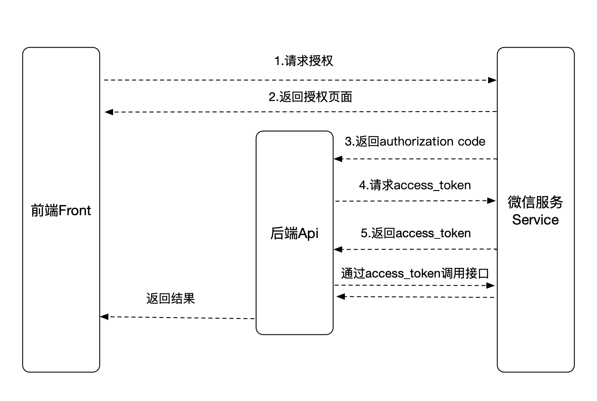

# OAuth2.0概述

## 概念
```
OAuth 2.0 is the industry-standard protocol for authorization. OAuth 2.0 focuses on client developer
simplicity while providing specific authorization flows for web applications, desktop applications, 
mobile phones, and living room devices. This specification and its extensions are being developed within
the IETF OAuth Working Group.
```

OAuth 2.0是用于授权的行业标准协议。OAuth 2.0致力于简化客户端开发人员的工作，同时为Web应用程序，桌面应用程序，移动电话和客厅设备提供特定的授权流程。该规范及其扩展由IETF OAuth工作组开发。

## 概念
### 角色
- 用户（resource owner）
- 资源服务（resource service）
- 访问资源者 (client)
- 认证服务 (authorization server)

### 流程图
- 授权流程
```
+--------+                               +---------------+
|        |--(A)- Authorization Request ->|   Resource    |
|        |                               |     Owner     |
|        |<-(B)-- Authorization Grant ---|               |
|        |                               +---------------+
|        |
|        |                               +---------------+
|        |--(C)-- Authorization Grant -->| Authorization |
| Client |                               |     Server    |
|        |<-(D)----- Access Token -------|               |
|        |                               +---------------+
|        |
|        |                               +---------------+
|        |--(E)----- Access Token ------>|    Resource   |
|        |                               |     Server    |
|        |<-(F)--- Protected Resource ---|               |
+--------+                               +---------------+
```

摘自参考3：
```
（A）用户打开客户端以后，客户端要求用户给予授权。
（B）用户同意给予客户端授权。
（C）客户端使用上一步获得的授权，向认证服务器申请令牌。
（D）认证服务器对客户端进行认证以后，确认无误，同意发放令牌。
（E）客户端使用令牌，向资源服务器申请获取资源。
（F）资源服务器确认令牌无误，同意向客户端开放资源。
```

- 刷新流程
```
+--------+                                           +---------------+
|        |--(A)------- Authorization Grant --------->|               |
|        |                                           |               |
|        |<-(B)----------- Access Token -------------|               |
|        |               & Refresh Token             |               |
|        |                                           |               |
|        |                            +----------+   |               |
|        |--(C)---- Access Token ---->|          |   |               |
|        |                            |          |   |               |
|        |<-(D)- Protected Resource --| Resource |   | Authorization |
| Client |                            |  Server  |   |     Server    |
|        |--(E)---- Access Token ---->|          |   |               |
|        |                            |          |   |               |
|        |<-(F)- Invalid Token Error -|          |   |               |
|        |                            +----------+   |               |
|        |                                           |               |
|        |--(G)----------- Refresh Token ----------->|               |
|        |                                           |               |
|        |<-(H)----------- Access Token -------------|               |
+--------+           & Optional Refresh Token        +---------------+
```
### 授权模式
- 授权码模式（authorization code）
- 简化模式（implicit）
- 密码模式（resource owner password credentials）
- 客户端模式（client credentials）

推荐使用第一种模式，风险小，安全性高（可查看参考3每一种示例）。

### 备注
嗯。。。看到了阮一峰（参考3）翻译了这个协议（参考2），这里就不展开细说了，直接看参考3吧（懒）。

## 补充

### 微信网页授权

#### 授权接口
- api/auth

- 接口描述
  用户同意授权后，用于从服务提供商获取 code。请求微信的用户同意授权，获取code接口。

- 接收参数
  target_uri：最终要跳转到的业务页面地址

- 接口返回值
  无返回值，获取code后跳转到授权回调接口地址。

#### 授权回调接口

- api/callback

- 接口描述
  上述授权接口获取到code后将跳转到该接口。

- 该接口目的：
  通过code获取用户access_token：通过code换取网页授权access_token使用access_token拉取用户数据：拉取用户信息(需scope为snsapi_userinfo)根据业务需求，对用户数据进行操作，例如：入库、更新用户数据等跳转到目标业务页 target_uri

- 接收参数
  code：授权码
  target_uri：最终要跳转到的业务页面地址

- 接口返回值
  无返回值，将重定向到目标业务页 target_uri。

## 参考
1. [https://oauth.net/2/](https://oauth.net/2/)
2. [https://tools.ietf.org/html/rfc6749](https://tools.ietf.org/html/rfc6749)
3. [http://www.ruanyifeng.com/blog/2014/05/oauth_2_0.html](http://www.ruanyifeng.com/blog/2014/05/oauth_2_0.html)