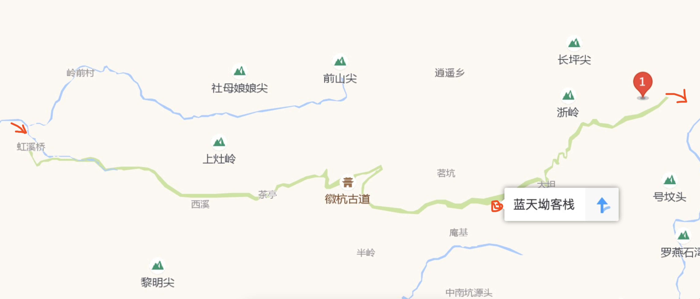
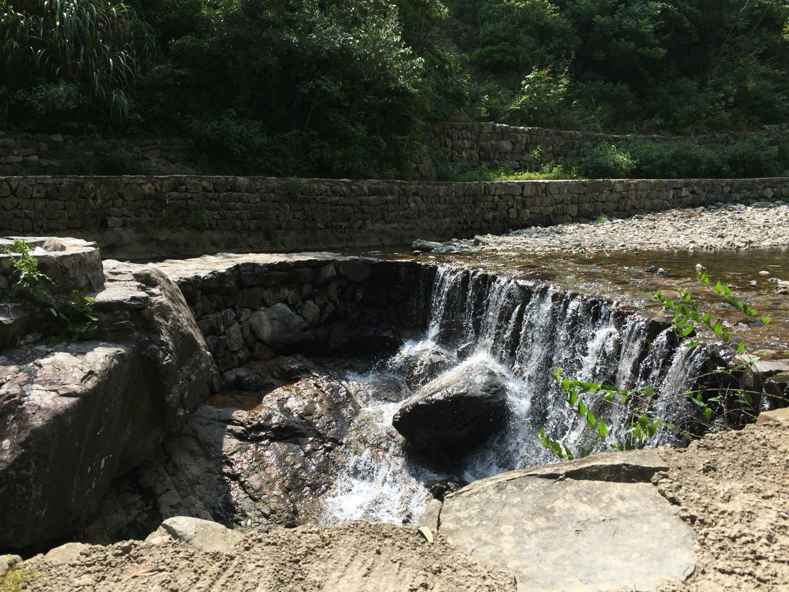
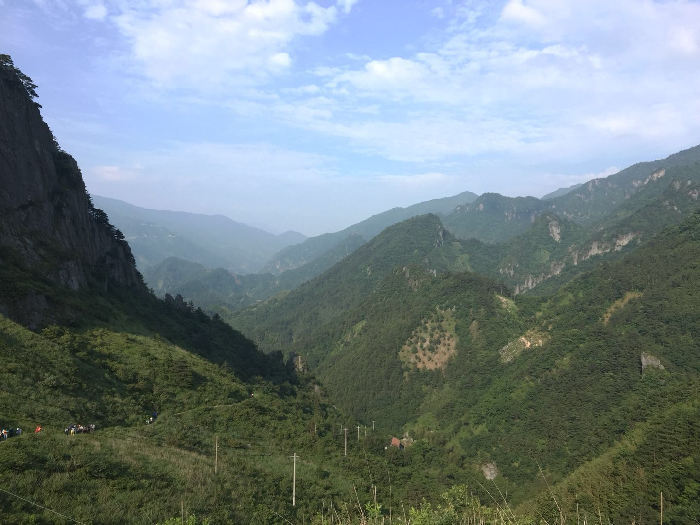
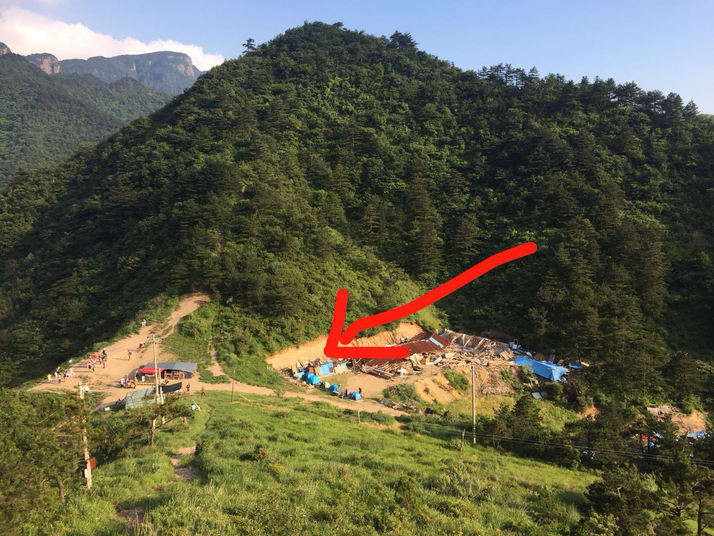
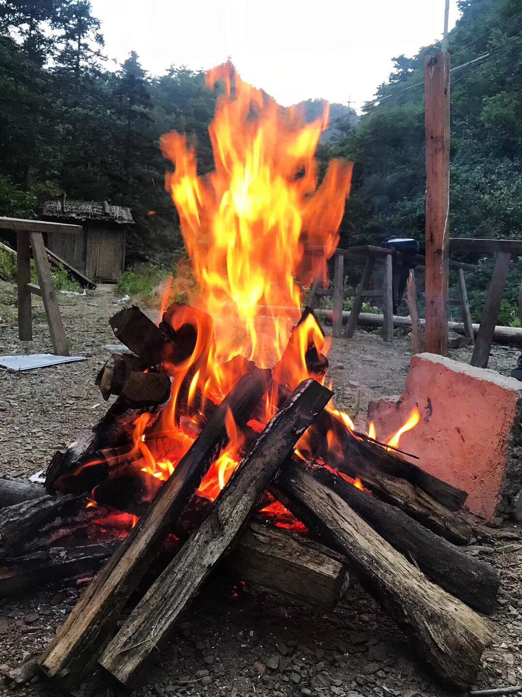

# 徽杭古道

## 地图

<iframe width='600' height='300' frameborder='0' scrolling='no' marginheight='0' marginwidth='0' src='http://f.amap.com/2FeTx_07F51tt'></iframe>

## 路线
杭州汽车西站（7:40）-> 绩溪汽车站（10:30） -> 徽杭古道西门（11：30） -> 南天岰 -> 临安客运中心 -> 行会走汽车西站

## 足迹

  

```
1.周六早上去汽车西站出发，大概10点半到绩溪汽车站，然后坐车到徽杭古道，大概11点半;
2.买门票上山；
3.到达南天岰，大概下午4点半，下面有一个买吃的，买一些水和吃的都可以；️⛺
4.第二天早上7点半点下山，大概1个半小时;
5.坐车去客运中心，回杭，大概11点半就能到；
```

## 图片

* 徽杭古道的山~😆

    

* 徽杭古道的山😊

    

* 大河坝☺️

    

* 小瀑布😯

    

* 覆盆子👌

    

* 南天岰~

    

* 彼岸花🌺

  

* 露营⛺️

    

* 烧烤

    

## 建议

* 时长：一日半即可玩完
* 吃喝：一般，带点干粮吧，东西略难吃
* 状态：适合慢慢走~因为爬山真的很累。。。。
* 花费：300RMB

## 备注

1. 注意保暖（晚上露营）
2. 注意防晒
3. 注意多喝水