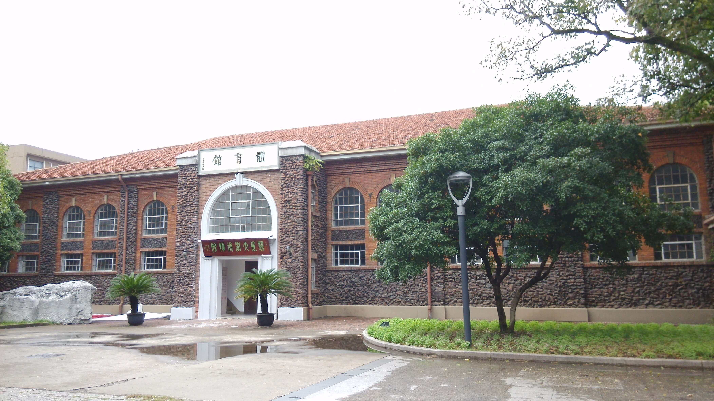
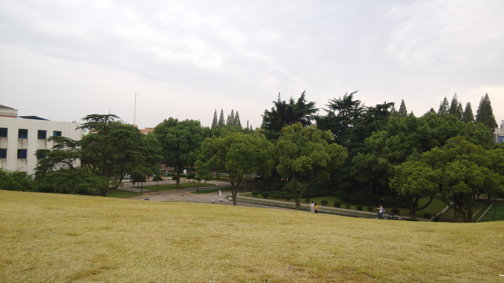
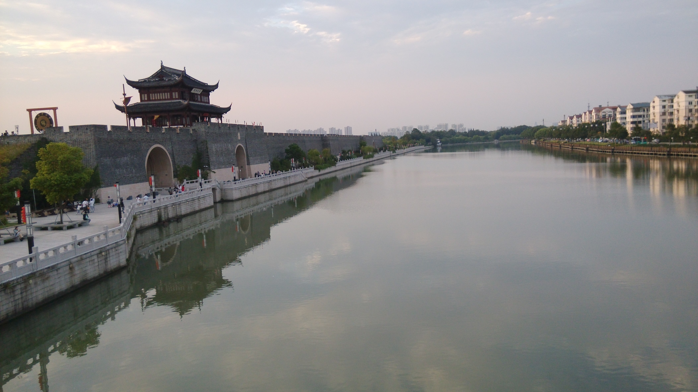
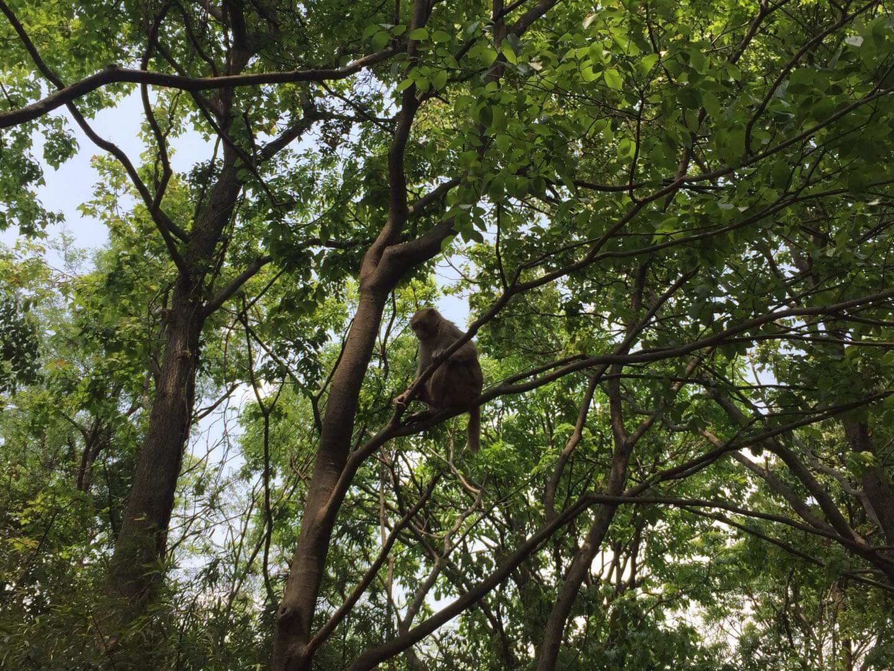
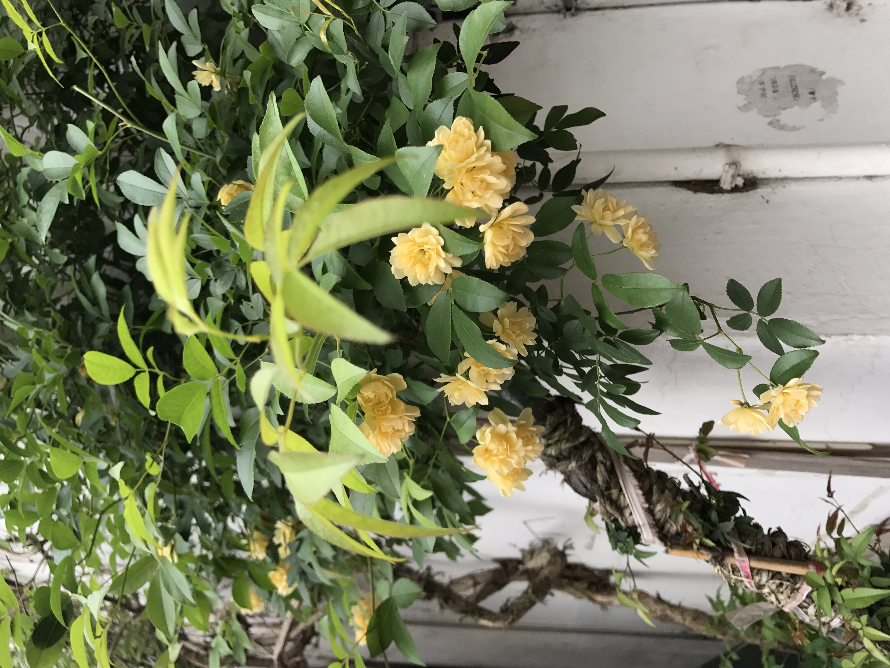
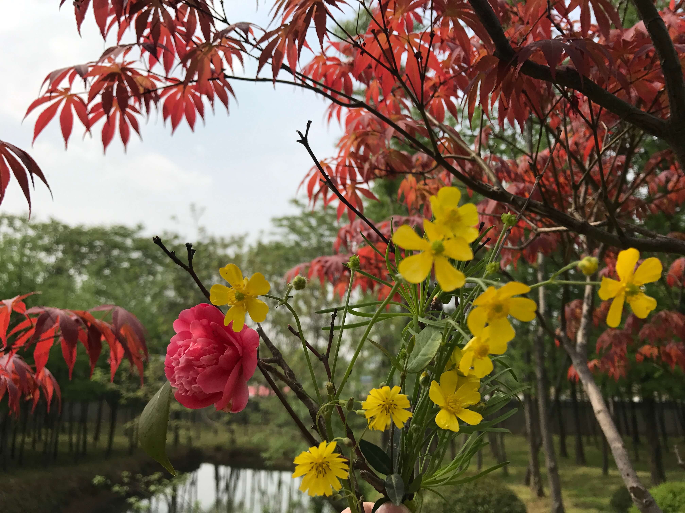

# 苏州

## 地图

<iframe width='600' height='300' frameborder='0' scrolling='no' marginheight='0' marginwidth='0' src='http://f.amap.com/2K4yV_0C34Cfc'></iframe>

## 路线
无，坐高铁或者客车皆可，时间都差不多

## 足迹

路线：无，略多，以后补充其他的景点（周庄，同里）

```
1.观前街(0.5d);
2.苏州大学（北校区）(0.5d);
2.木渎古镇(0.5d);
3.上方山国家森林公园（1d）;
4.山塘街（晚上去看吧~）
```

## 图片

* 苏州大学北校区图书馆😊

    

* 大学小山坡

    

* 运河(相门)

    

* 苏州站（南门）

    

* 上方山森林公园

    

* 蒲公英

    

* 木渎古镇小黄花

    

* 上方山森林公园🌺

    

* 上方山森林公园🍑

    

* 上方山森林公园紫藤萝

    

## 建议

* 时长：两日半即可玩完
* 吃喝：鸡头米(嘎嘣脆)，拌面（还行吧）
* 状态：适合慢慢走~适合散步

## 备注

1. 注意保暖
2. 注意防晒
3. 去山塘街的时候下雨，没有拍照。。。不过鸡头米好吃~~
4. 鲁坚强同学
