# 越南芽庄

## 地图
无

## 路线
坐灰机->坐车->坐灰机

## 足迹

路线：跟着导游走，没啥好说的

```
1.坐灰机（21点半）去金兰国际机场;
2.入住酒店（Cam Hải Đông);
2.芽庄大教堂->占婆塔->酒店;
3.自由行;
4.买翡翠，买橡胶制品，回去;
```

## 图片

* 酒店😊

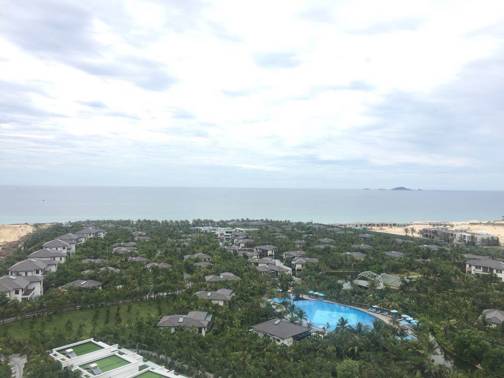    

* 酒店旁边

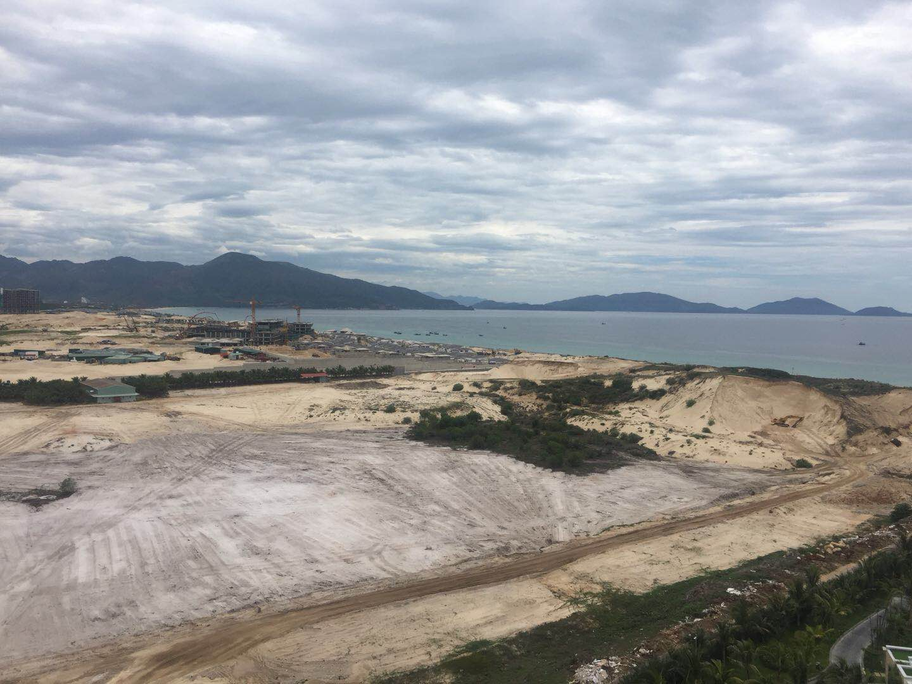    

* 好吃的河粉

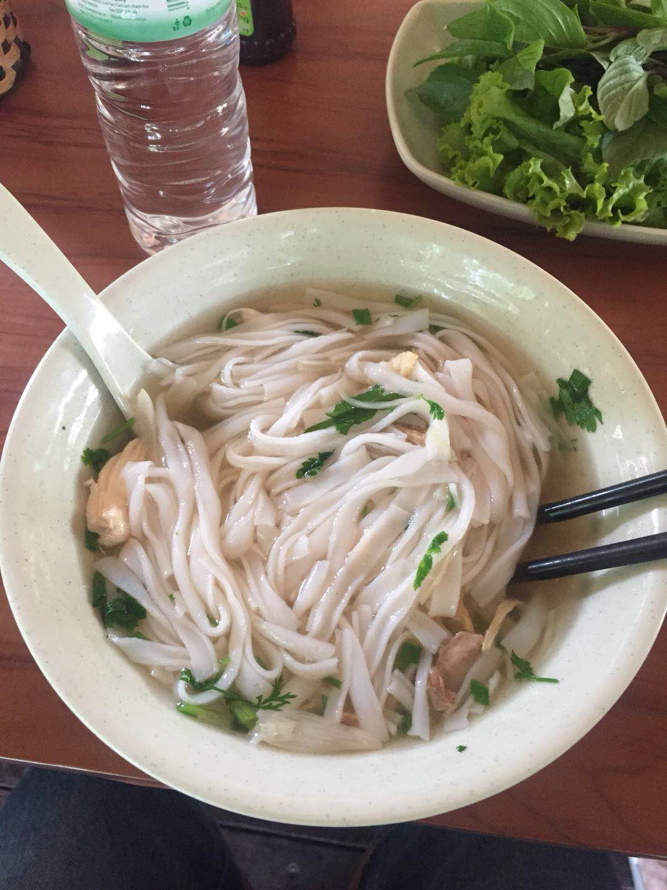    

* 教堂⛪️

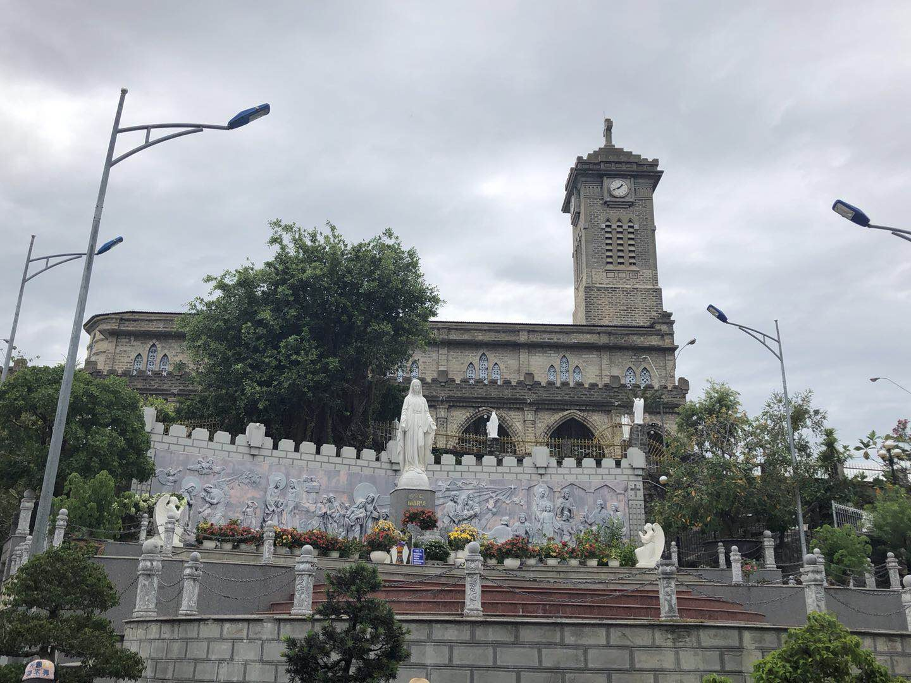    

* 占婆塔

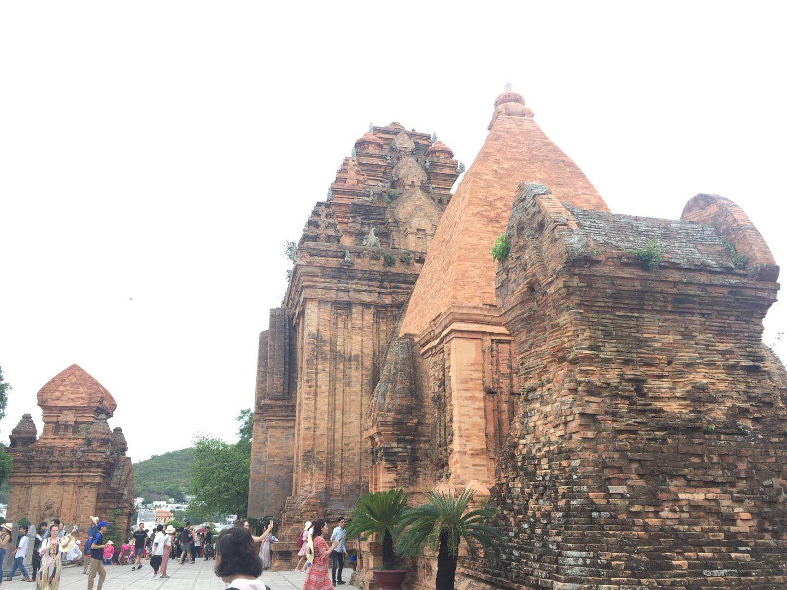    

* 风景

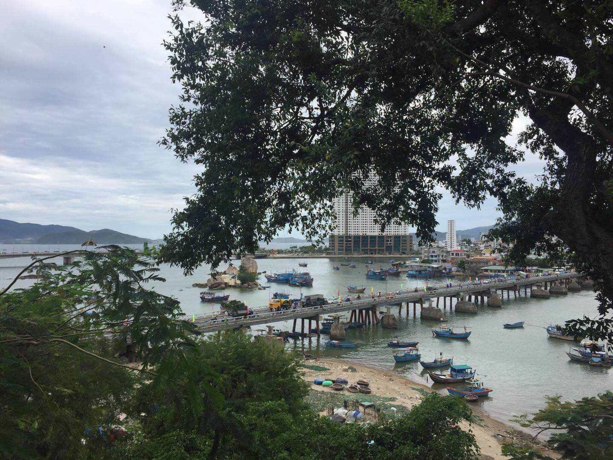    

* 椰子

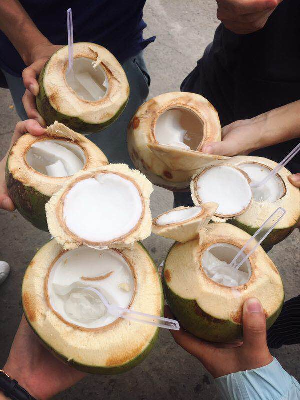  

* 不懂

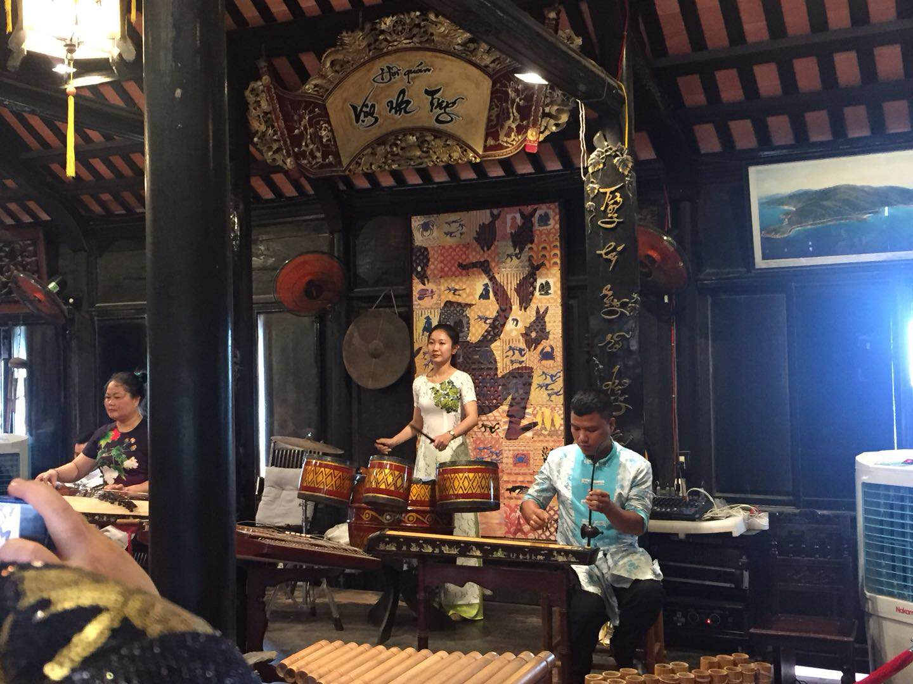    

* 水

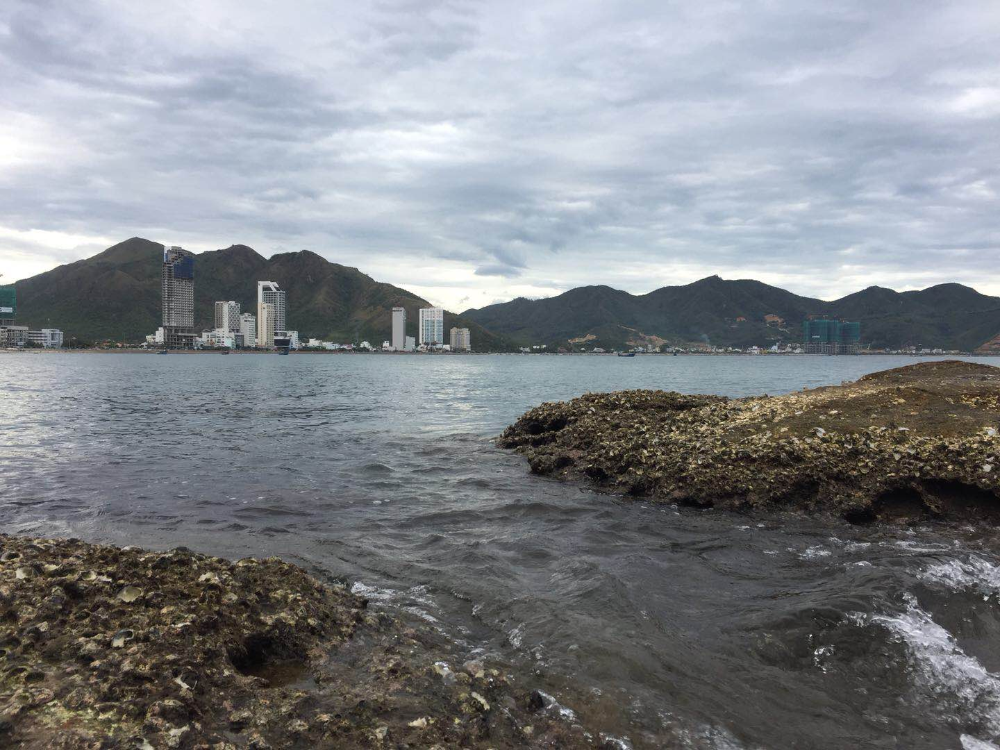    

* 酒店

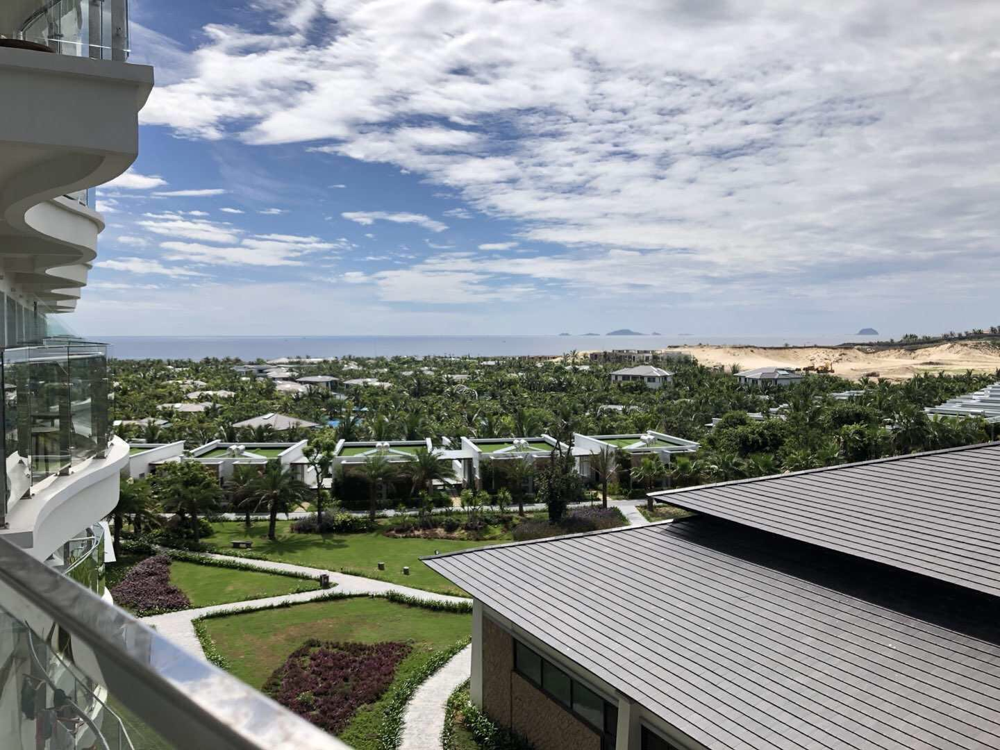

* 海

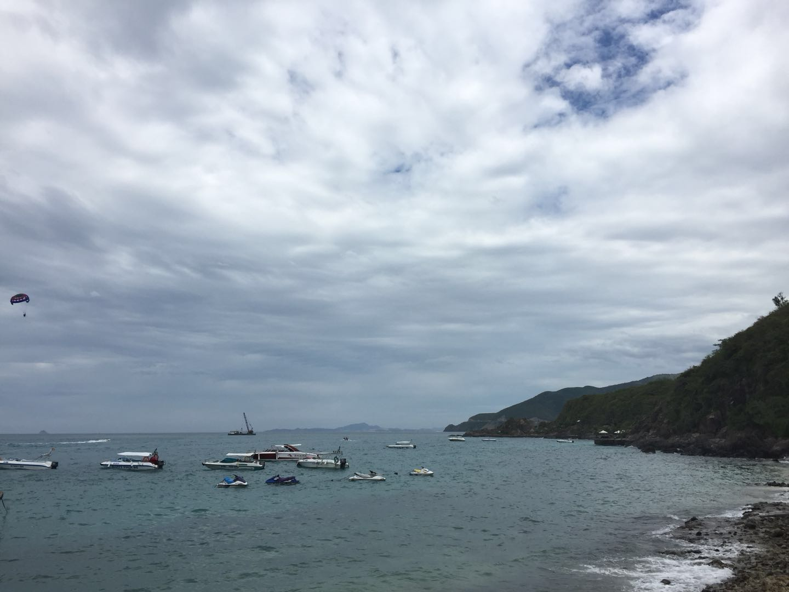

## 建议

* 时长：。。
* 吃喝：河粉好吃（鸡汤），椰子好吃
* 状态：适合去散心~

## 备注

1. 注意防晒
2. 注意安全
